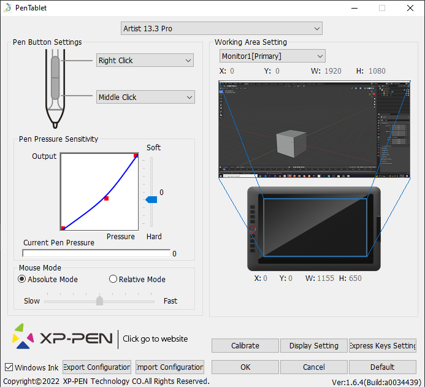

# DEV-01, Graphics Tablet Setup
### Tags: [setup]
### Link: https://academy.cgboost.com/courses/mastering-sculpting-in-blender-2/lectures/25367094

## Set Up tablet for blender

## Controls

    Moving around = Shift + Bottom pen button 
    Zooming = Ctrl + Bottom pen button 
    Orbiting = Bottom pen button
    Flat Viewpoint = Alt + Bottom pen button + drag (up/down/left/right)