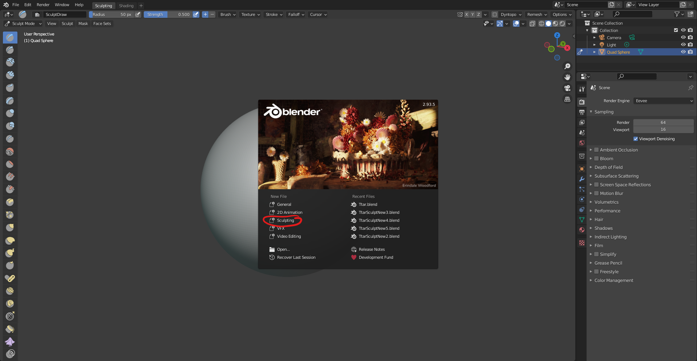
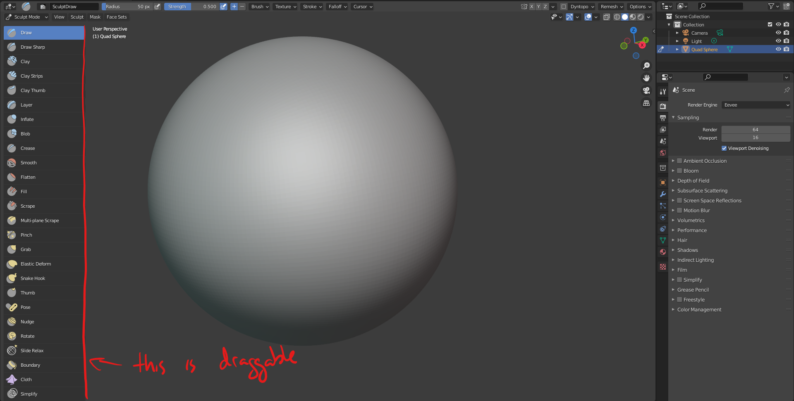
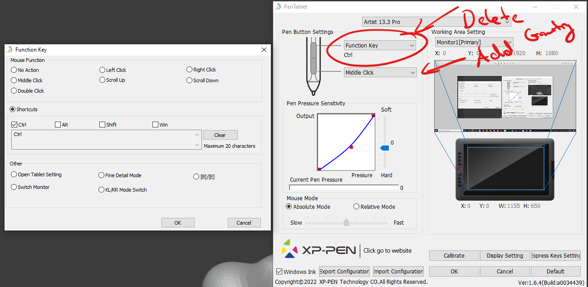

# DEV-03, Sculpt Mode UI Overview
### Tags: [walkthrough]
### Link: https://academy.cgboost.com/courses/mastering-sculpting-in-blender-2/lectures/25231723

## Starting with a sculpting UI right away

    Subdivided Quad Sphere

    Sub Divisions are needed because we are deforming the geometry. The higher the subdivisions the more details we can add

## Menus

## Adding Geometry

    Draw

## Removing Geometry

    Ctrl + Draw

## Brush Radius

    F + Move Mouse

## Brush Strength

    Shift + F + Move Mouse

## Quick Smooth Brush

    Shift + Draw