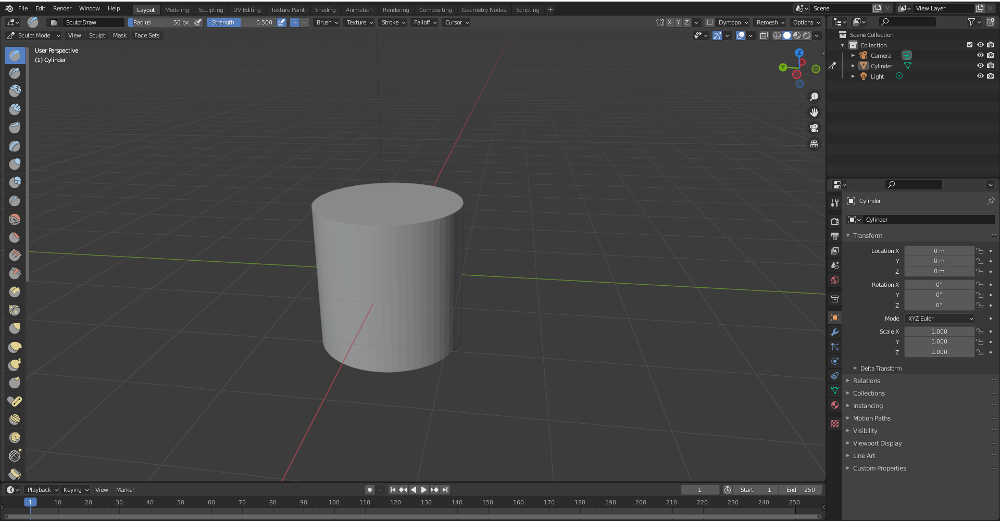

# DEV-04, Workflow: Dynamic Topology
### Tags: [Dyntopo, MeshFilter, Remesh, snakehook, draw, claystrips, smooth]
### Link: https://academy.cgboost.com/courses/mastering-sculpting-in-blender-2/lectures/26933745

## Getting a proper cylinder

    This allows me to see each an every edge on the surface

    The face types are very not useful for sculpting so I are going to remesh. Before I do so, I visually see the resolution I want
    By pressing Shift and R

    Then select remesh with this resolution, or with Ctrl + R

    Result

## Working with Dynamic Topology

    Starting from numpad 7 I am pulling at the geometry, but the longer i pull at the geometry, the uglier it gets.
    This is because we are only working with the existing geometry. I am pulling at what we have and at some point this will be stretched

    Thats why generating new geometry is great with dyntopo

    Result

## Sculpt tools

    Although I am using the Snake tool here and it is working really well with adding new geometry, not all sculpt tools work effectively alongside Dynamic Topology.

## Front Faces Only

    This will make sure that you are only sculpting on the faces you actively see and working on

## Mass Smoothing with Mesh Filter

## Tree

