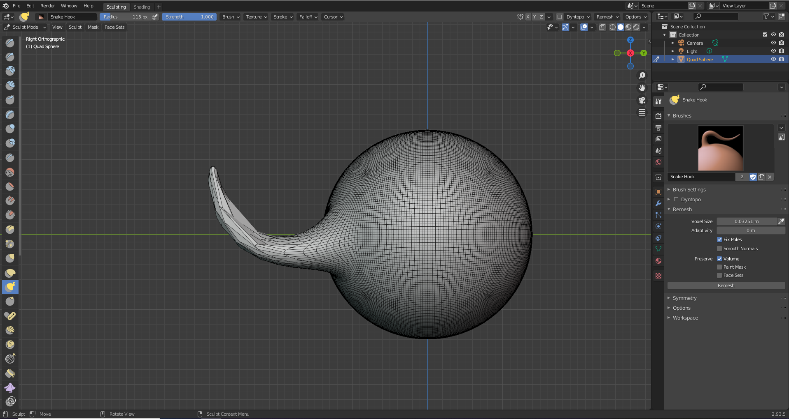
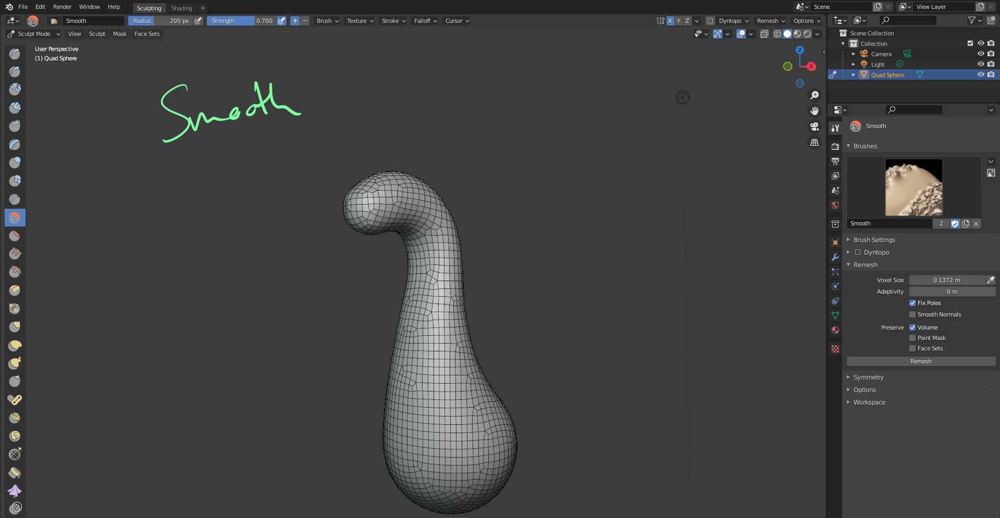

# DEV-05, Workflow: Voxel Remesher 
### Tags: [remesher, joining, mirroring, subdividing]
### Link: https://academy.cgboost.com/courses/mastering-sculpting-in-blender-2/lectures/27072751

## Remeshing

    The Voxel Remesher is automatically recreating the mes with an even and optimized topology which is great for sculpting.
    Its not turned on all the time like the dynamic topology so we just running the remesure when needed and then it is turned off,
    which is great for performance.

## Recentering the 3D Cursor

## Extruding on Mouse Click

## Workflow

# Workflow 2

## Interesting things

# Ice stuff

## Finishing up

