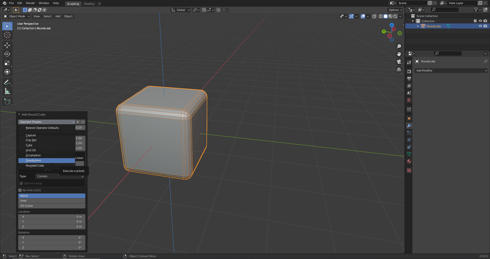
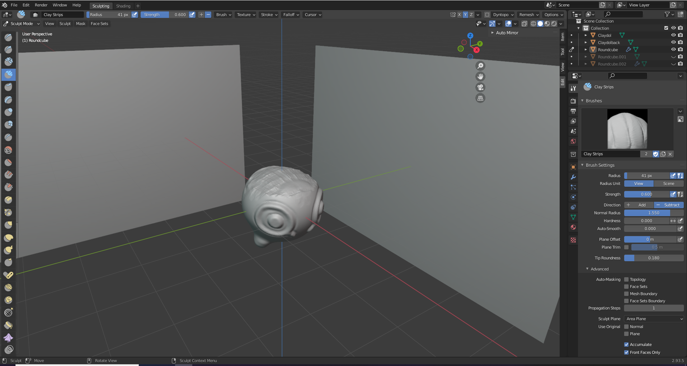

# DEV-06, Multiresoultion Modifier
### Tags: [Multresolution Modifier, Curve deform Modifier, Simple deforem modiifer]
### Link: https://academy.cgboost.com/courses/master-3d-sculpting-in-blender/lectures/27072753

## Introductory use of the Multiresolution Modifier

## Getting More default shapes

## Creating the general shape for Claydol

## Subdivision Modifier vs the Multresolution Modifier

    At first glace they appear to do the same exact thing, but one thing that the Muliresolution modifier (multires-mod) has over the subdivision modifier (sub-mod) is that when use the sub-mod and then go to sculpt mode, the base geometry and its original verticies are still present. You cannot sculpt the
    geometry too effectively due to the lack of geometry.

    sub-mod

    multires-mod

## Building along

## Side discoveries

