# DEV-07, Texture Painting
### Tags: [painting, uvs, normals]
### Link: [https://www.youtube.com/watch?v=nht2RoYBUfA, https://www.youtube.com/watch?v=uTSr_R1_QbM, https://www.youtube.com/watch?v=DOn4G9HVo2M, https://www.youtube.com/watch?v=GiIWaF6WJSg]

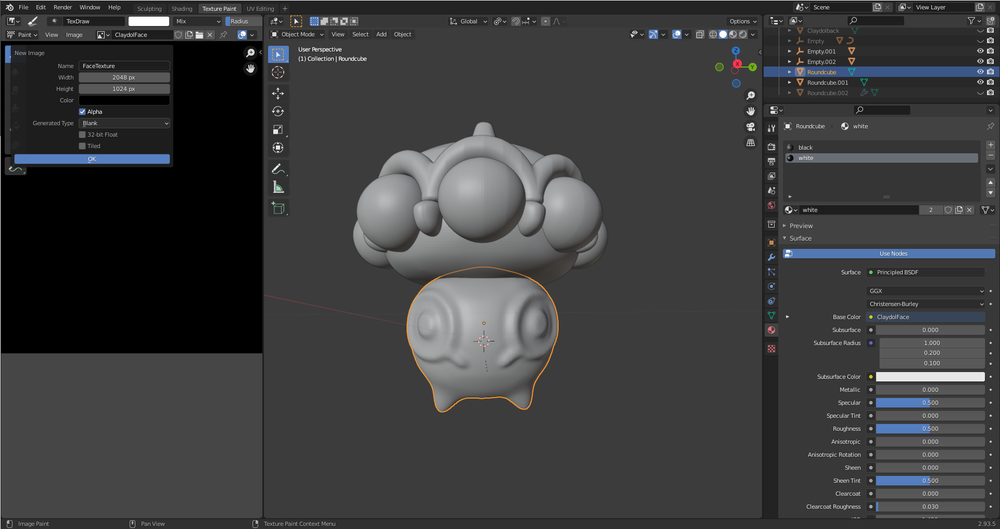

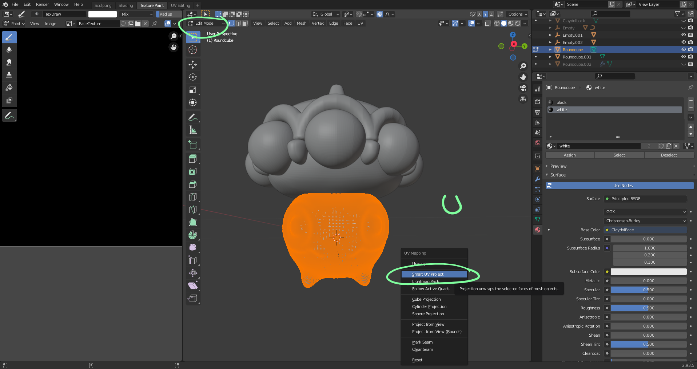

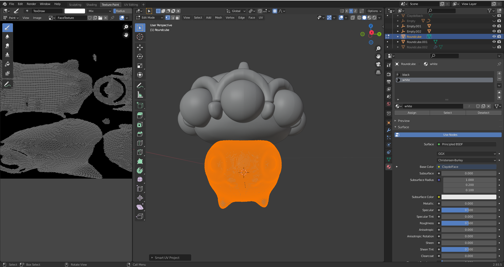

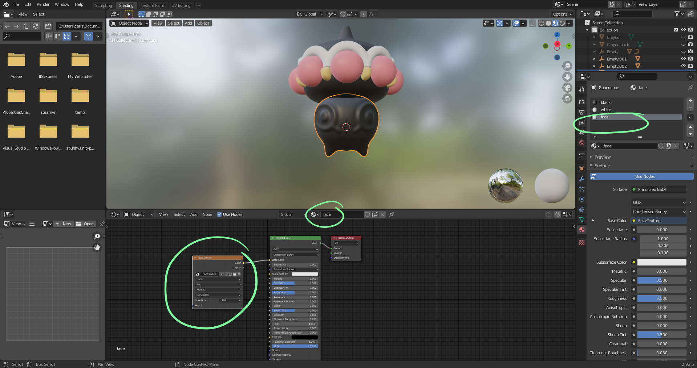

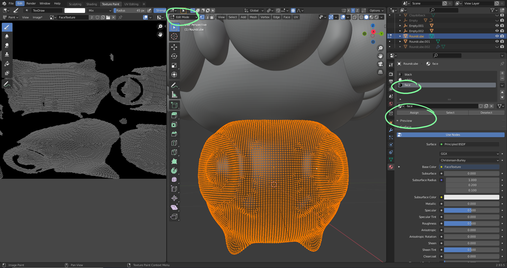

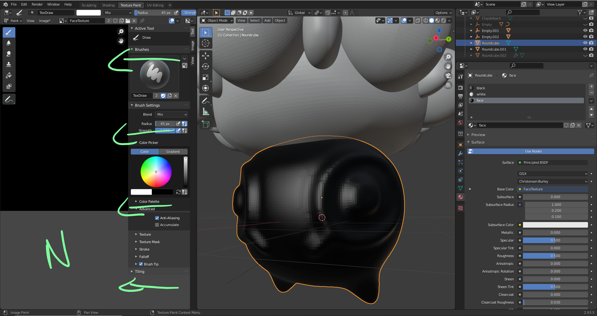

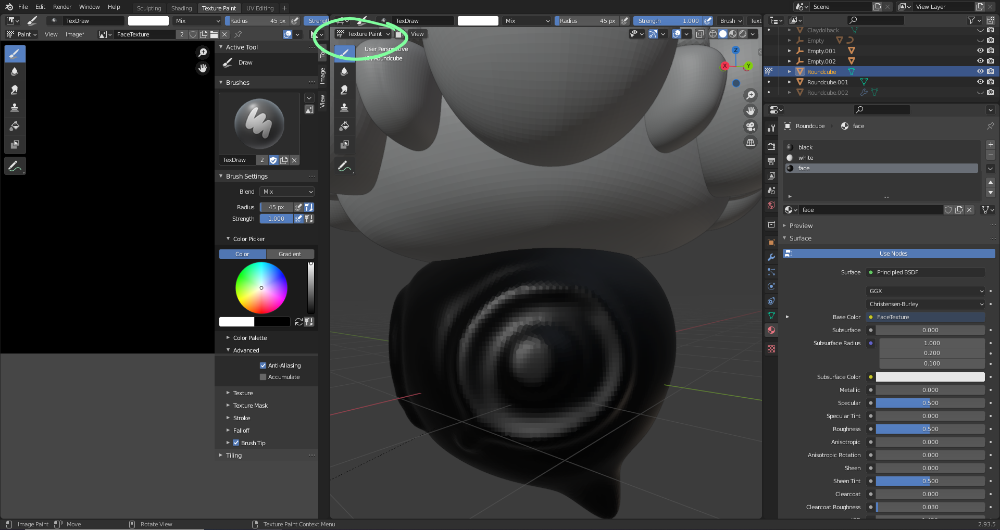

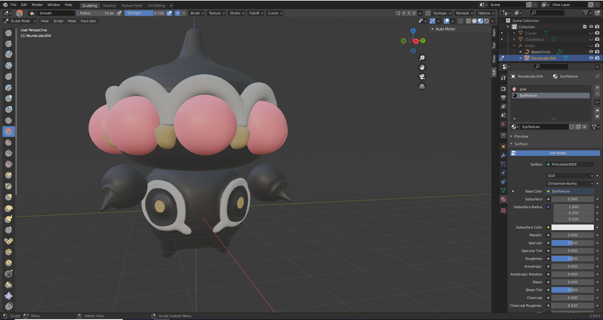

## Cant Draw, Check Normals

    Places where it is red (inward facing normals), you cannot draw, but you can flip them to blue (outward facing normals)

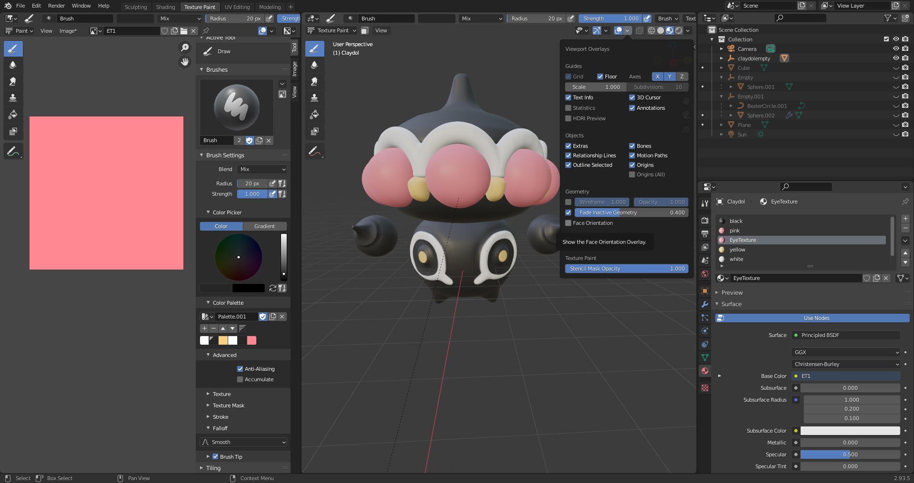

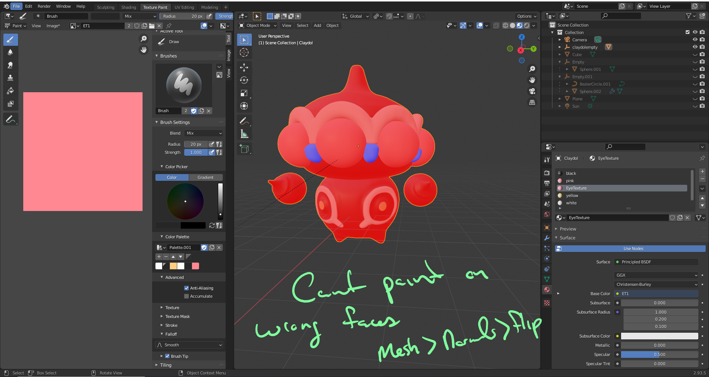

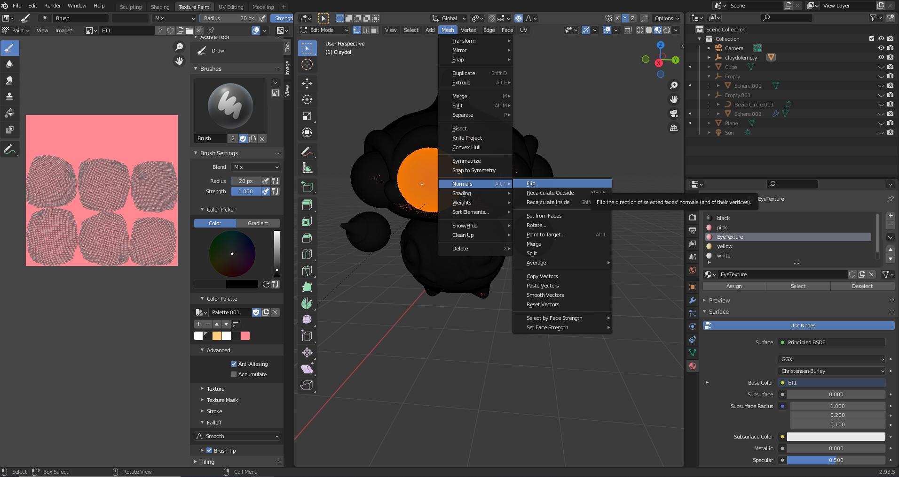

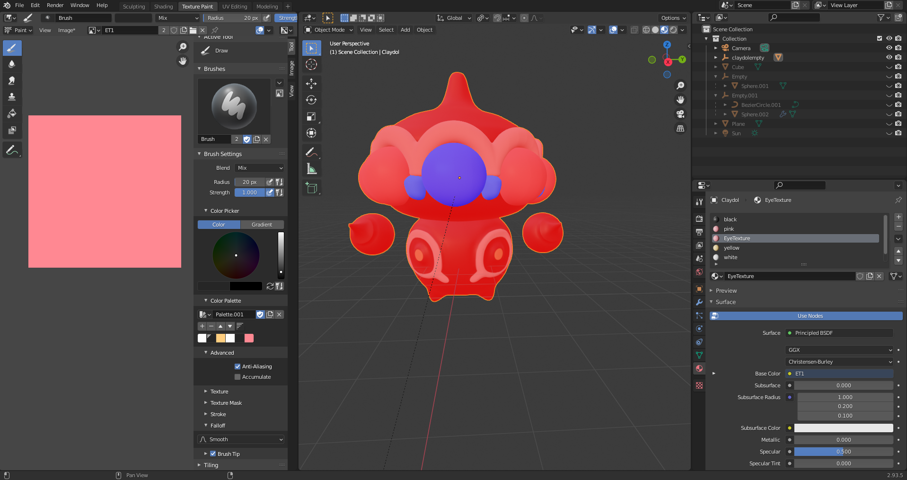

## This horrible issue where you are in the shading tab and no objects are showing up

    View > Frame Selected

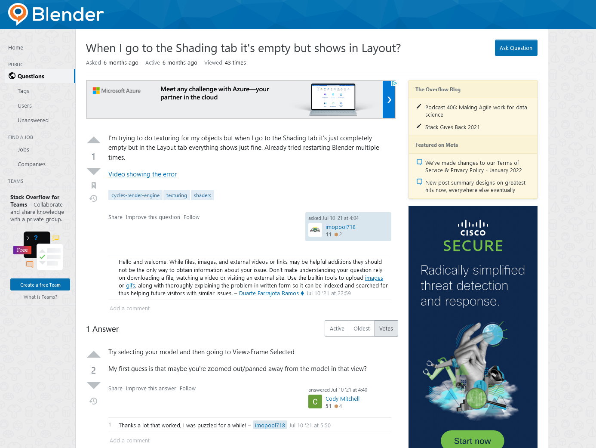

## Texture website

https://www.textures.com/browse/3d-scans/114548

## Working with Textures

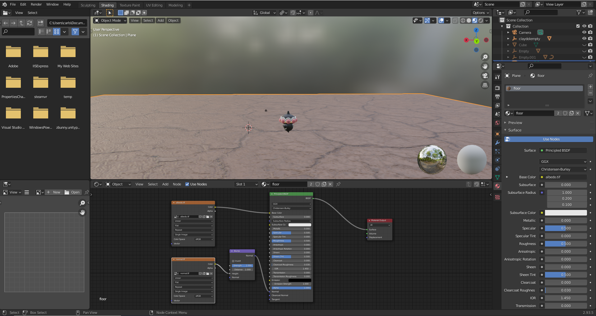

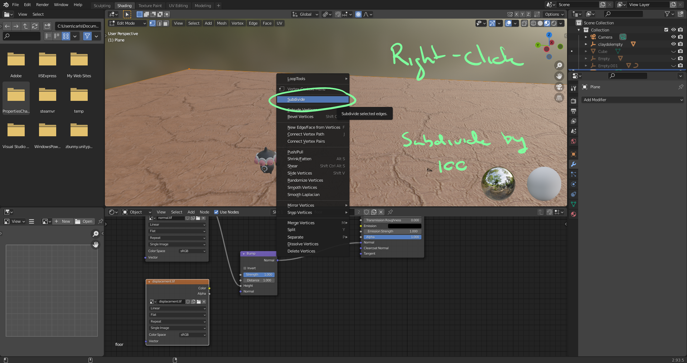

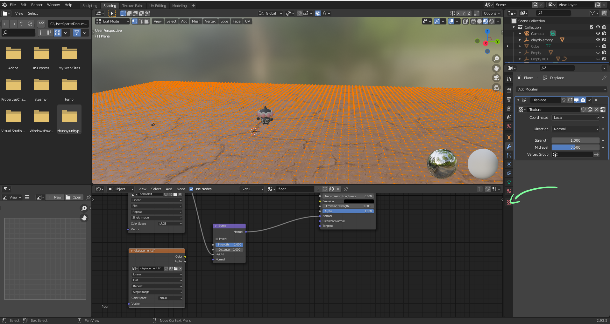

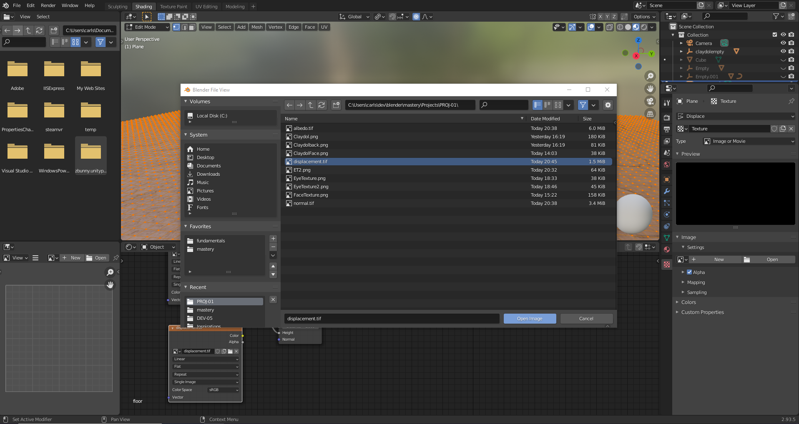

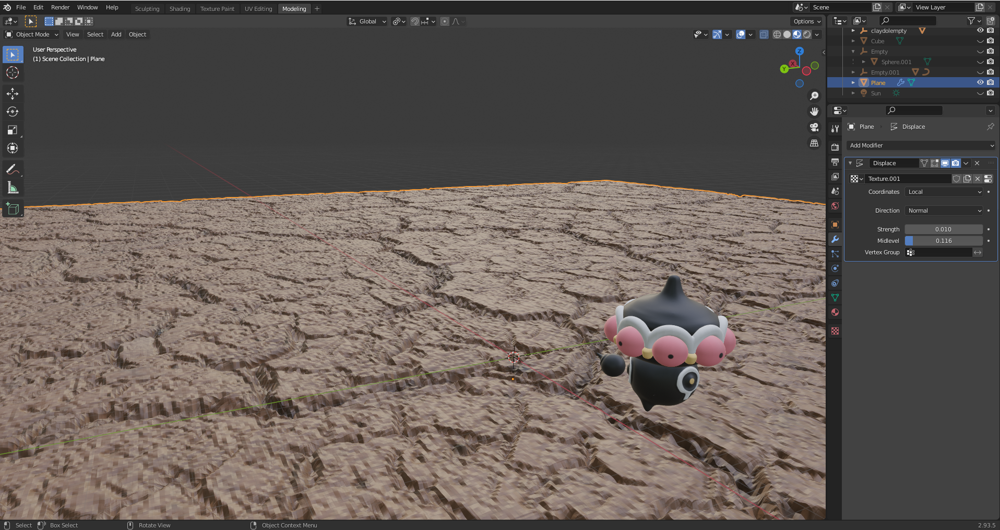