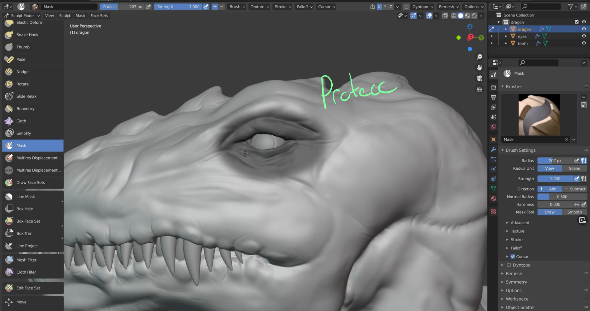
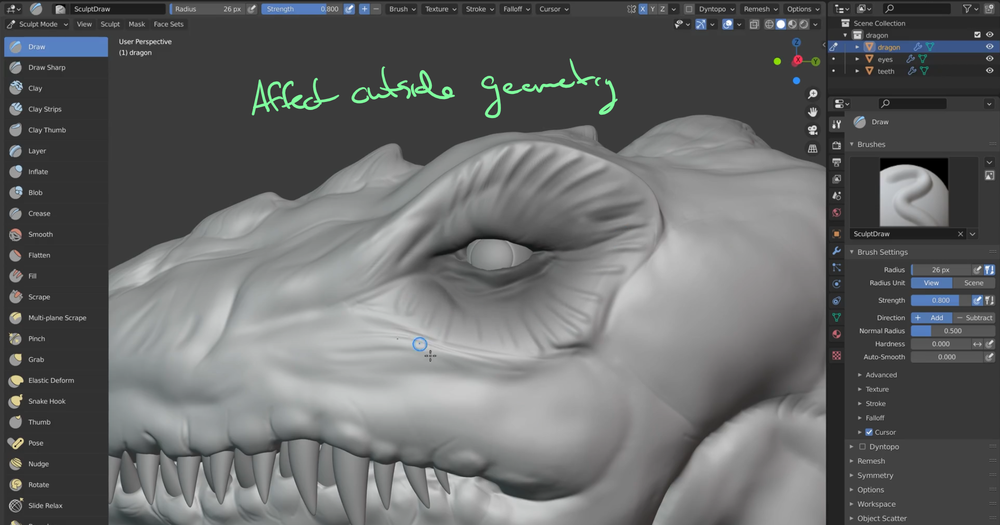
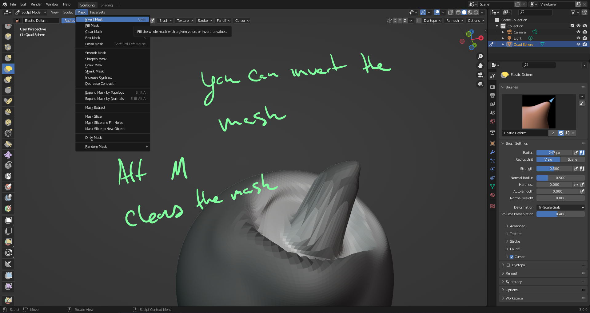
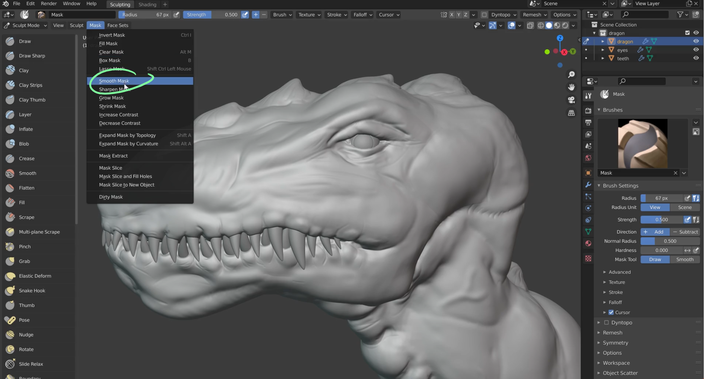
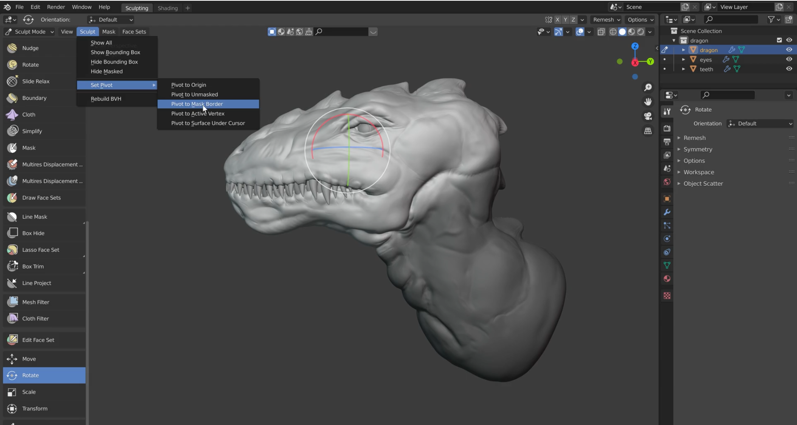
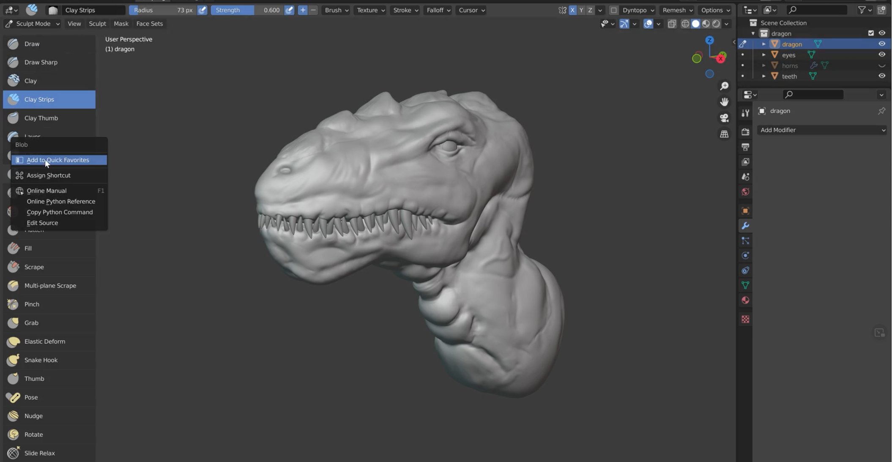
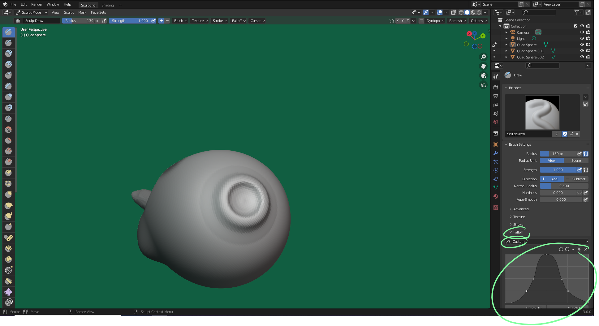

# DEV-09, Masking And Quick favorites
### Tags: [masks, Quick Favorites, suction cups]
### Link: [https://academy.cgboost.com/courses/master-3d-sculpting-in-blender/lectures/29946223, https://academy.cgboost.com/courses/master-3d-sculpting-in-blender/lectures/30454500]

## Masking

 

 

 

## Combined with Meshfilters

    This can be used effectively along with Meshfilter to protect parts of them mesh you dont want overly smoothed

## Sharpening Masks and SMoothing Masks

 

## Posing with Masks

 

## Clearing Masks

    You can clear all masks with Alt M

## Quick Favorites

    You can add a quick favorite by right clicking an action and saviong it to quick favorites. Pressing Q will bring all your saved favorites

 

## Suction cups

 