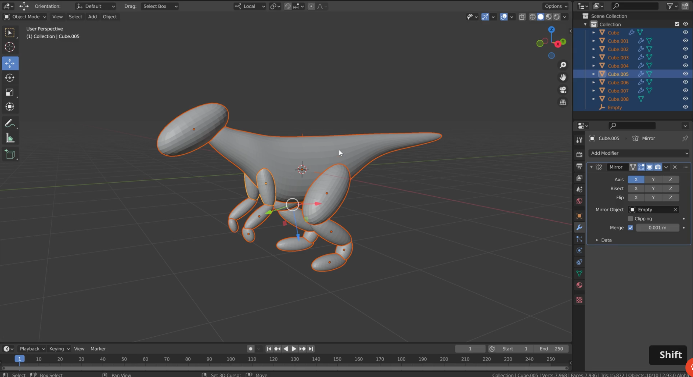
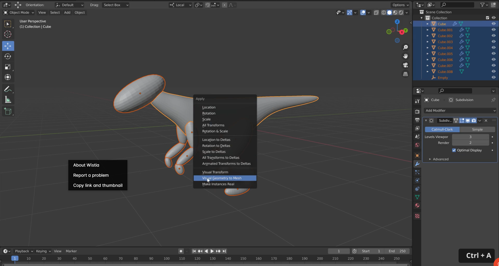
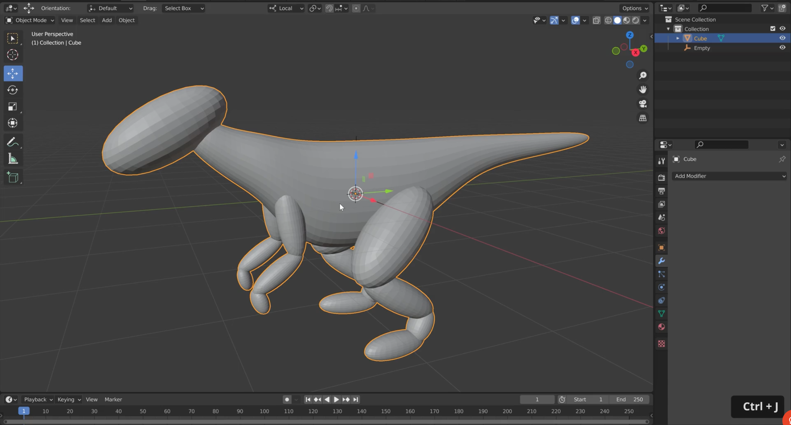
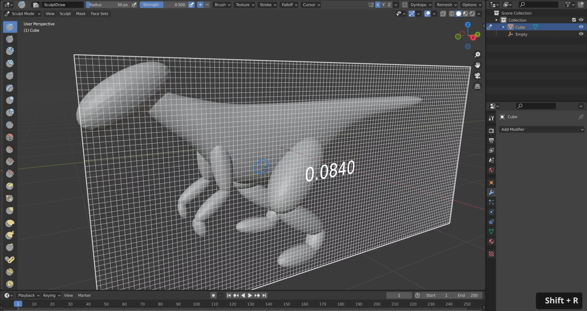
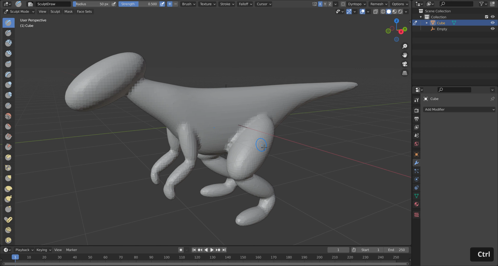

# DEV-10, Subsurf Modifer Workflow
### Tags: [Subsurf Modifer, voxel remesh]
### Link: https://academy.cgboost.com/courses/master-3d-sculpting-in-blender/lectures/30300541

## Subdivision Workflow
    The subdivision workflow is creating the base mesh by using subdivided cubes

## Combine all the parts together

