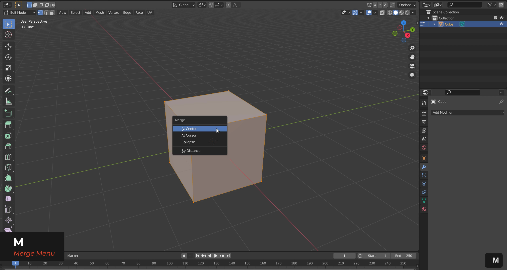
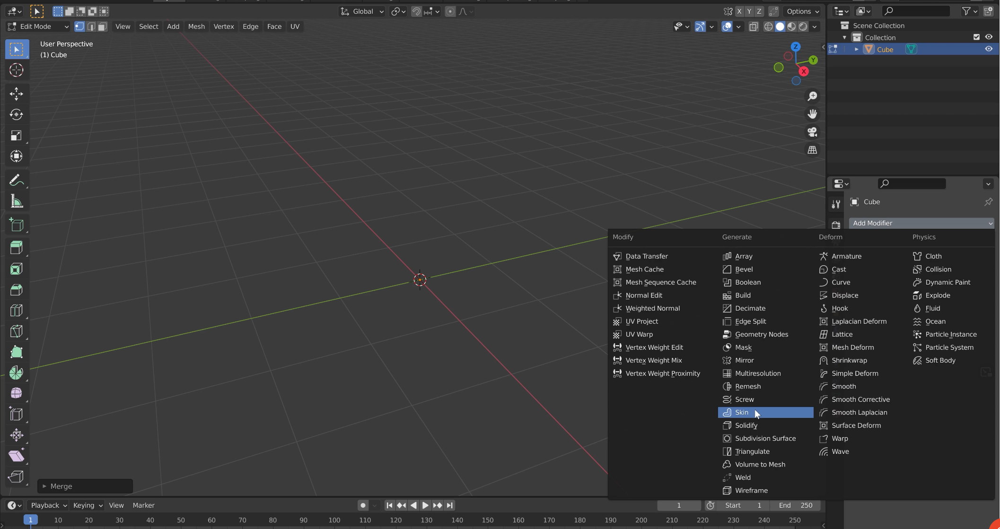
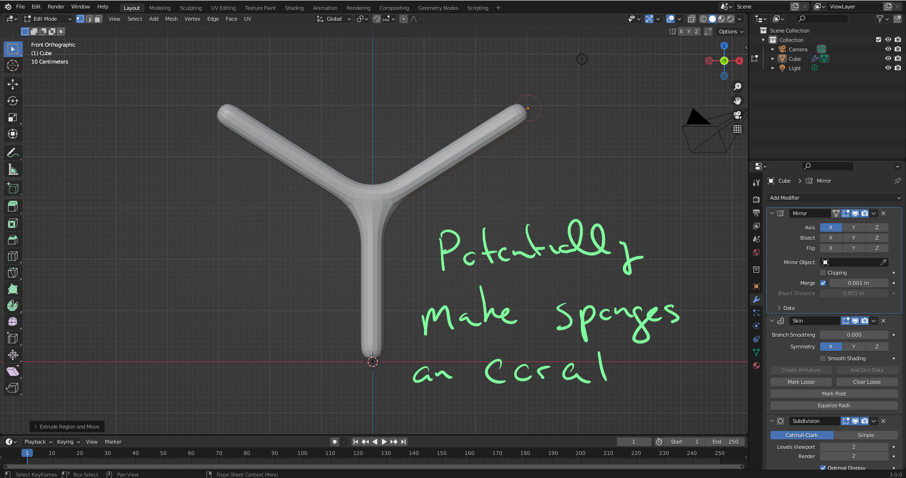
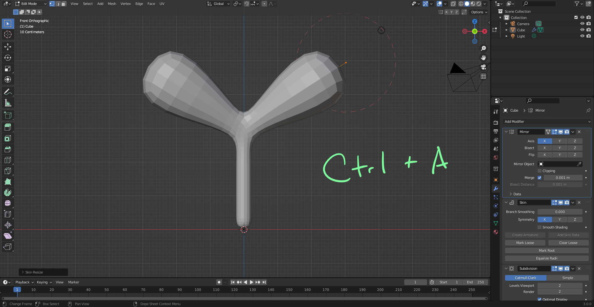
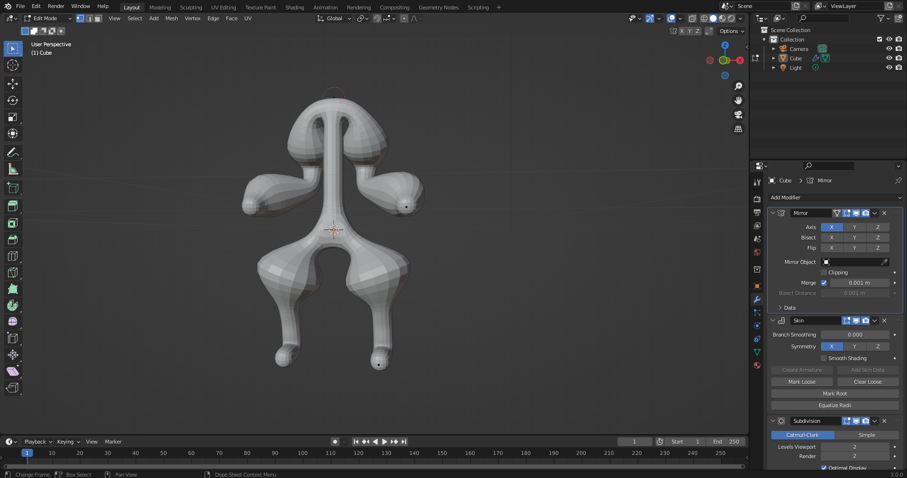
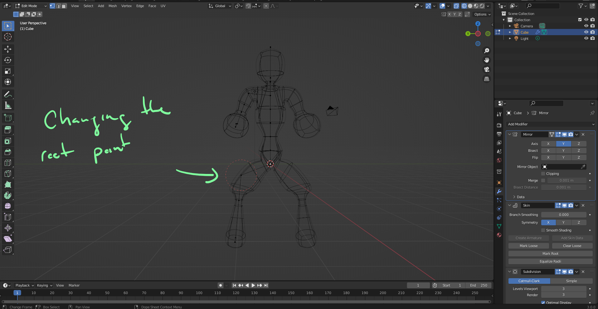
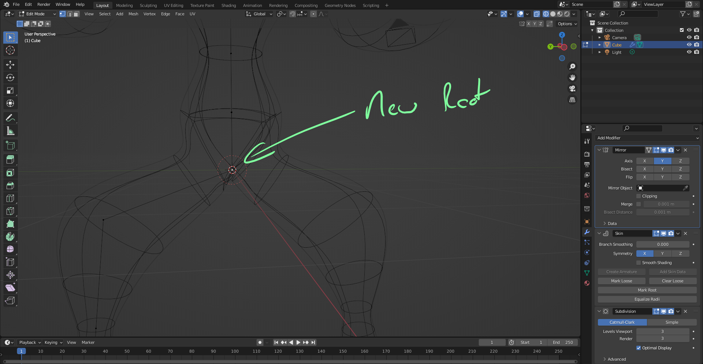
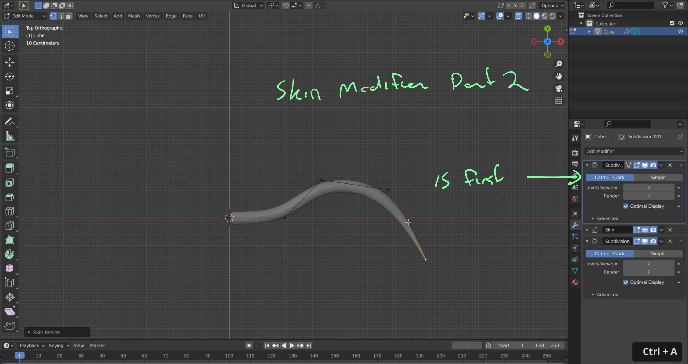

# DEV-11, Skin Modifier Workflow
### Tags: [Skin Modifier]
### Link: https://academy.cgboost.com/courses/master-3d-sculpting-in-blender/lectures/30300981

## Using the Skin Modifier to makes person mesh

## Using the Mark Root feature

## Creating a Curve

