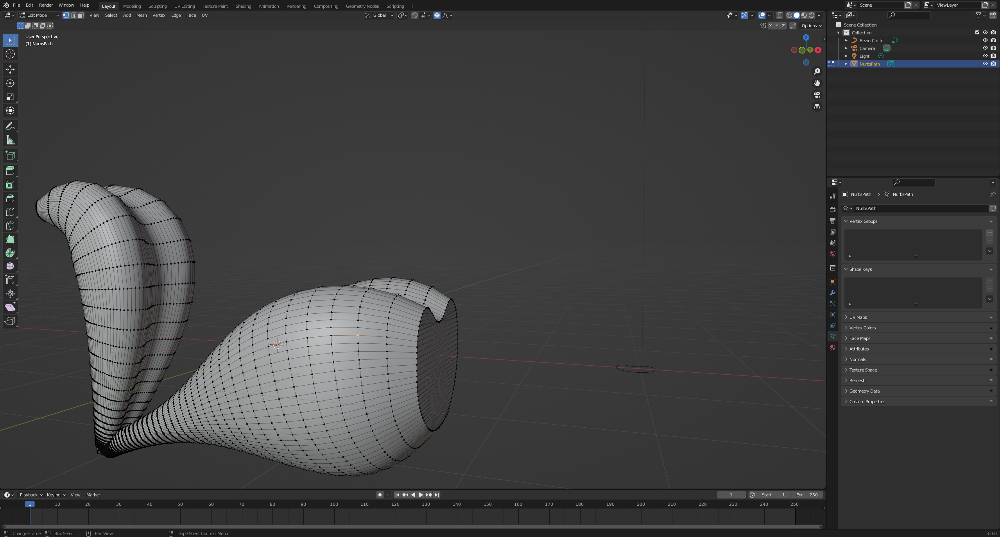

# DEV-12, Curve Workflow
### Tags: [curve work flow]
### Link: https://academy.cgboost.com/courses/master-3d-sculpting-in-blender/lectures/30325524

## Creating geometry via a curve

## manipulating curve geometry with a second curve

    Convert it to a mesh

    Remesh

