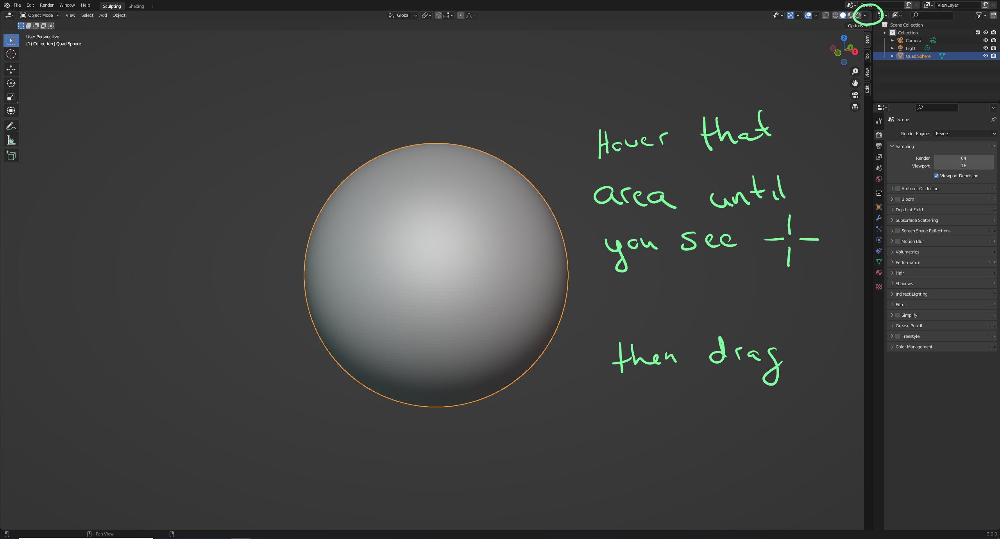
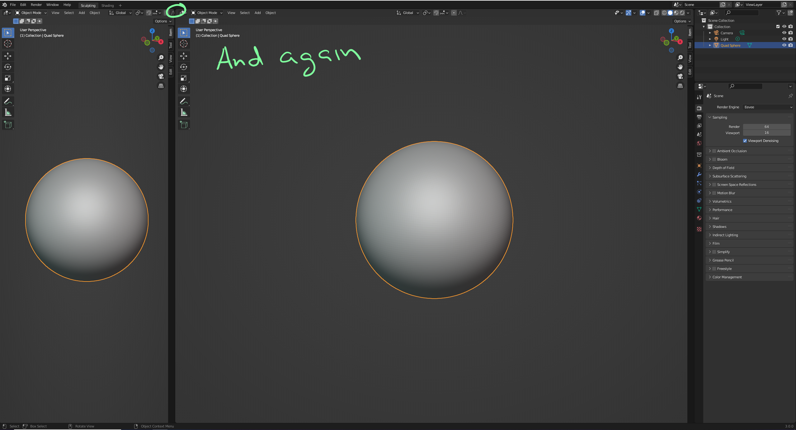
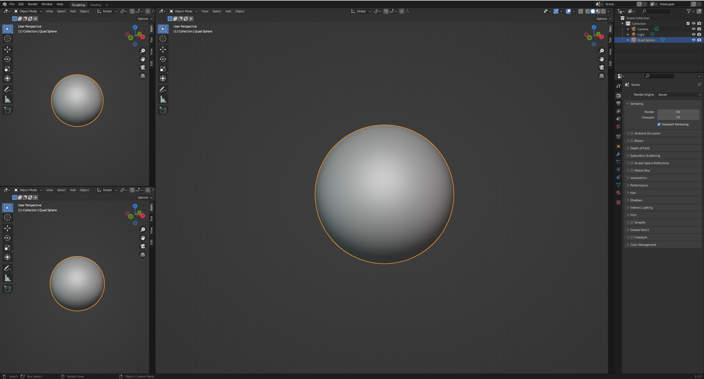
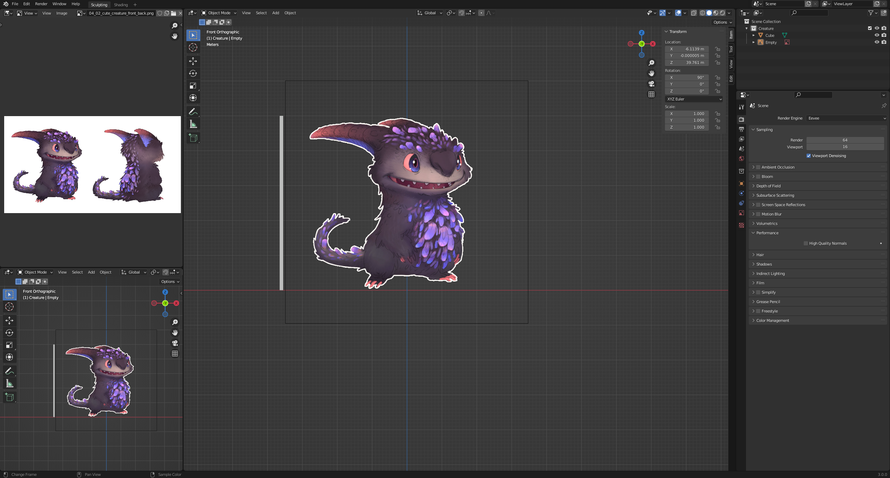
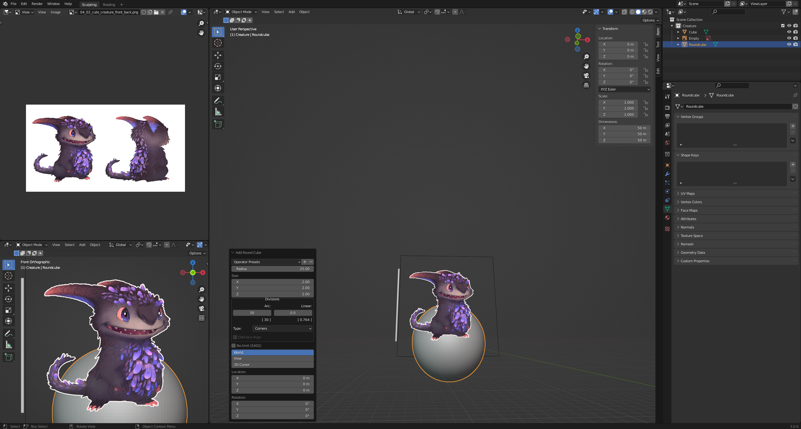
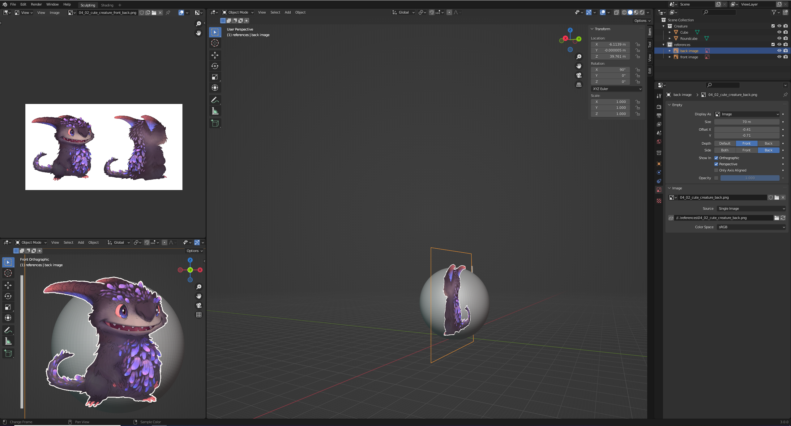
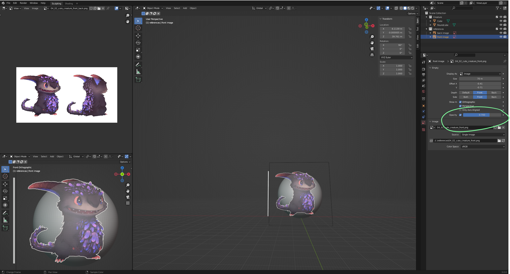
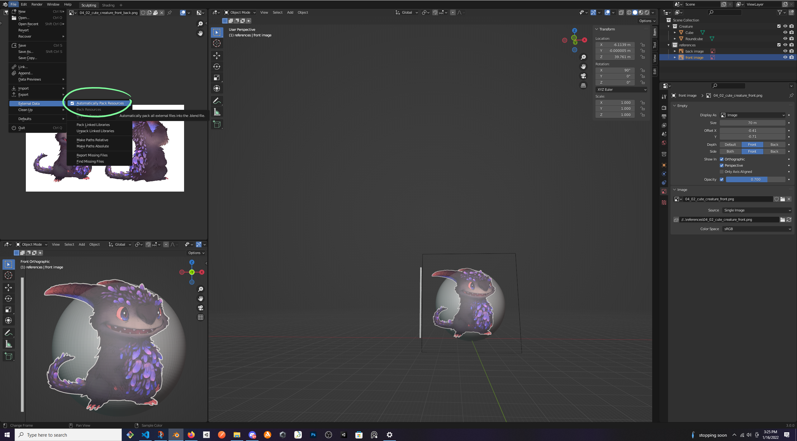

# DEV-13, Preparation
### Tags: [UI]
### Link: https://academy.cgboost.com/courses/master-3d-sculpting-in-blender/lectures/30598301

## Changing the user interface for sculpting

## Making sure the image is always in front

## Final image prep

