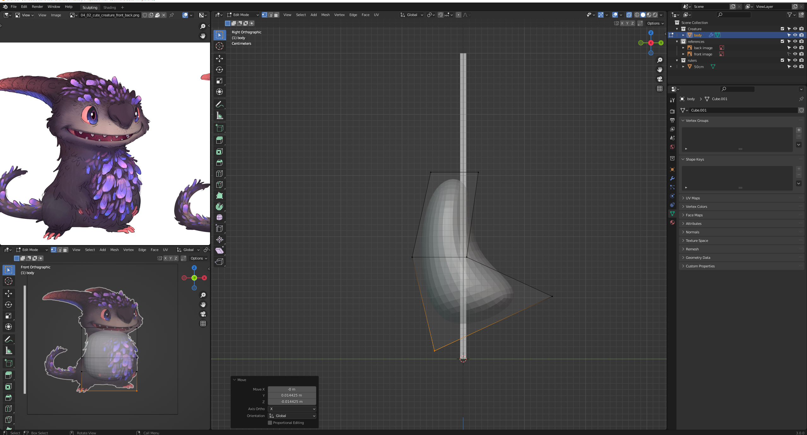
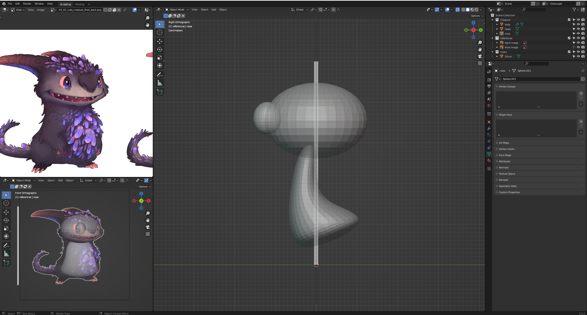
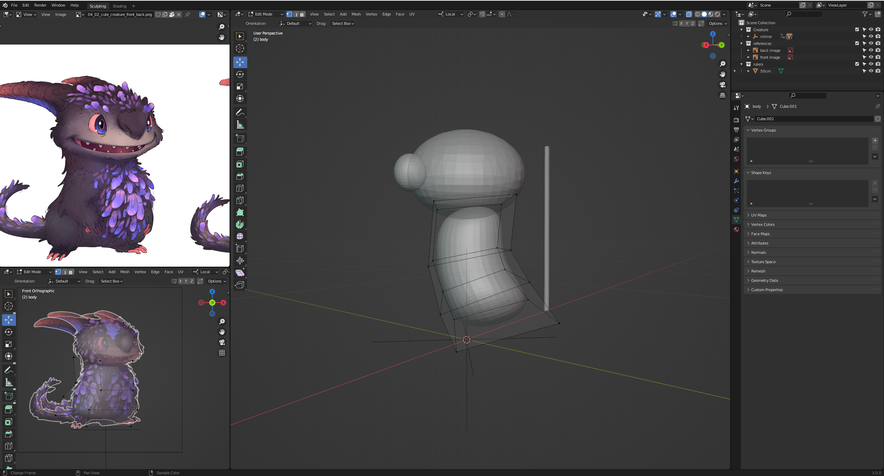

# DEV-14, Base Mesh: Body and Head
### Tags: [base parts]
### Link: https://academy.cgboost.com/courses/master-3d-sculpting-in-blender/lectures/31189690

## Sculpting 

## Add an empty (mirror) and parent the body parts

## Add key frames to shift from front perspective and reference percepective

## Make sure the images oly show in orthogreaphic view

    Images will now show if I press 1 or ctrl 1

