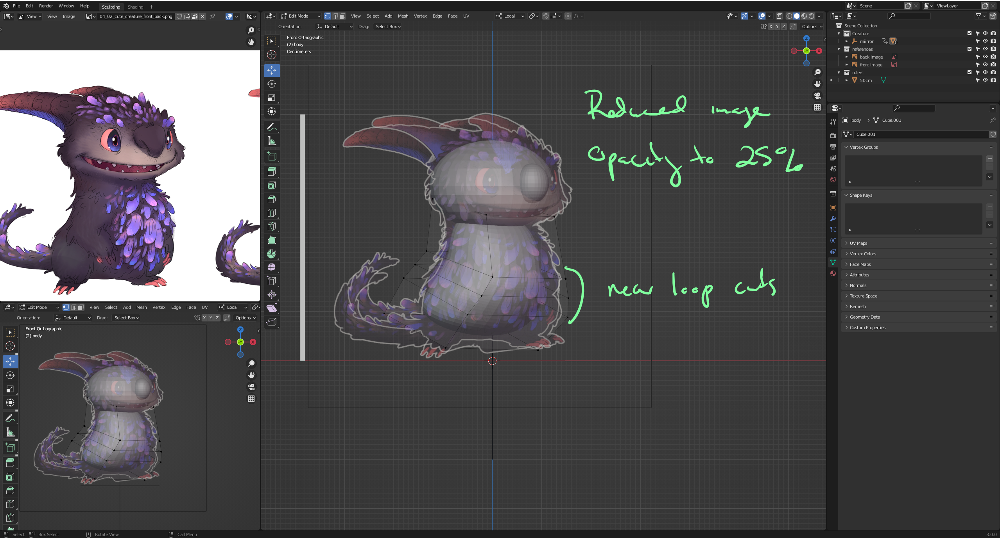
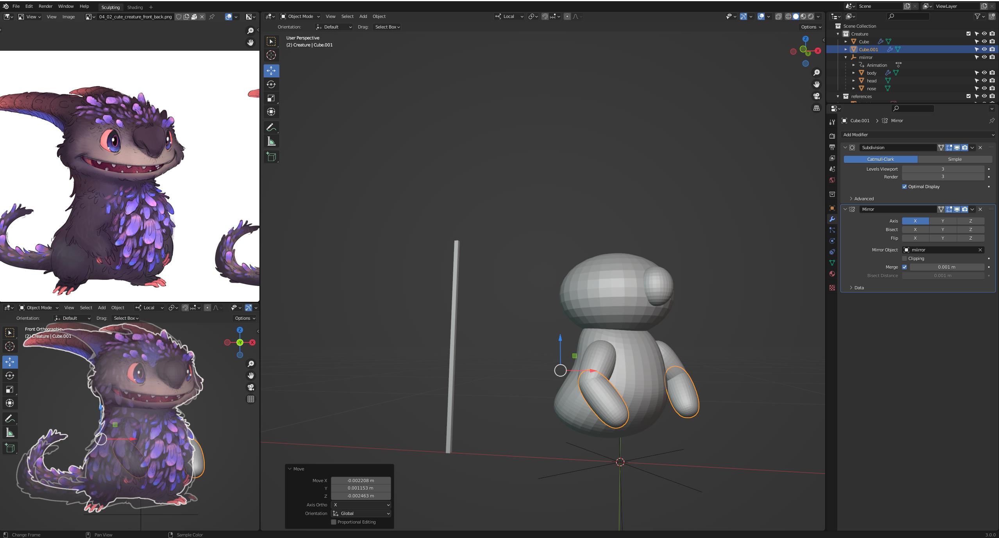
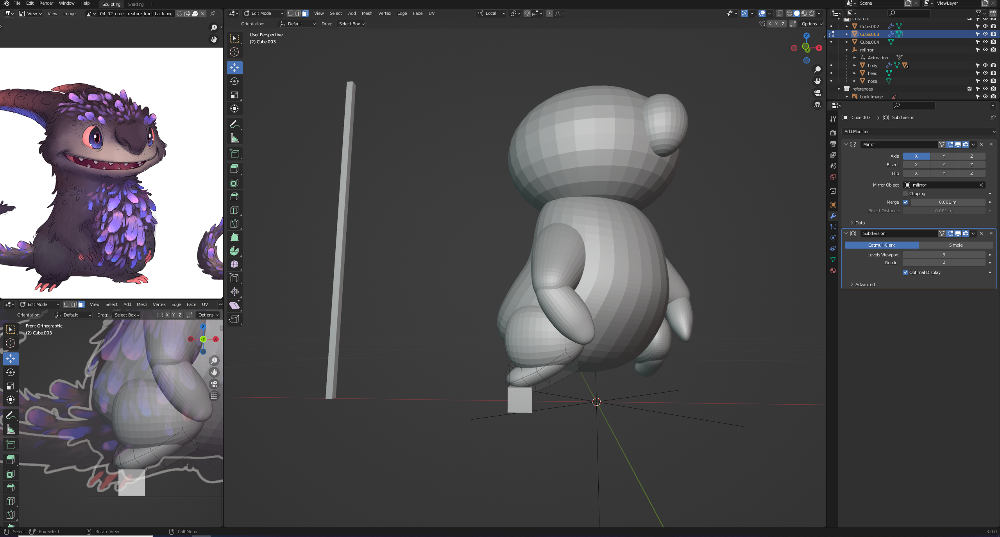
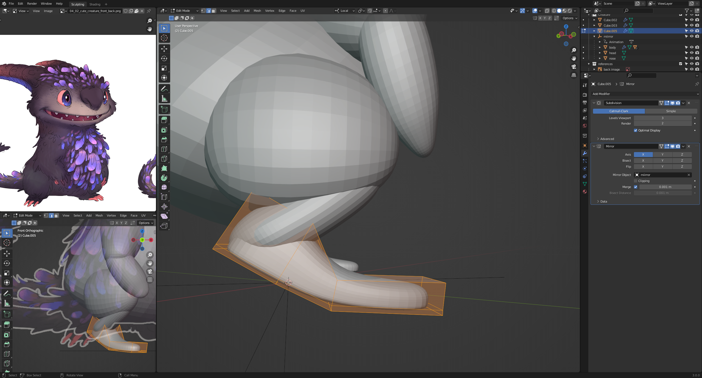
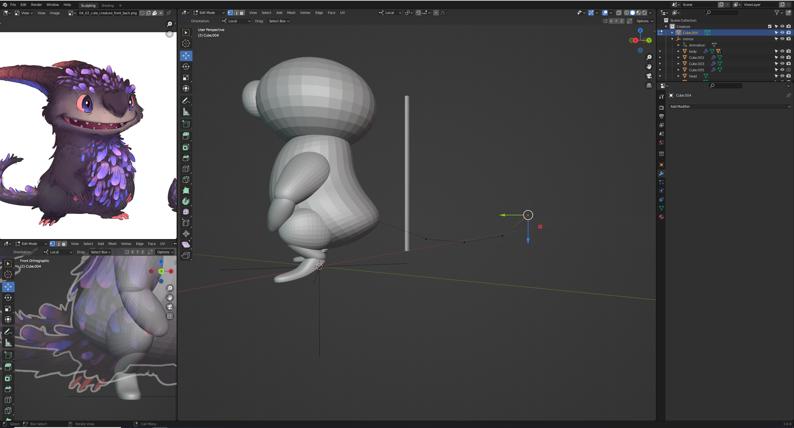
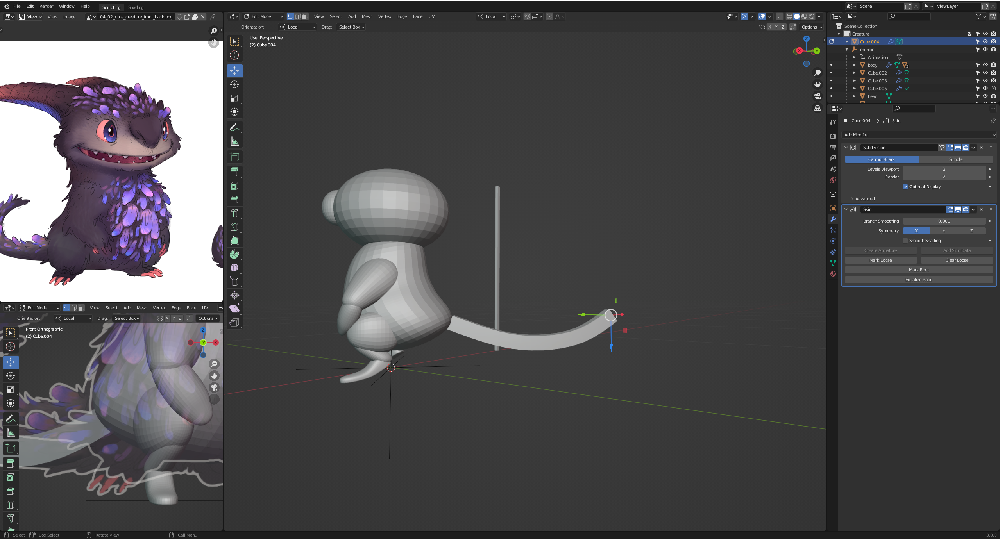
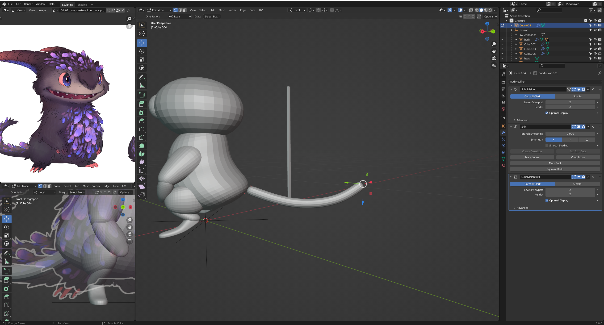
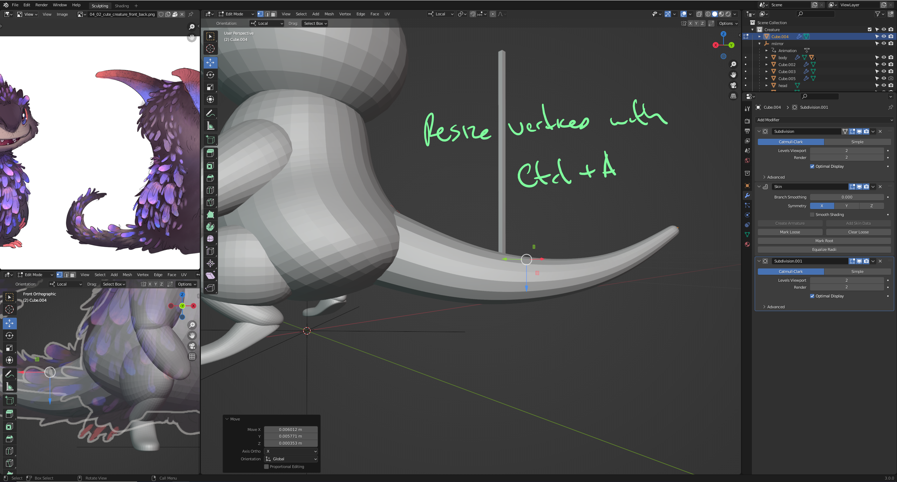
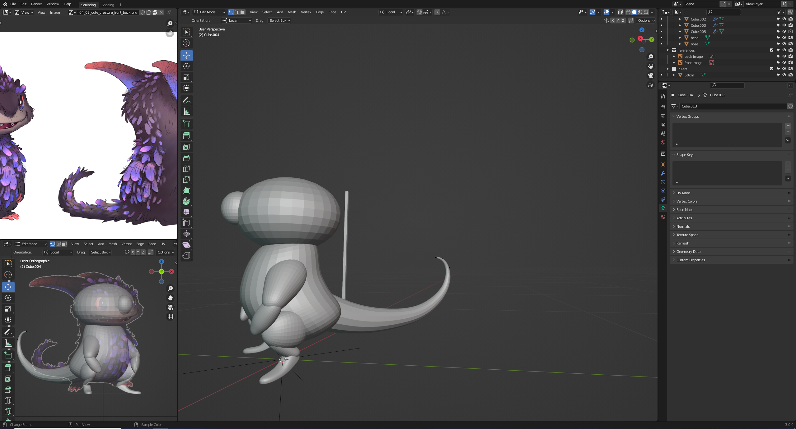
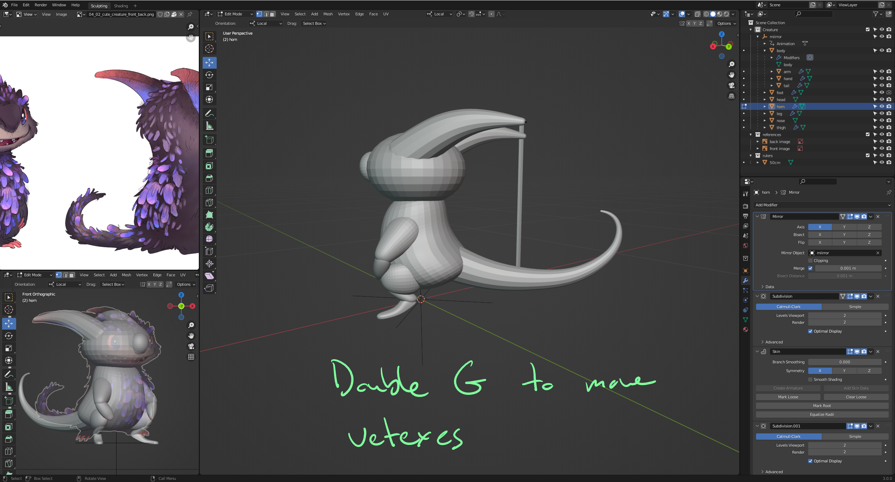

# DEV-15, Limbs and tail
### Tags: [limbs and tail]
### Link: https://academy.cgboost.com/courses/master-3d-sculpting-in-blender/lectures/31190178

    Creating Limbs

    Creating tail

    Creating horn

