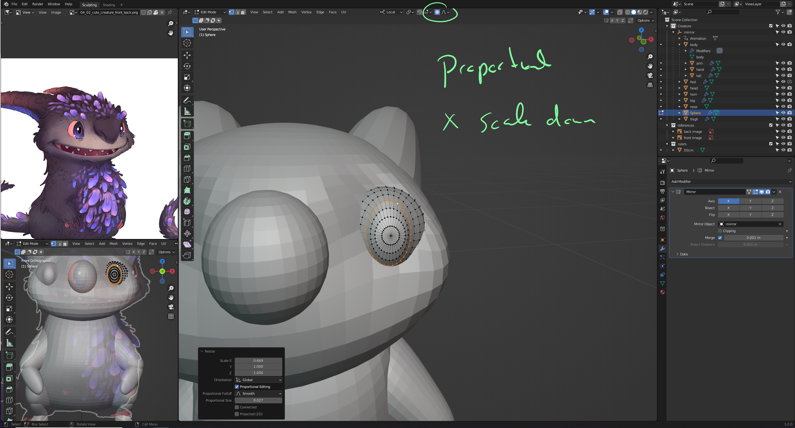
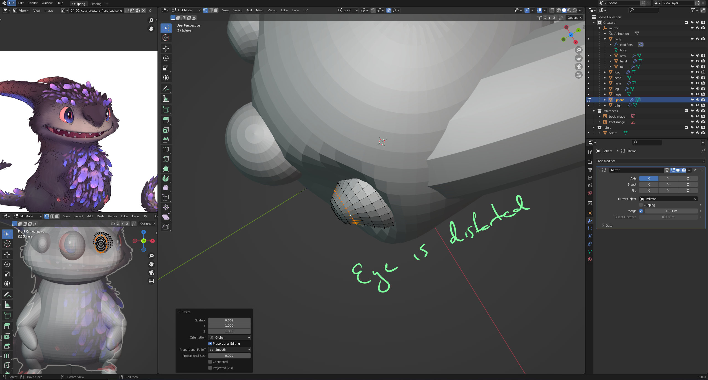
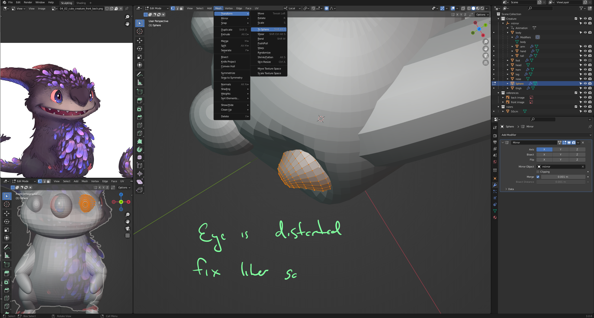
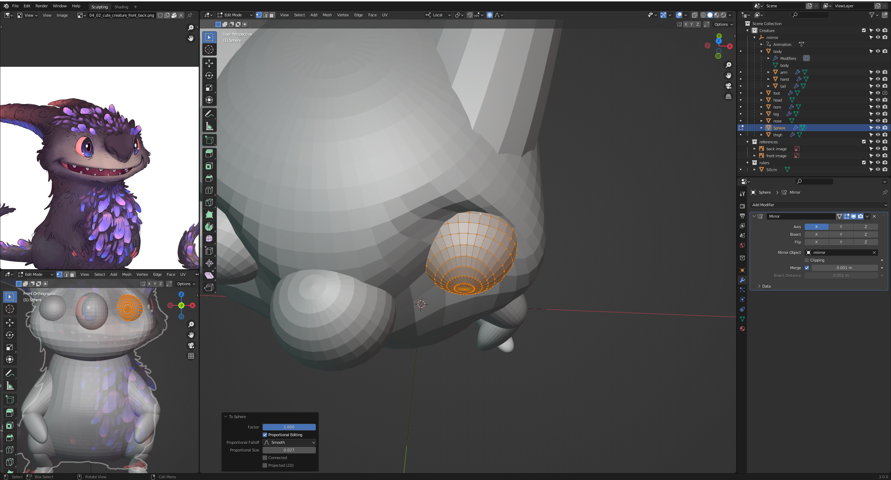
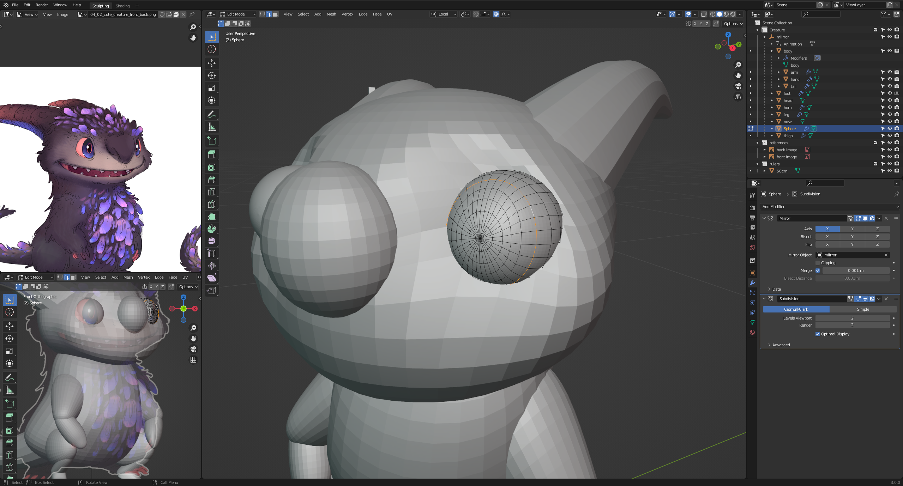
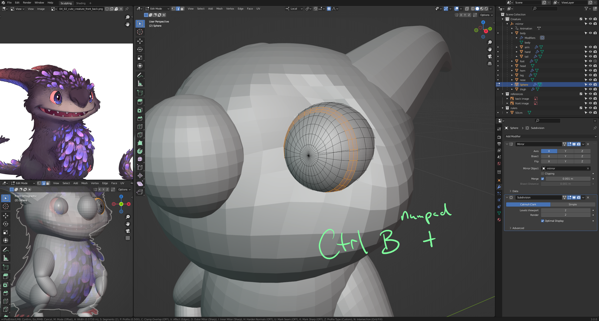
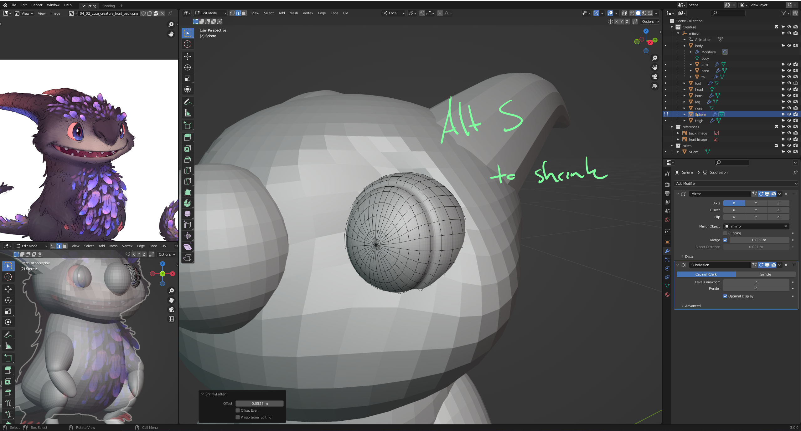
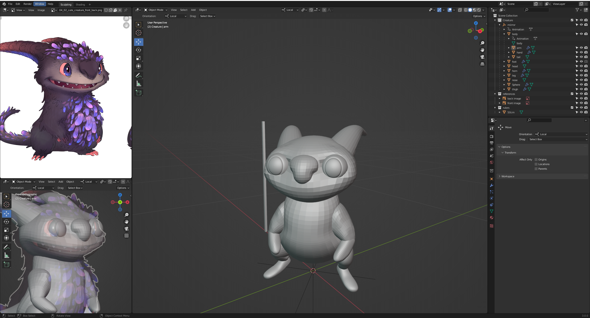

# DEV-16, Mesh Shaping
### Tags: [shaping/ multiple objects]
### Link: https://academy.cgboost.com/courses/master-3d-sculpting-in-blender/lectures/31191708

## Switching meshes

    to switch quickly between multiple objects is Alt + Q

## Working with toSphere to manage the eye

## New way of shrinking

    Alt S

## Model so far 

