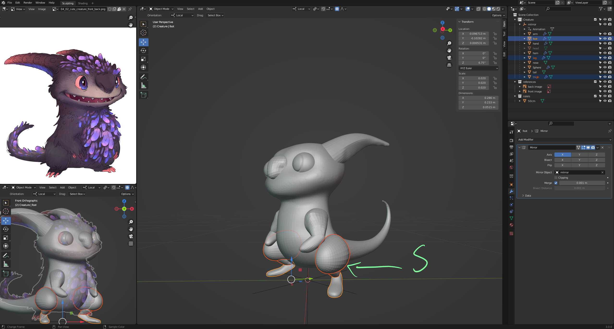

# DEV-17, First Sculpting Layer 
### Tags: [off symmetry]
### Link: https://academy.cgboost.com/courses/master-3d-sculpting-in-blender/lectures/31231409

## Progress

## Off Symmetry

    If you remesh without applying your symmetry can be a bit off as you sculpt, you can fix this by applying your changes in the object menu
    this should make your symmetry sculpt indicator line up with the other side

