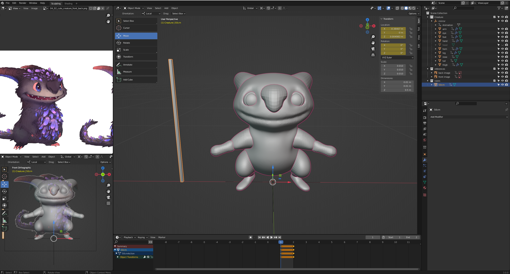
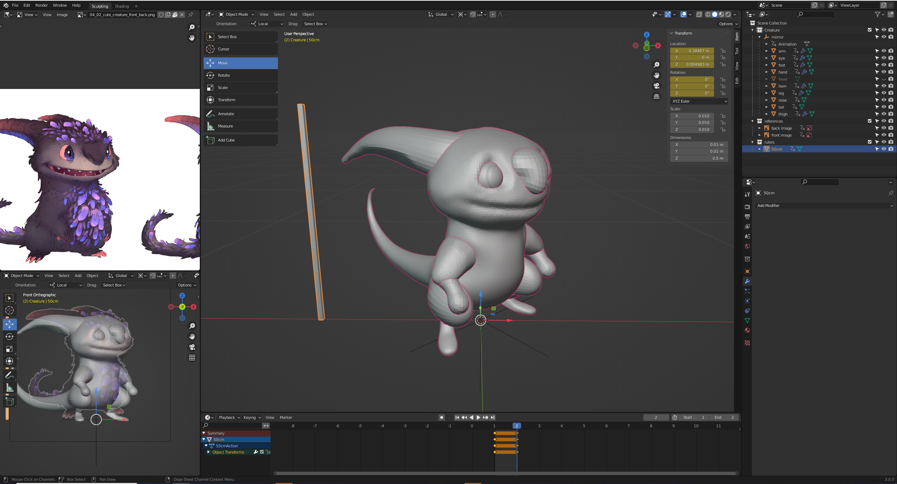
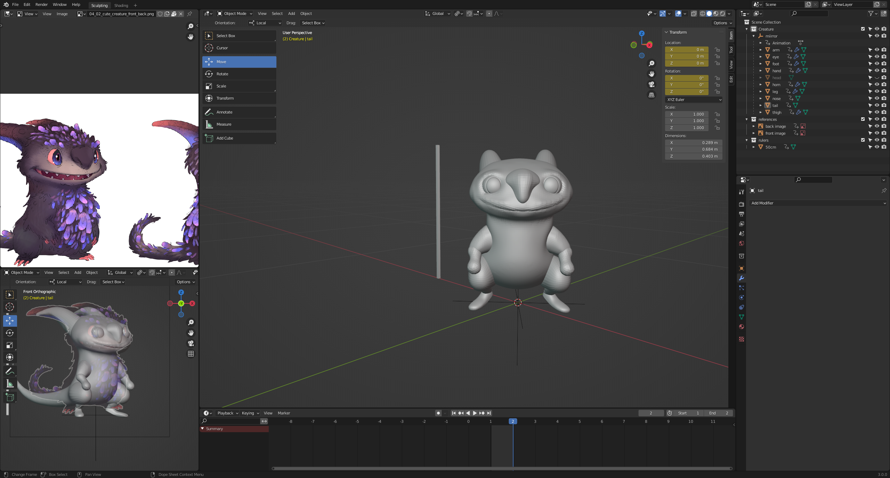
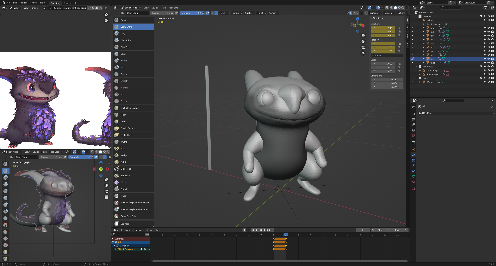
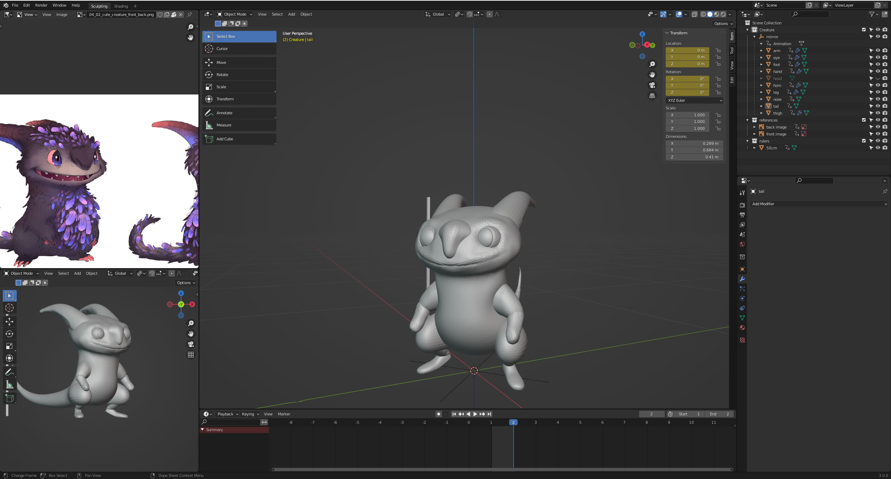

# DEV-18, TPose
### Tags: [Tpose]
### Link: https://academy.cgboost.com/courses/master-3d-sculpting-in-blender/lectures/31231794

    Using a mask to combine with mesh filter :inflate to increase to size of the top of the head slightly

