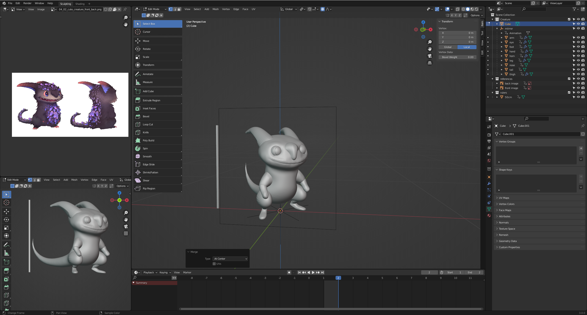

# DEV-19, Claws
### Tags: [skin modifier, snapping]
### Link: https://academy.cgboost.com/courses/master-3d-sculpting-in-blender/lectures/31232801

## Skin modifier workflow for Claws

## Snapping against Faces

    Make sure your element is rotated correctly, it depends on the origin point of the shape.
    Apply the rotation
    Then G to move
    Hold CTRL
    Then drag against the mesh until aligned

