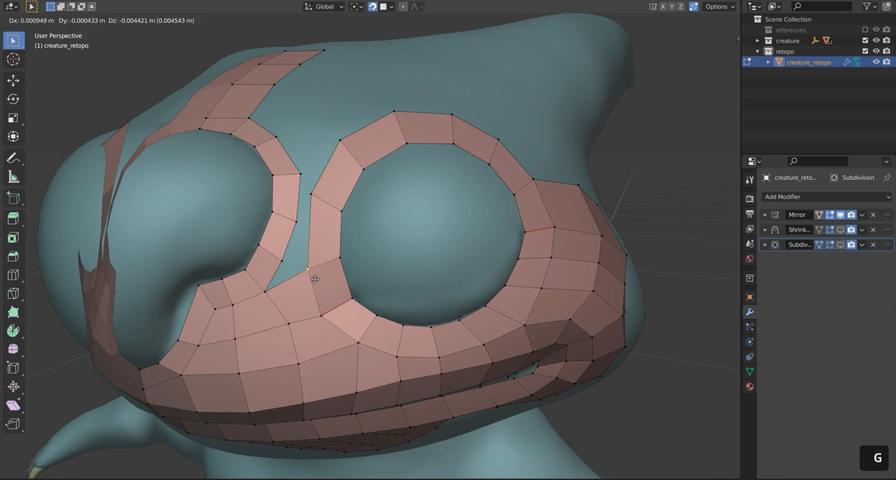

# DEV-22, Retopology
### Tags: [Retopology]
### Link: <https://academy.cgboost.com/courses/master-3d-sculpting-in-blender/lectures/31519761>

## Why not just use our regular sculpts?

    You can for sure just create a full and finished scuplting
    using the voxel remesher or dynamic topology. This is especially the case if you just want to create a static scuplting in a static pose where the surface.

    When the possibility to pose, texture and rig your scuplting later on is not important to for you, then you can skip retopology.

    All of this would be nearly impossible with the raw scupting

## Does it have to be perfect?
    No

