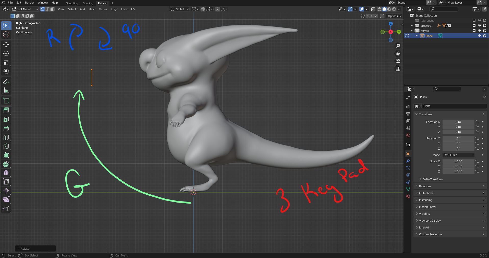

# DEV-23, Retopology Setup
### Tags: [setup, retypo, recolor]
### Link: <https://academy.cgboost.com/courses/master-3d-sculpting-in-blender/lectures/31437641>

## How to prepare Retopology

    Make sure all modifiers are applied (CTRL + A)

    Make sure all parts are joined (CTRL + J) (Actually leave our claws tho)

    Translate everything up (G + Z + Move Up)

    Hide the mirror object with H

## Creating a new Tab

## Adding Geometry

## Our Starting point

    Distinguish between the retypo and the raw mesh

    Allow our faces to snap smoothly

    Make sure the retypo always appears in front

    Add backface culling

    Recalculate and flip normals

    Adding mirroring

    Add a subsurface modifier to check progress. in the end we will use multires modifier

