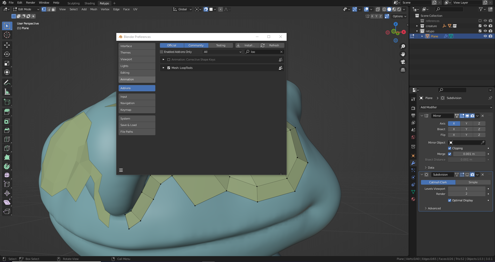
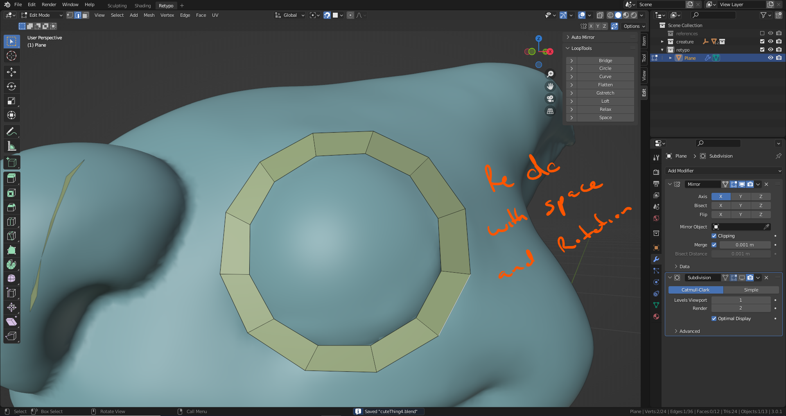

# DEV-24, Speeding up Retypology
### Tags: [retypo]
### Link: <https://academy.cgboost.com/courses/master-3d-sculpting-in-blender/lectures/31445816>

## Adding Geometry on the retypo

    Use shift right click to create this circle then close the gap by highlight the edges to connect with (F)

    To add more loop cuts, use (CTRL R)

## Adding geometry to the eye

    Select the line with (Alt Click)

    Create the grid

    Line the outer part of the nose

    Auto merge vertexes after you drag and drop

    Clean up

## Speeding up workflow

## Add addons through preferences

    Open preferences with F4
    Then Select under addons f2

    Also under preferences get Loop Tools
    (Unrelated but get Auto Mirror too)

    Evenly space the distance between the vertices

## Redo of Eye

