# DEV-27, Retypology, the Head Pt2
### Tags: [retypo, head, shrink wrap]
### Link: <https://academy.cgboost.com/courses/master-3d-sculpting-in-blender/lectures/31823834>

## Filling in the gaps by mouth

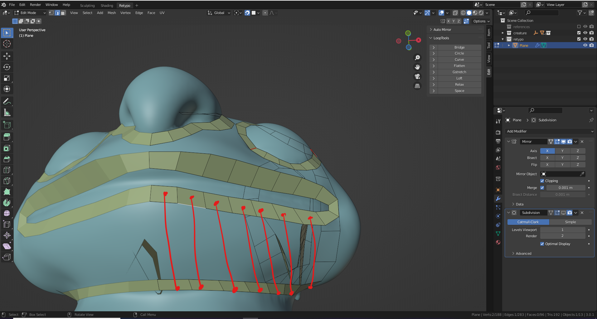

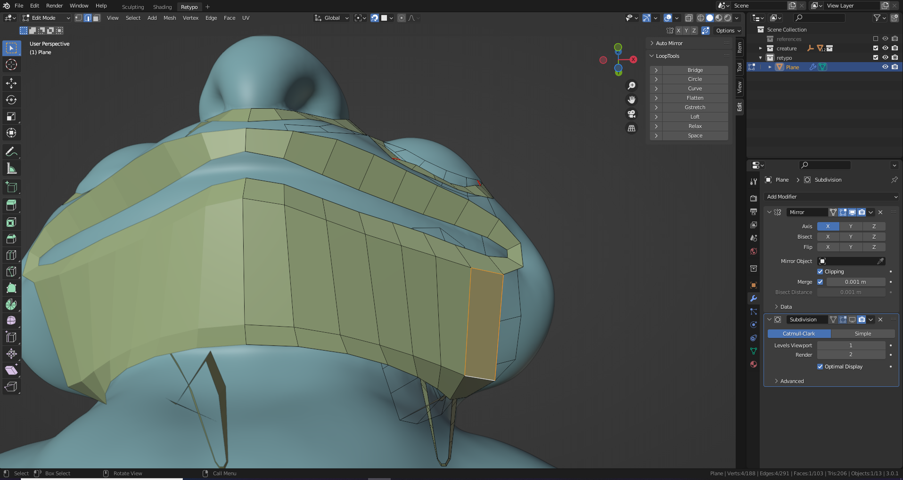

## Adding more encloning at head

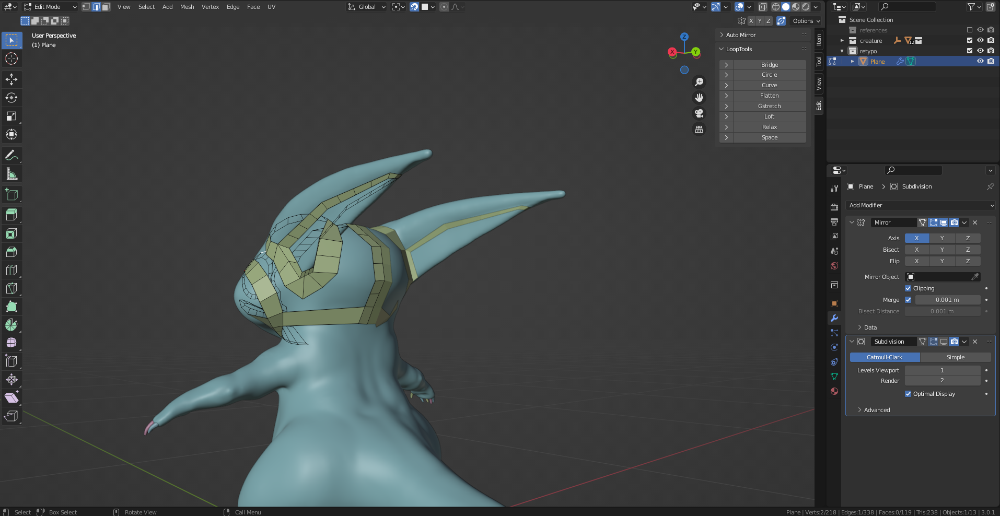

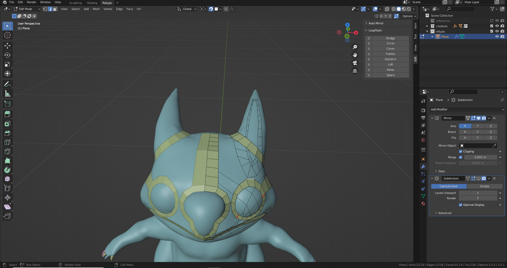

## Using shrink wrap modifier

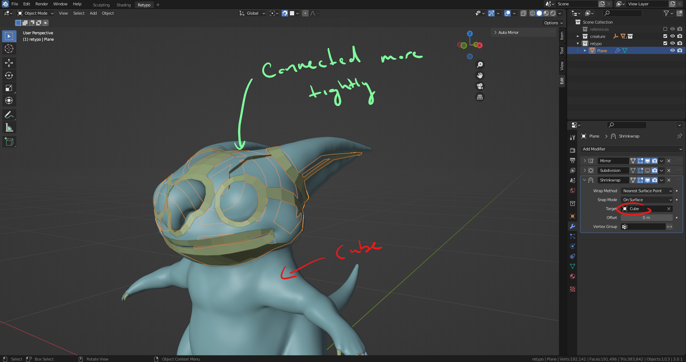

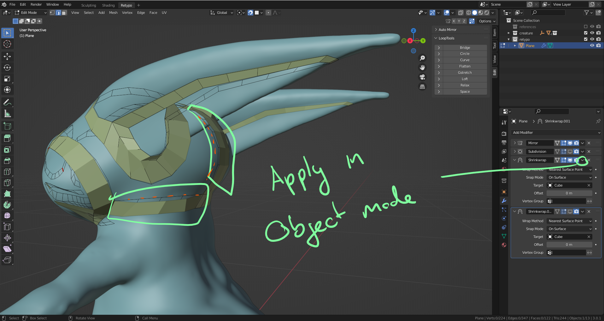

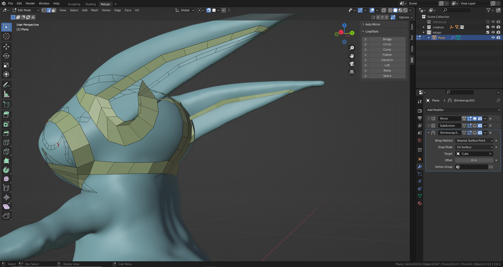

## Filling in the face

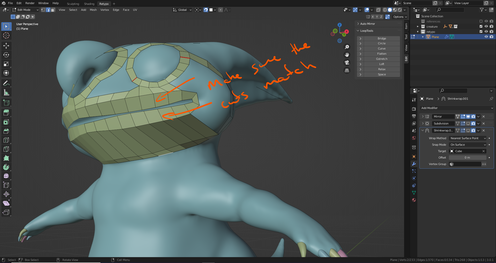

## Filling in the face P2

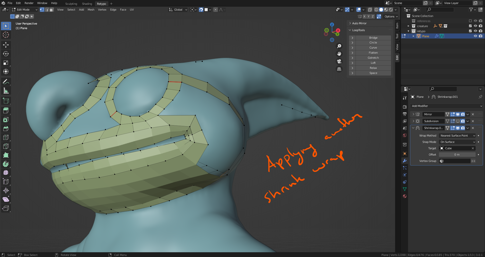

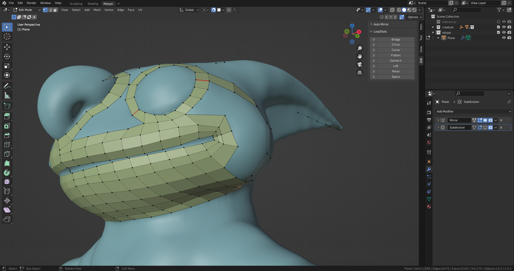

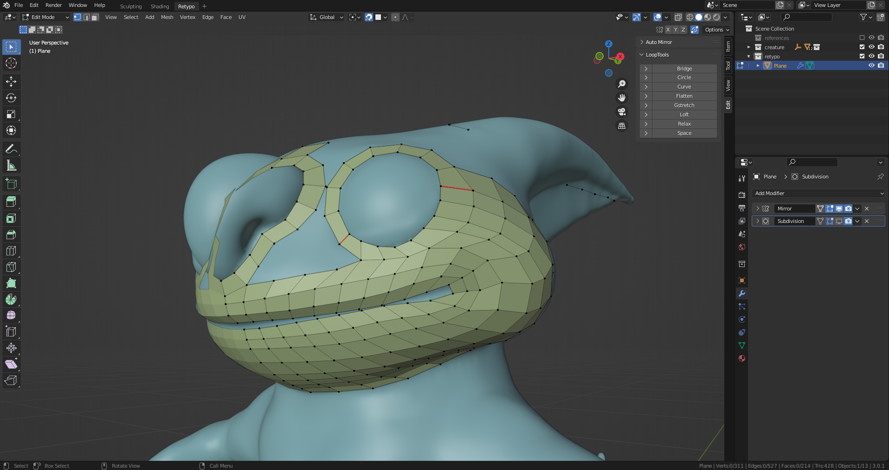

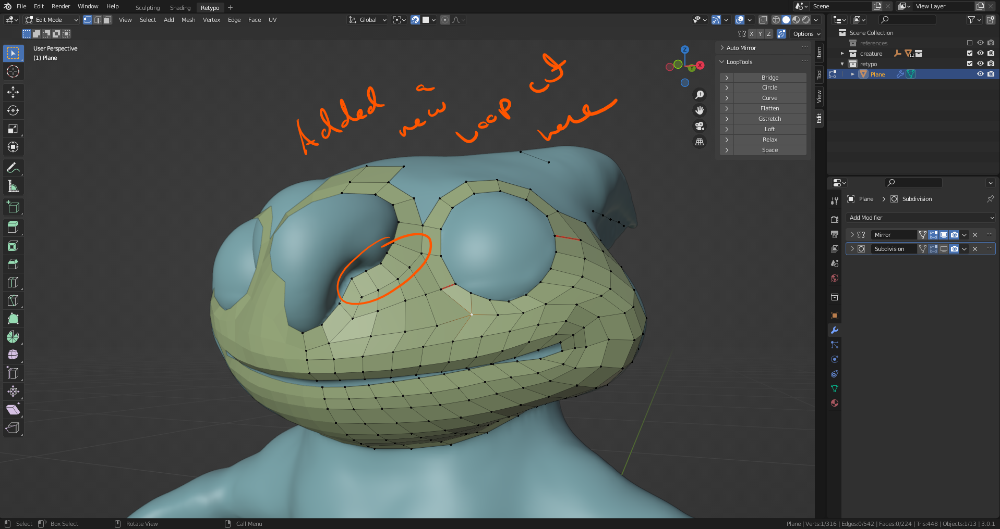

## End

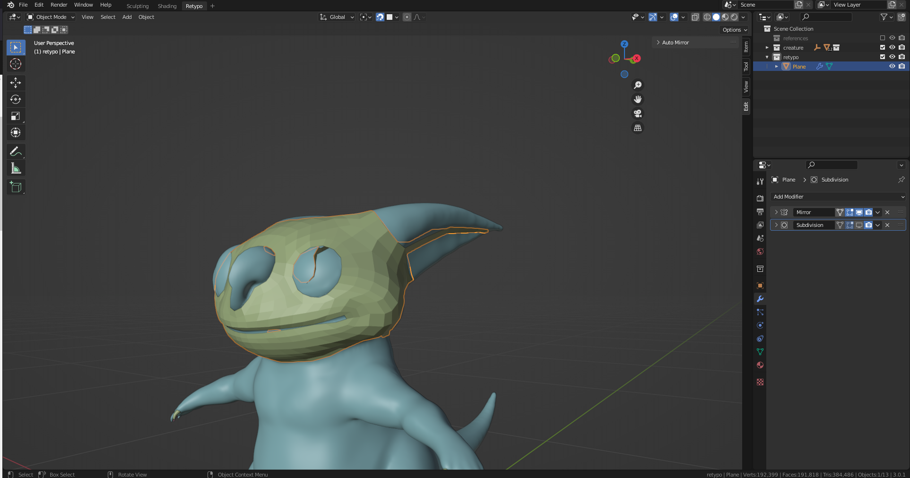

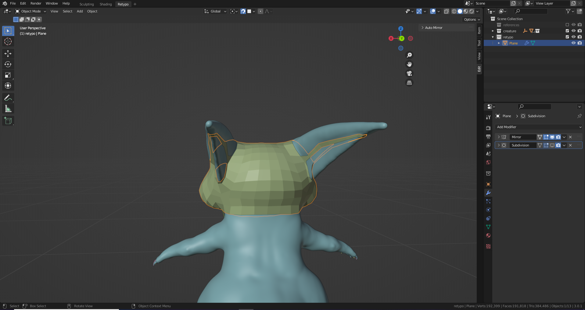