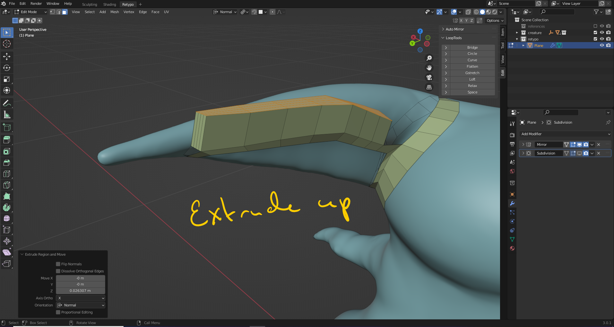

# DEV-28, Retypology, the Head Pt3
### Tags: [retypo, head, inverting]
### Link: <https://academy.cgboost.com/courses/master-3d-sculpting-in-blender/lectures/31823837>

## Continued Progress on body

## The eyes

    I needed to turn off the auto wrap and snapping behavior for this to project properly along its local z axis.

## Hiding

    How to invert selection to hide stuff:

## The Horns

