# DEV-29, Retypology, the Body Pt1 and Pt2
### Tags: [retypo, grid]
### Link: [<https://academy.cgboost.com/courses/master-3d-sculpting-in-blender/lectures/31824430>,<https://academy.cgboost.com/courses/master-3d-sculpting-in-blender/lectures/31824737>]

## Create Rings

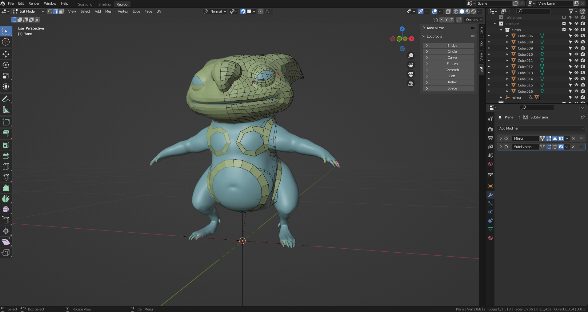

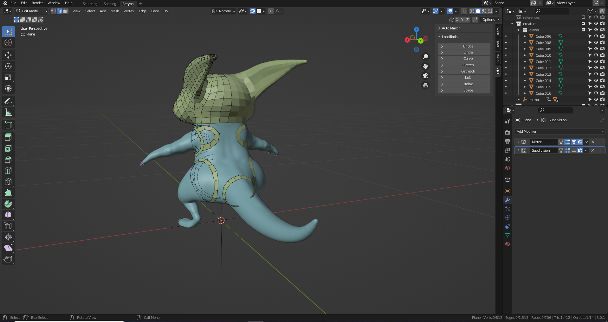

## Fill in Gaps

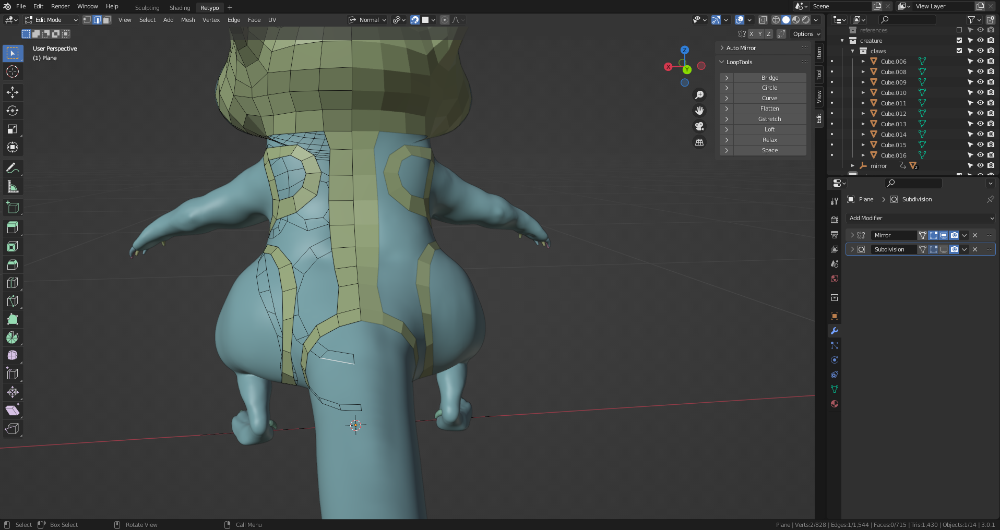

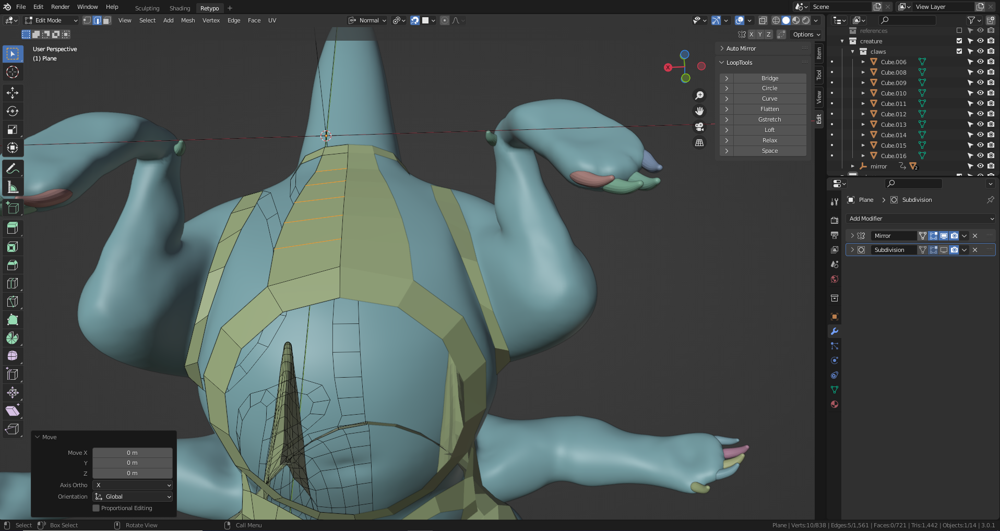

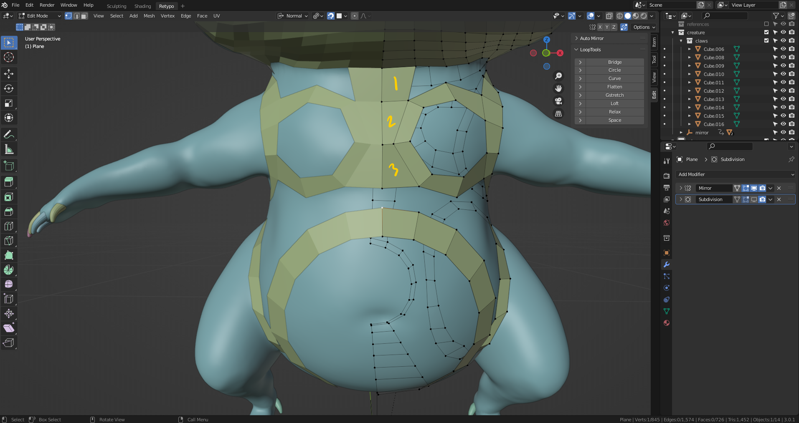

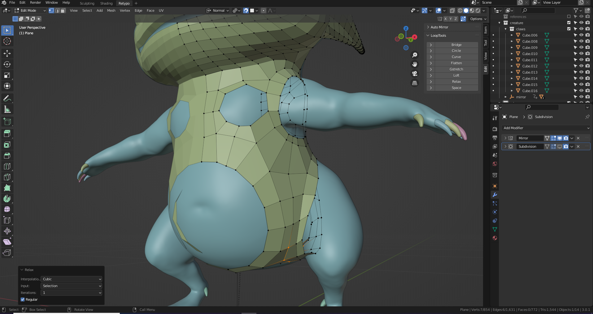

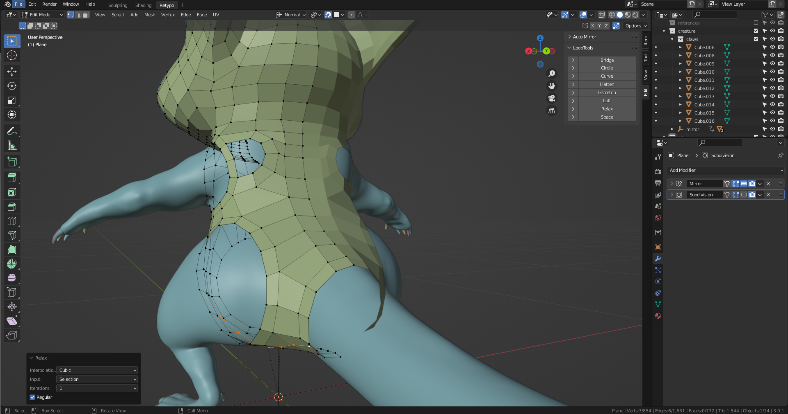

## Fill in Circles

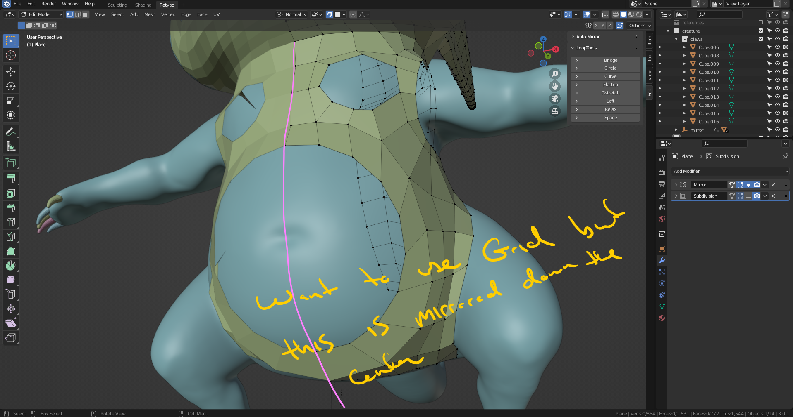

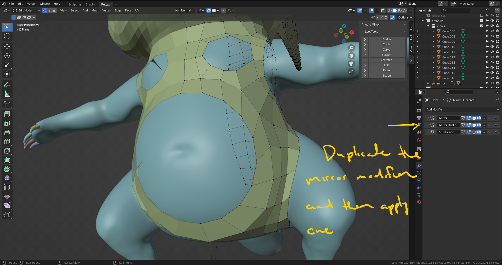

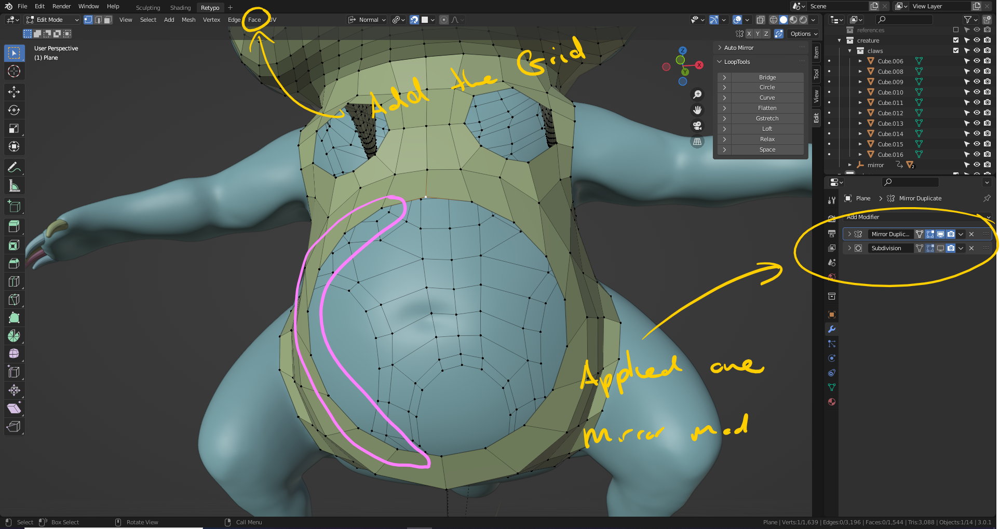

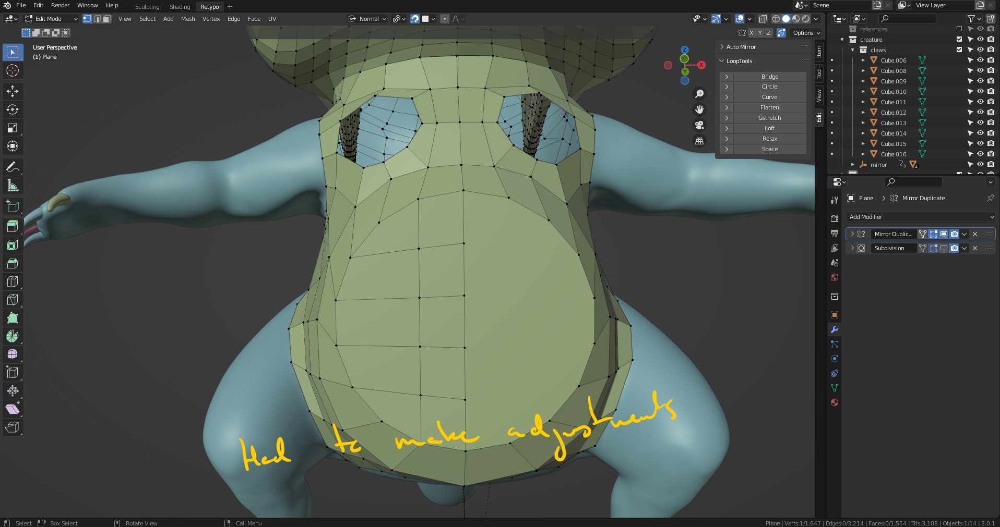

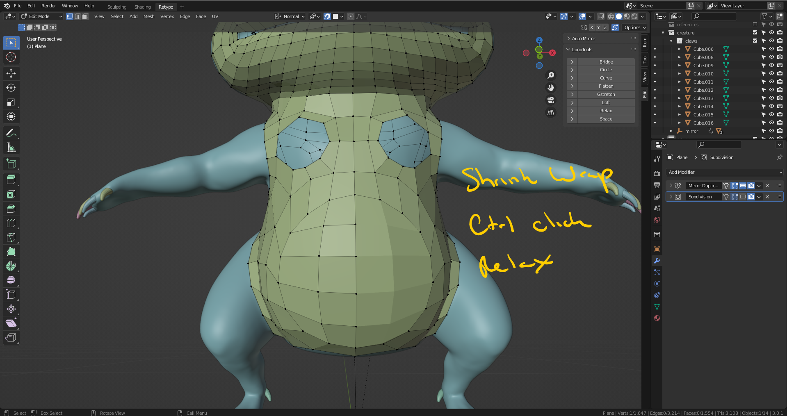

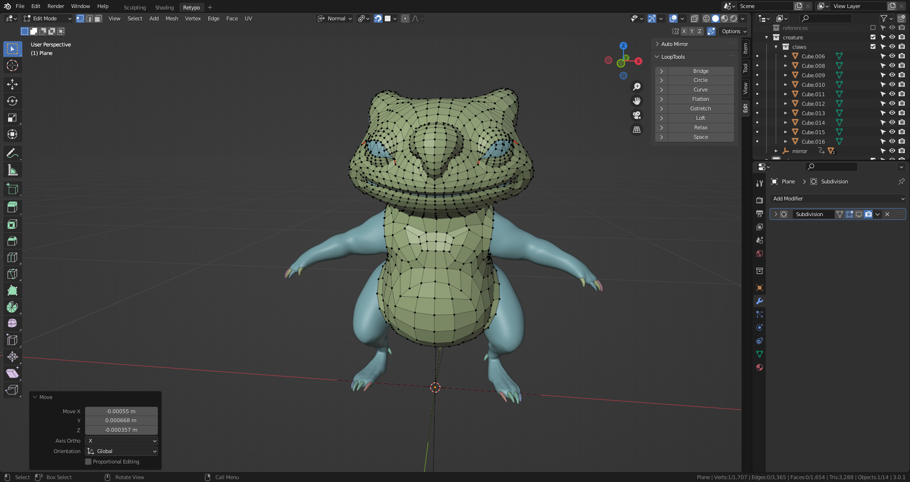