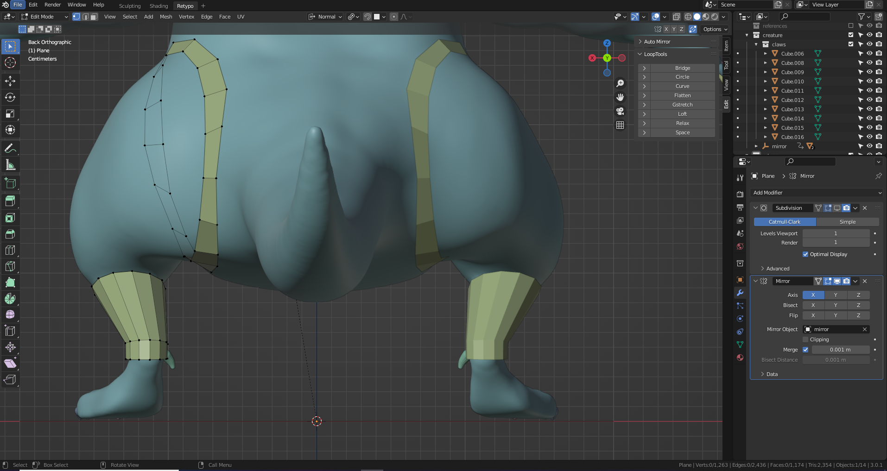
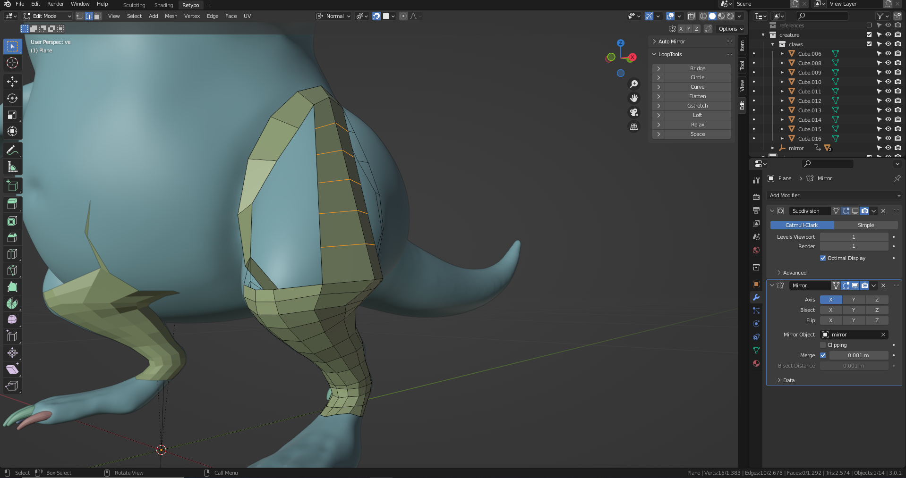

# DEV-30, Retypology, the Limbs Pt1
### Tags: [retypo]
### Link: <https://academy.cgboost.com/courses/master-3d-sculpting-in-blender/lectures/31824927>

## Regain the mirror modifier

## Create retypo for arms

## Create retypo for tail

## Create retypo for legs

