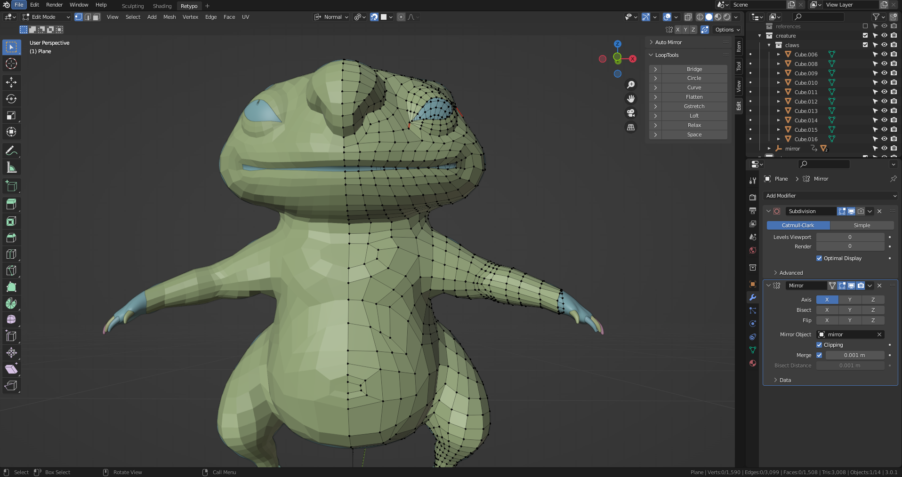
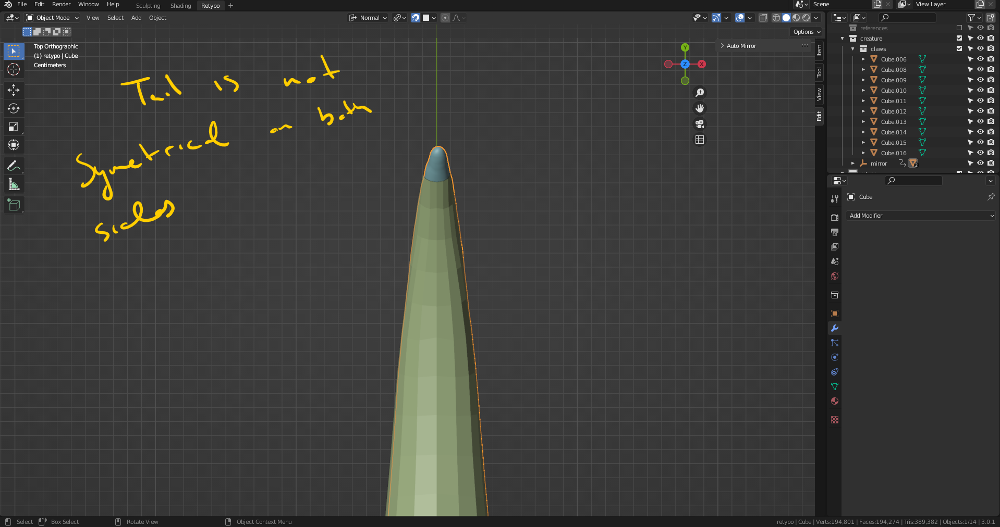
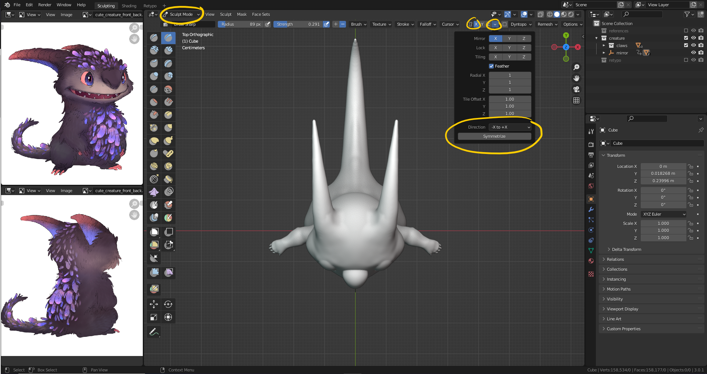
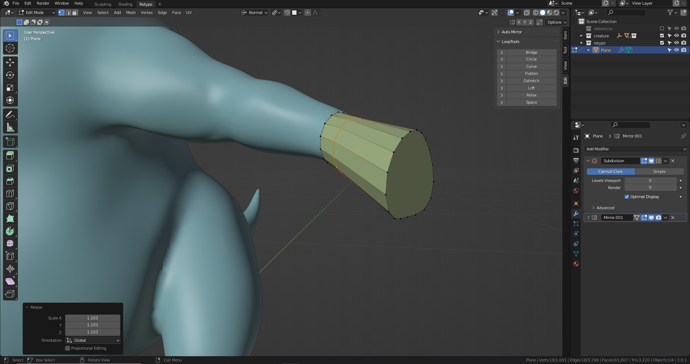
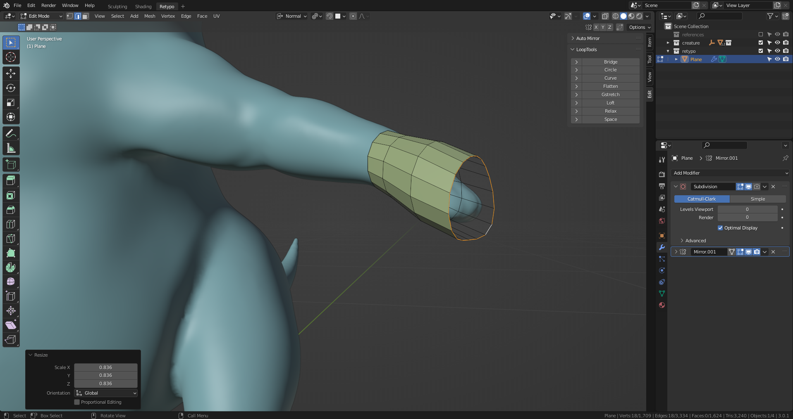
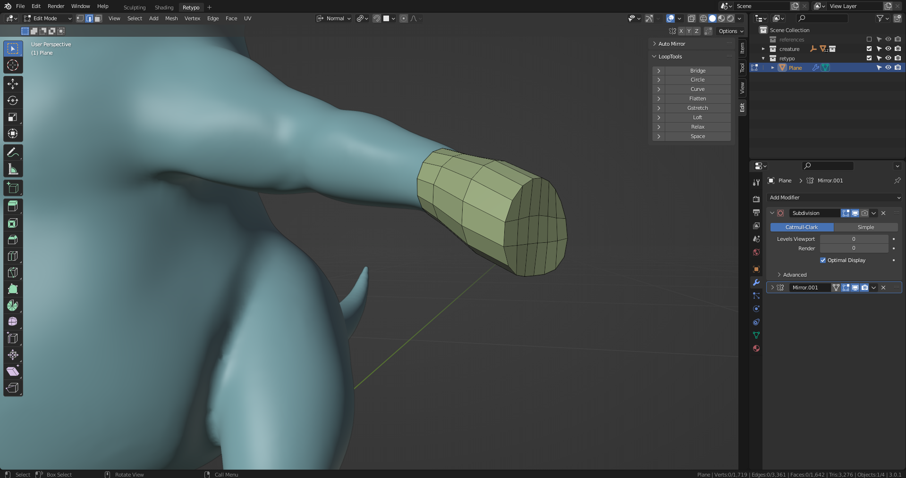
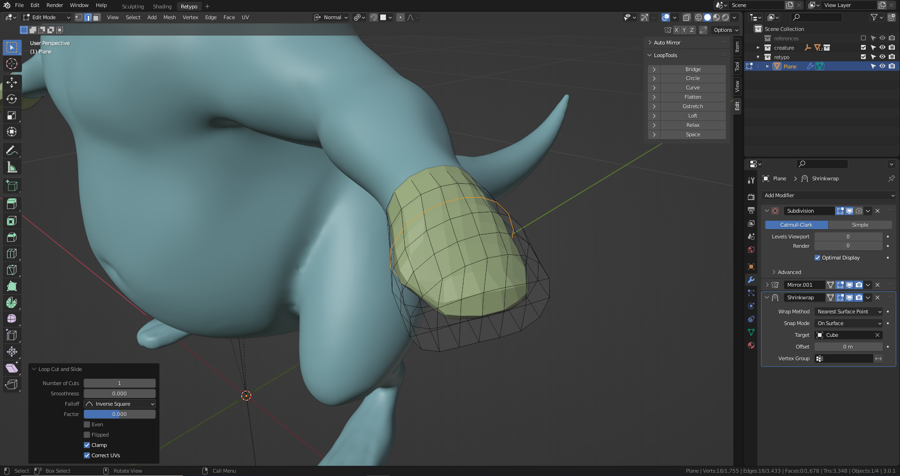
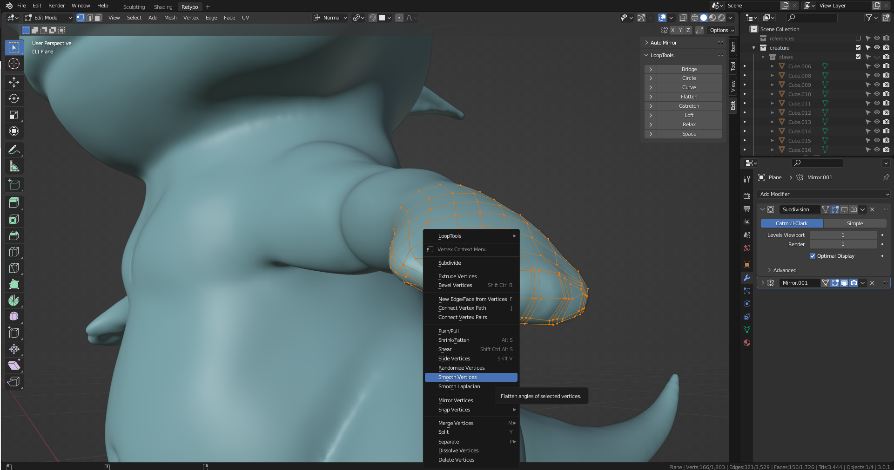
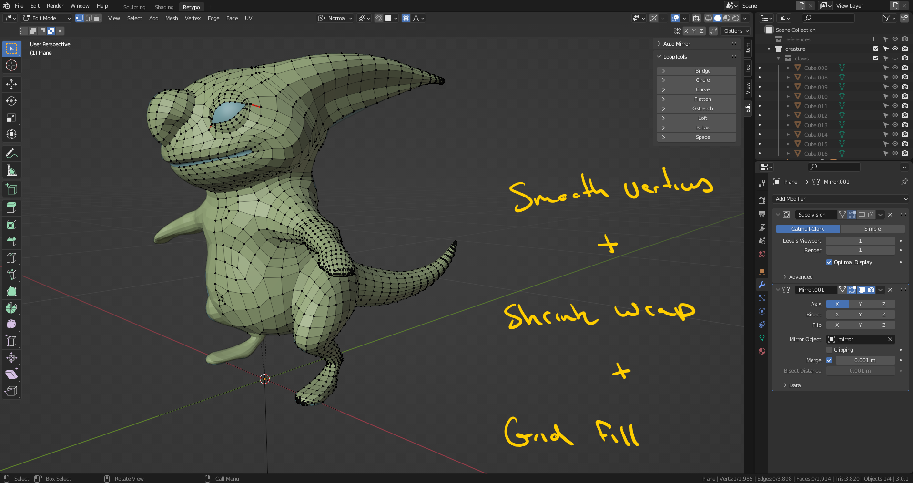
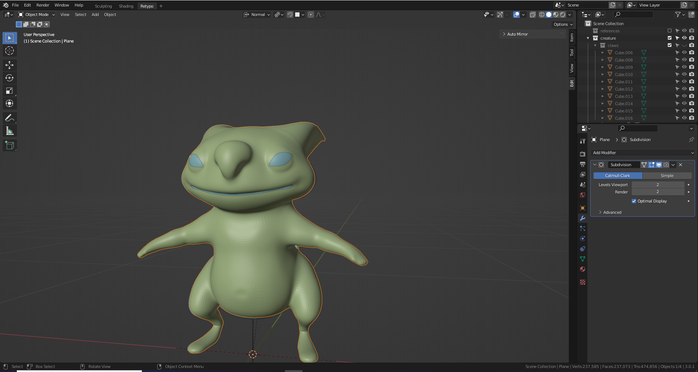

# DEV-30, Retypology, the Limbs Pt2
### Tags: [retypo, grid fill, smooth verticies, shrink wrap]
### Link: <https://academy.cgboost.com/courses/master-3d-sculpting-in-blender/lectures/31824937>

## Retypo of Chest again

## Complete the tail tip

## Complete the hands

## Completed the feet in a similar way to hands

## Output

