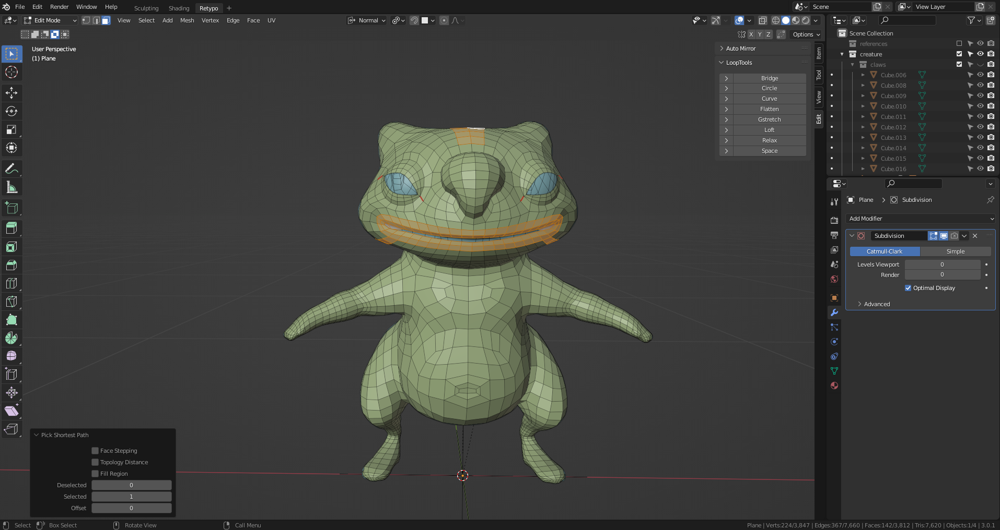
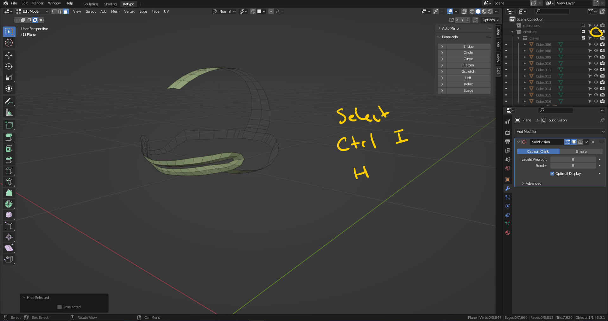
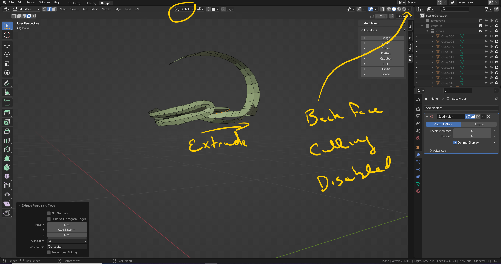
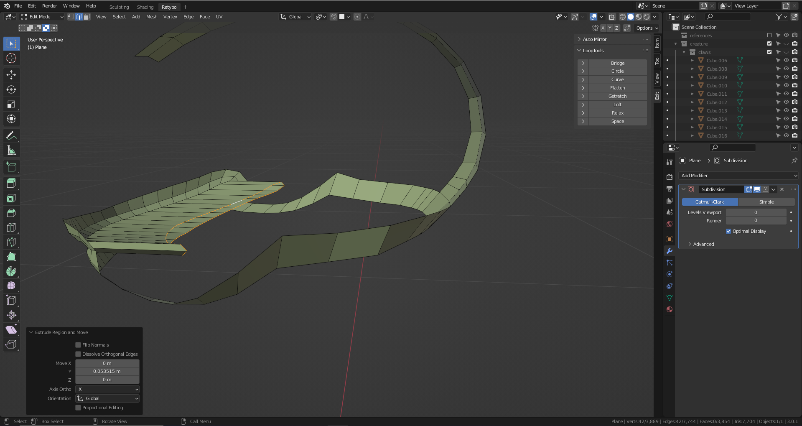
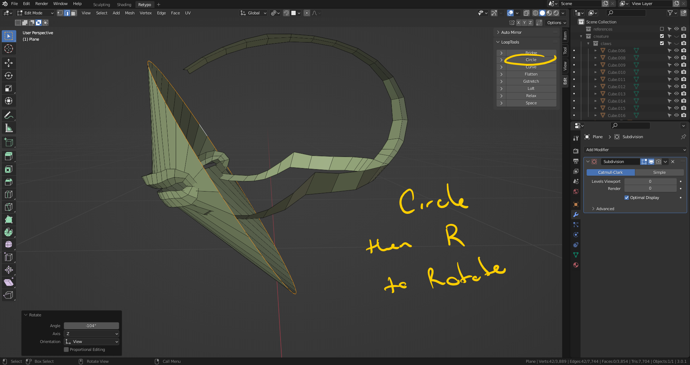
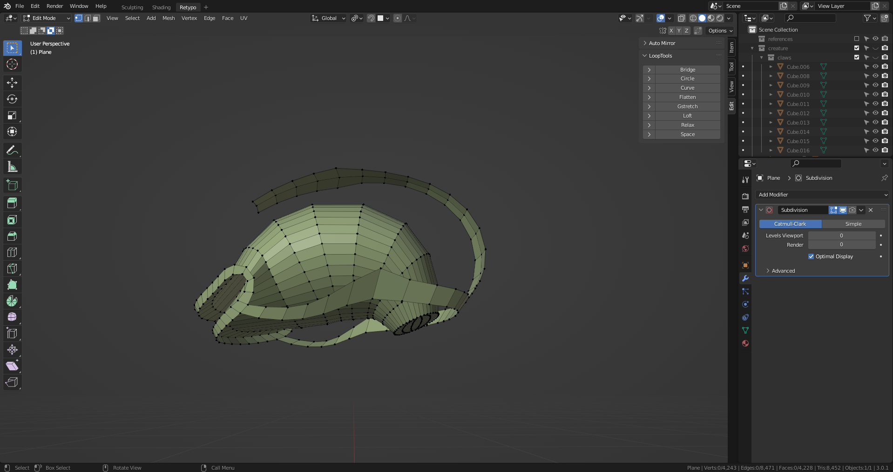
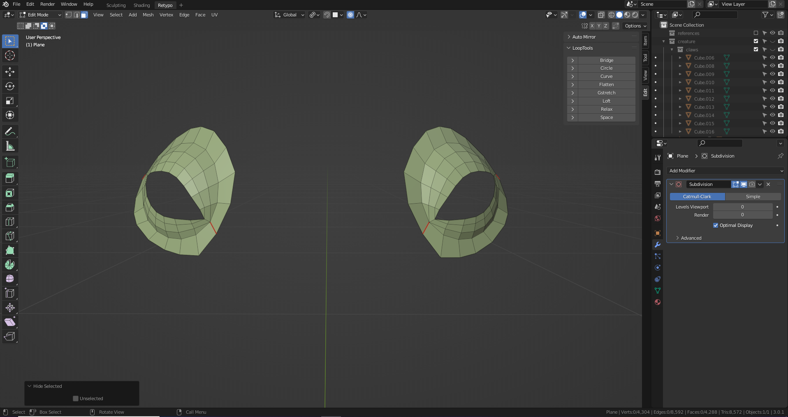
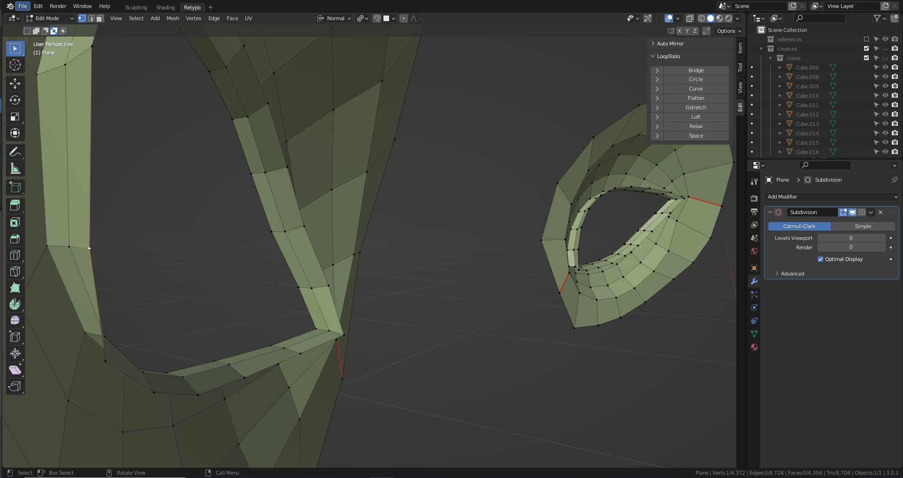
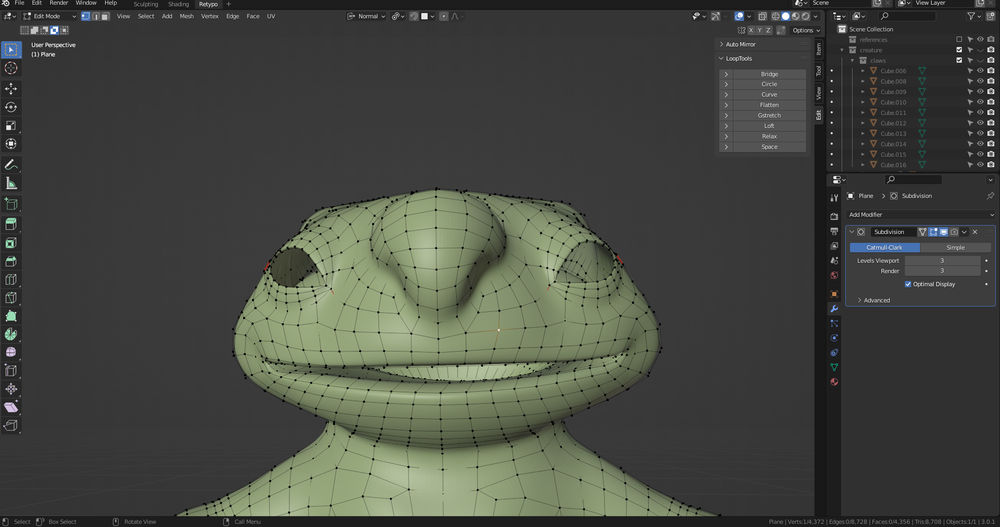
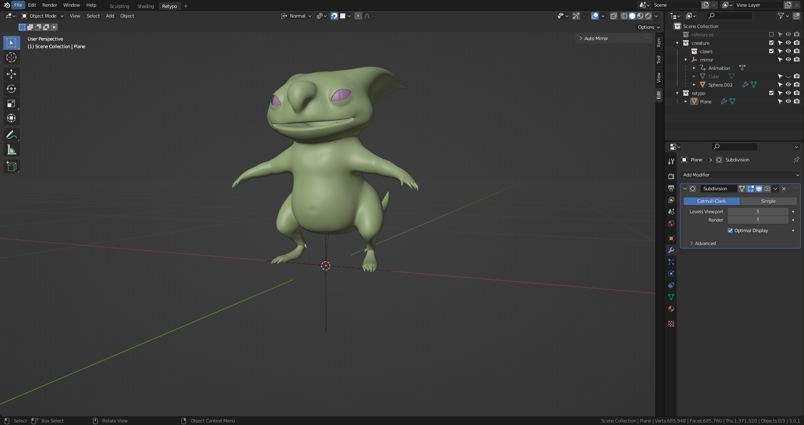

# DEV-32, Creating the eyes and mouth
### Tags: [retypo]
### Link: <https://academy.cgboost.com/courses/master-3d-sculpting-in-blender/lectures/32099705>

## Creating the mouth

## Creating eye lids

## reducing geometry in the claws and joining them

