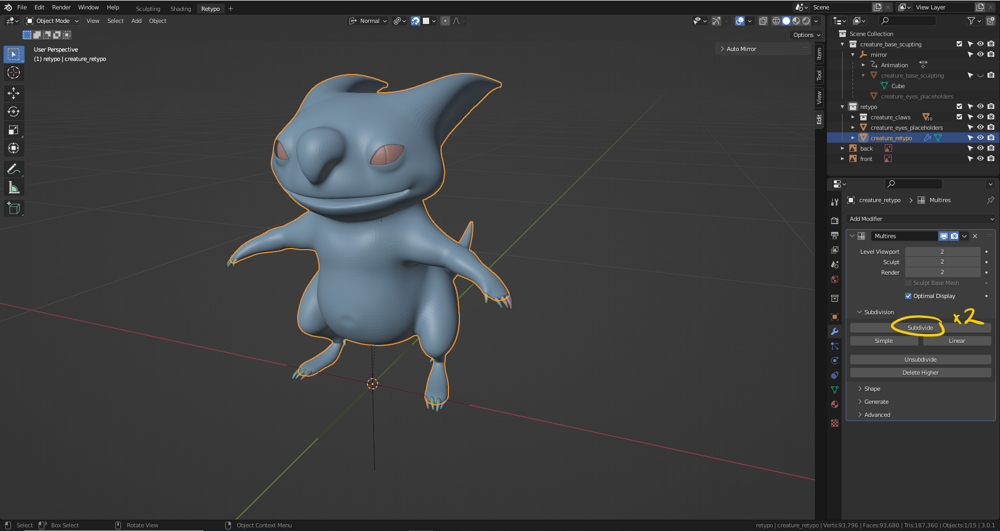
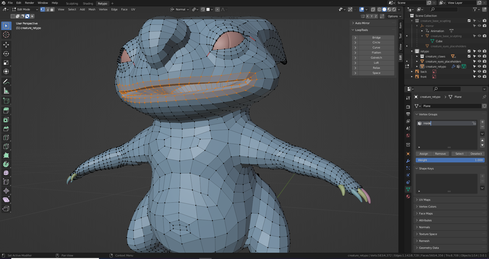
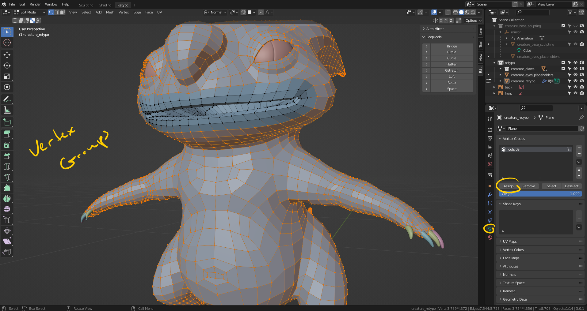
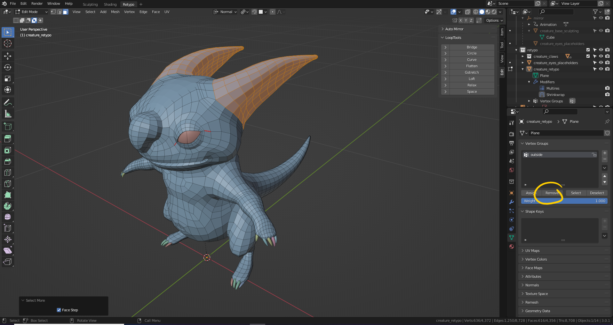
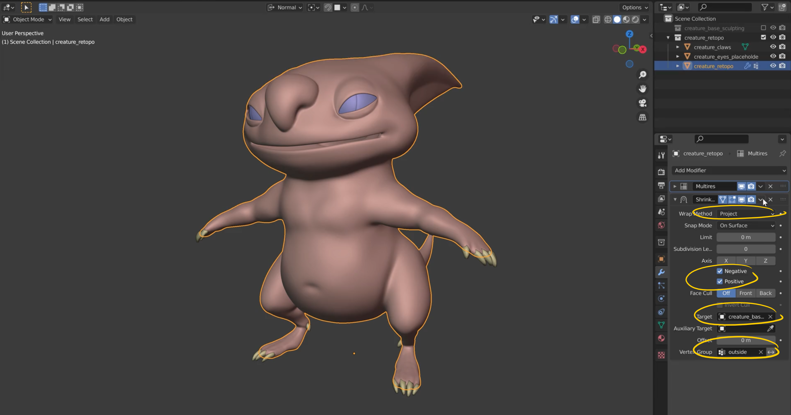
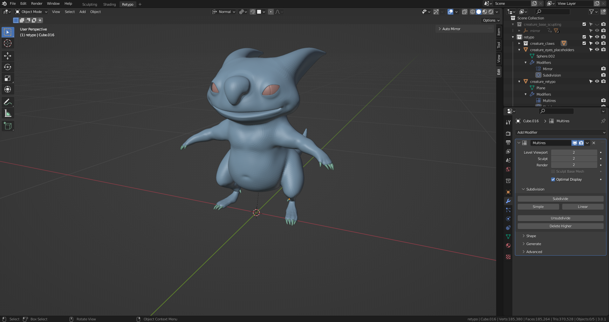

# DEV-33, Multires Modifier Projection
### Tags: [multires, shrinkwrap, vertex groups]
### Link: <https://academy.cgboost.com/courses/master-3d-sculpting-in-blender/lectures/32100185>

## select the vertexes in the mouth then invert

    We will make this a vertex group called outside

## Remove these from the vertex group

    Some of the extra details like the wobbly horns we dont was to carry over in the projection

    Shrink wrap settings

## Final output

