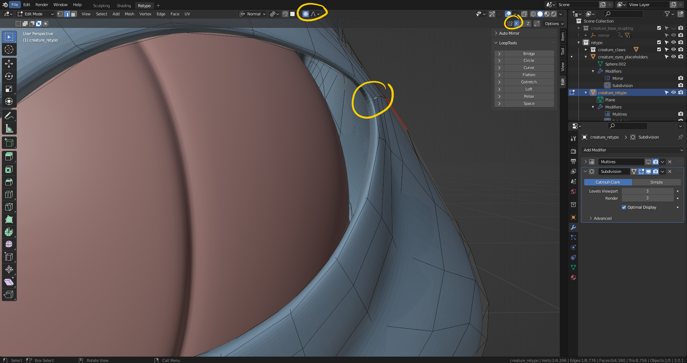
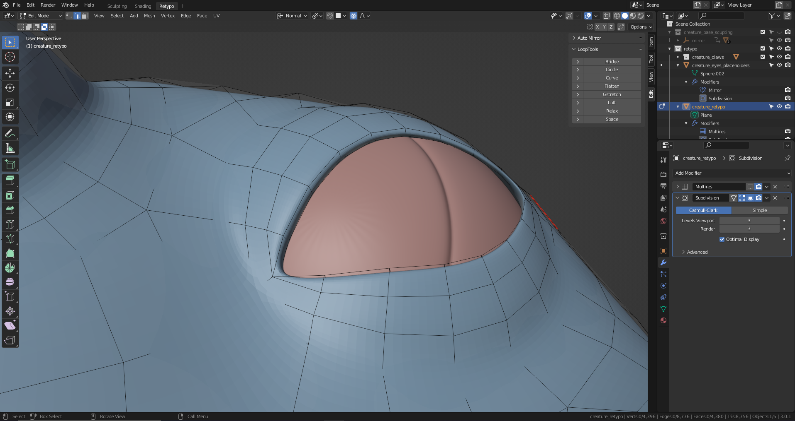
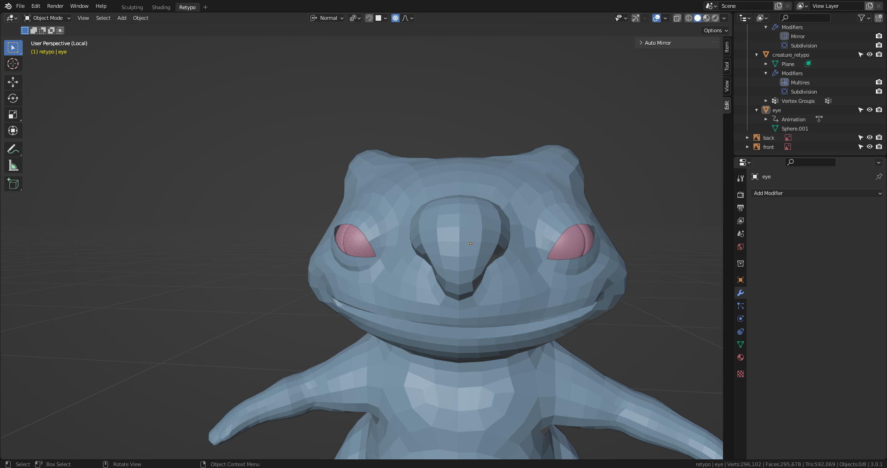
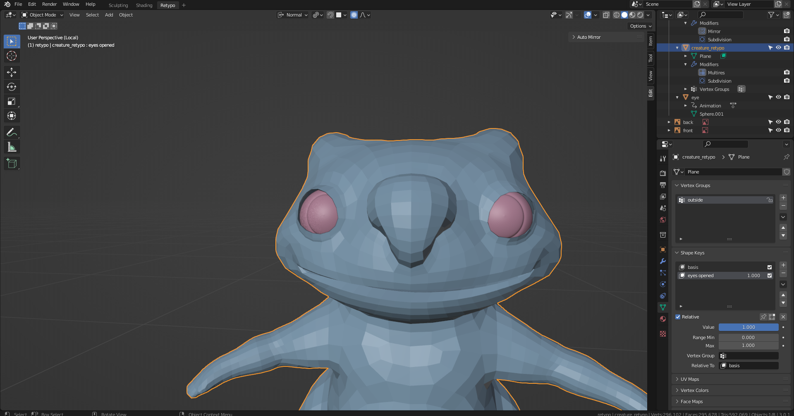
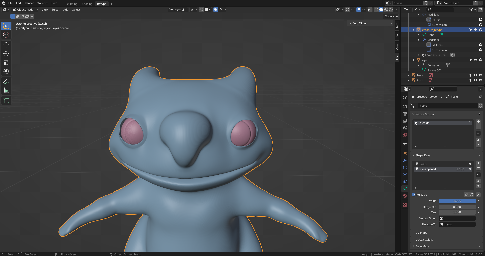
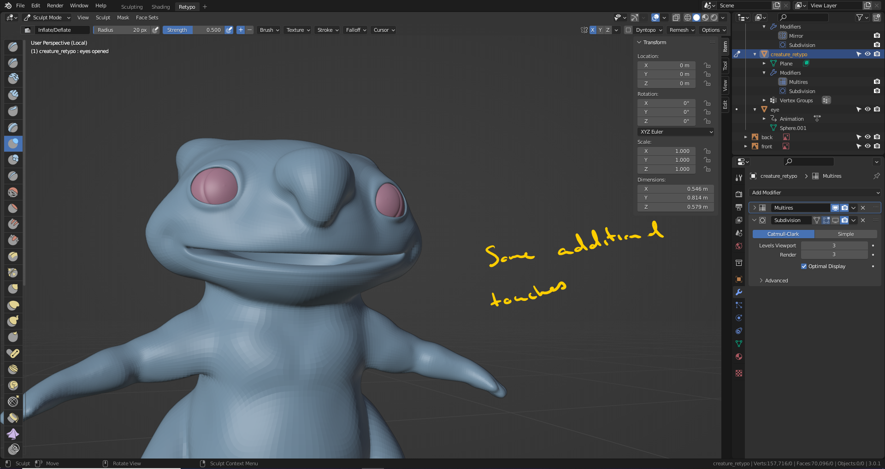
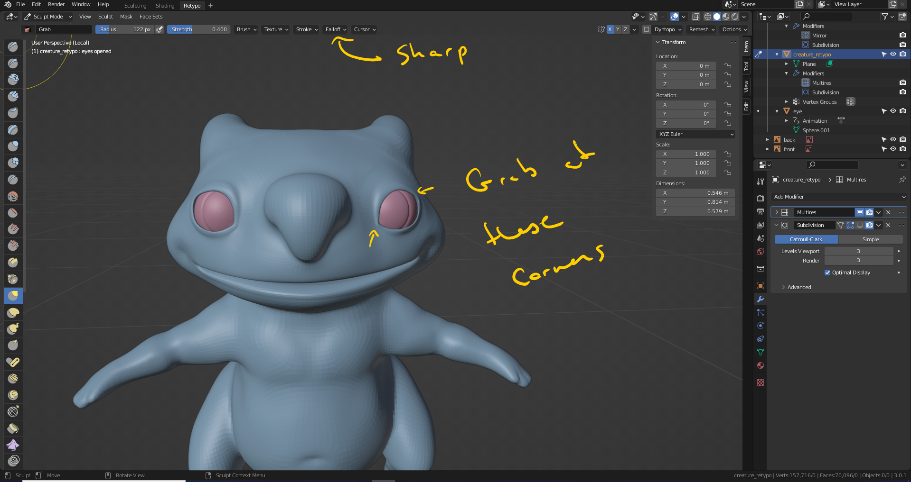
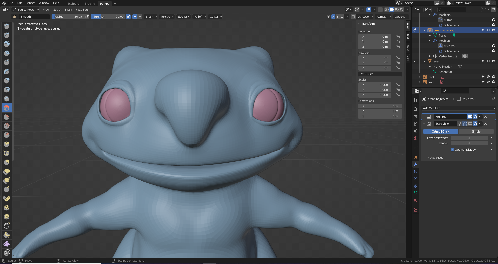

# DEV-34, Opening the Eyes
### Tags: [Shape Keys]
### Link: <https://academy.cgboost.com/courses/master-3d-sculpting-in-blender/lectures/32647632>

## Checking gaps

    Wanna make sure that there is not gaps between the eyes and the eye lid

## Using Shape Keys to keep deformations we make

