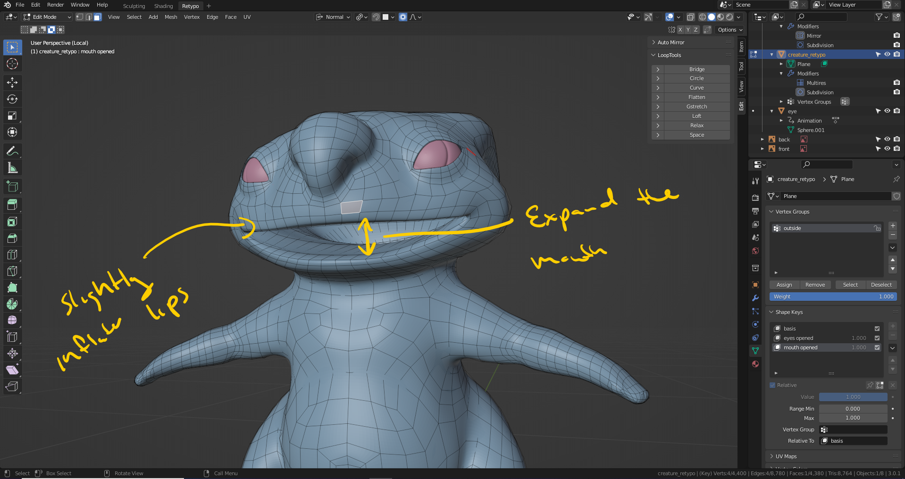
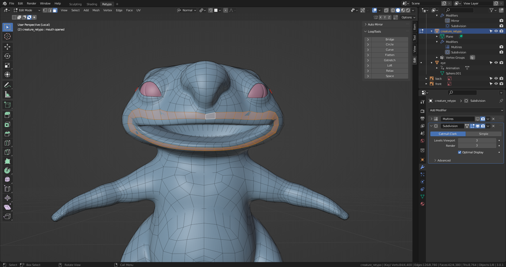
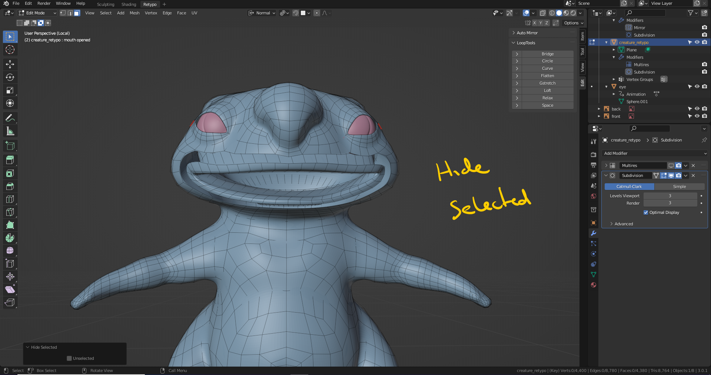
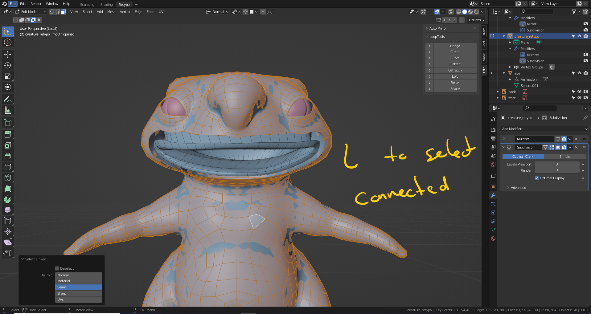
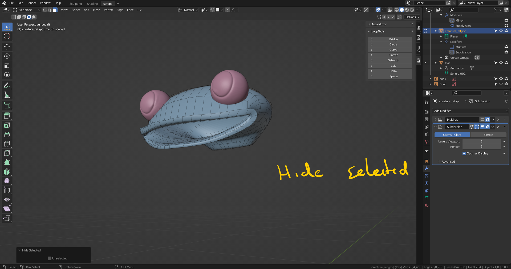
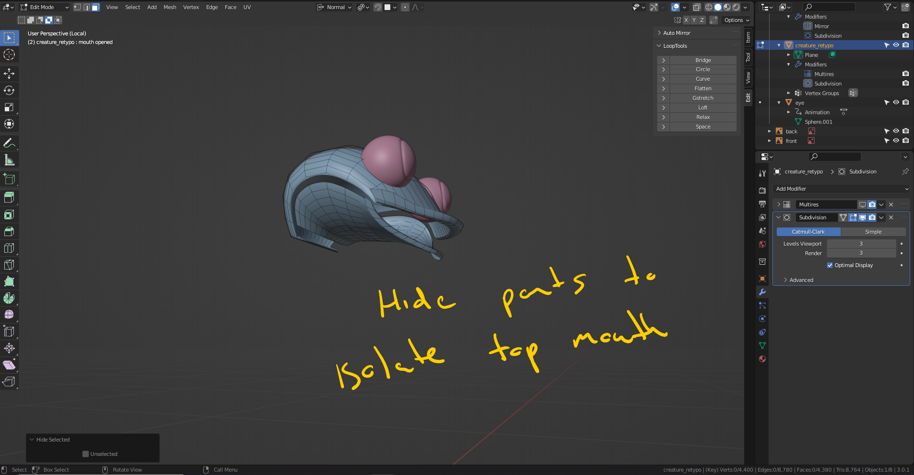
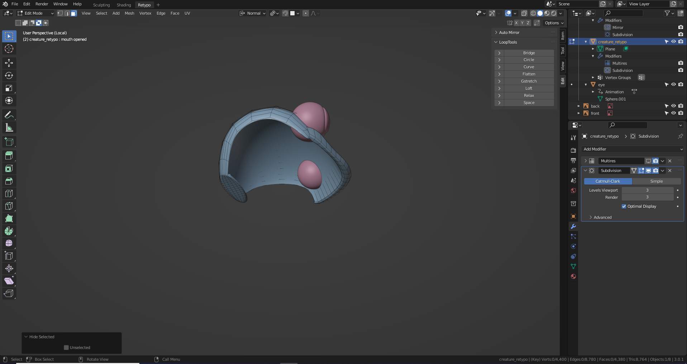
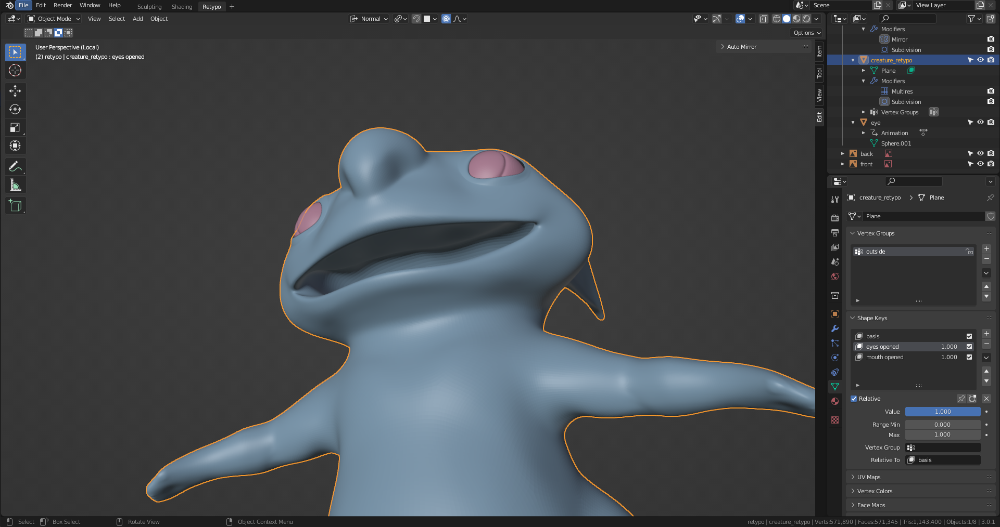

# DEV-35, Opening the Mouth
### Tags: [scupting, hiding, L, symmitrize]
### Link: <https://academy.cgboost.com/courses/master-3d-sculpting-in-blender/lectures/32648372>

## Opening the mouth

## Adding more geometry to the mouth roof

