# DEV-37, mouth details
### Tags: [scuplting, meshfilter]
### Link: <https://academy.cgboost.com/courses/master-3d-sculpting-in-blender/lectures/32674570>

## Applying modifiers

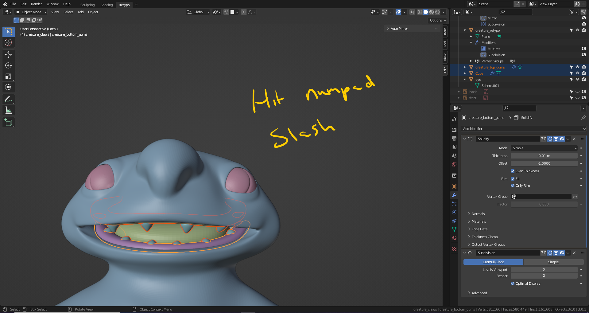

## Gums and teeth

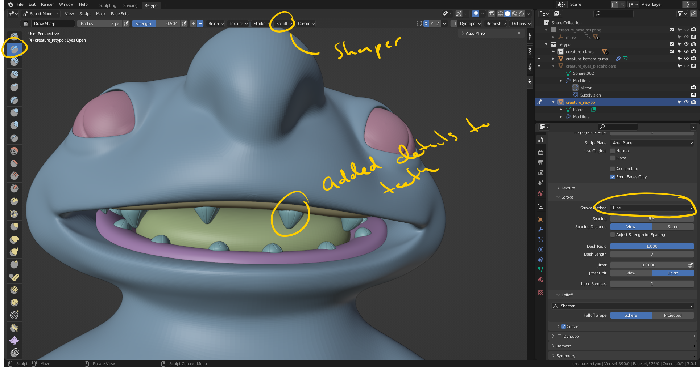

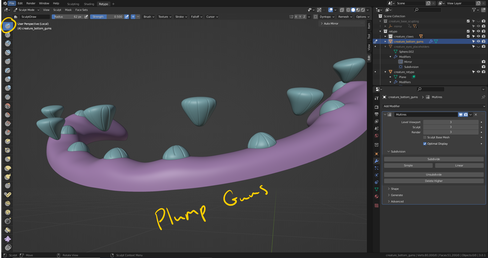

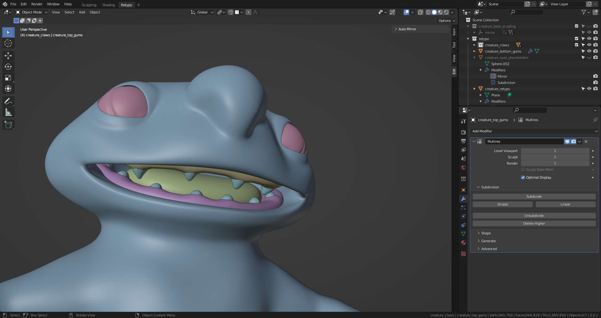

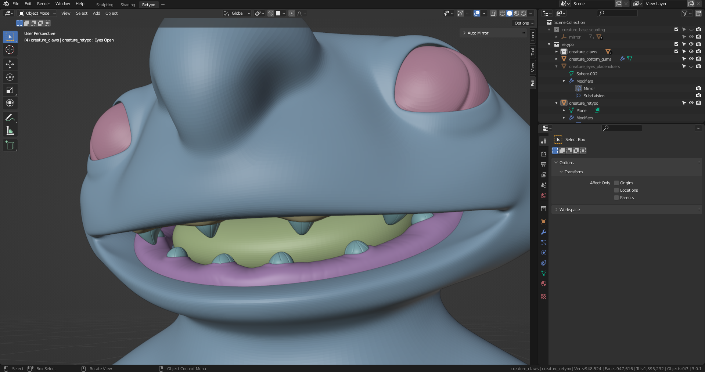

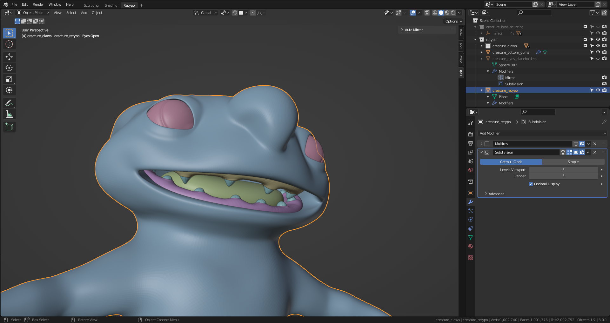

## Tongue details

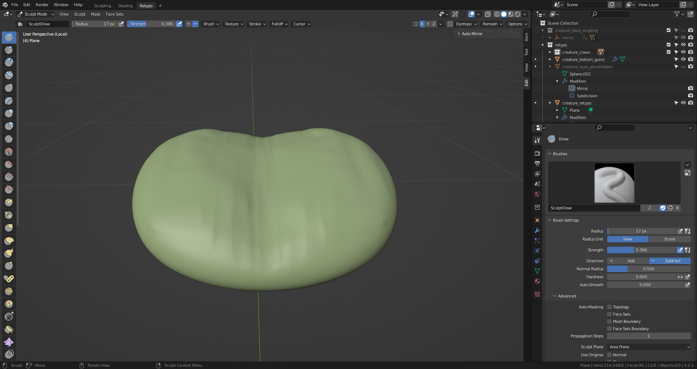

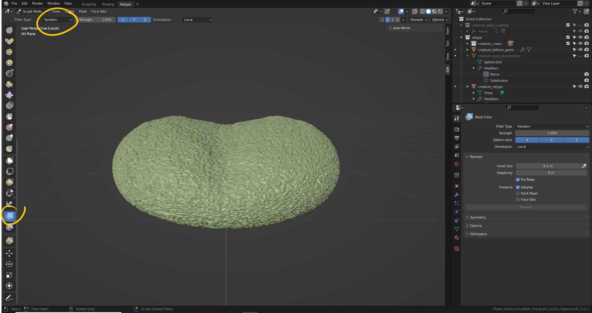

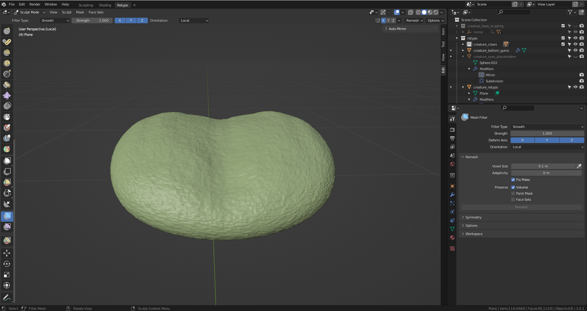

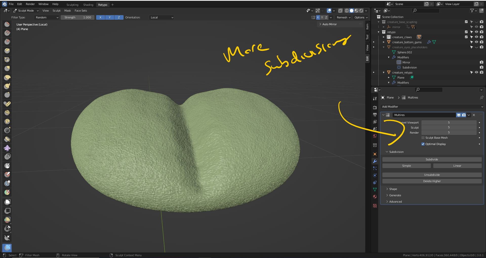

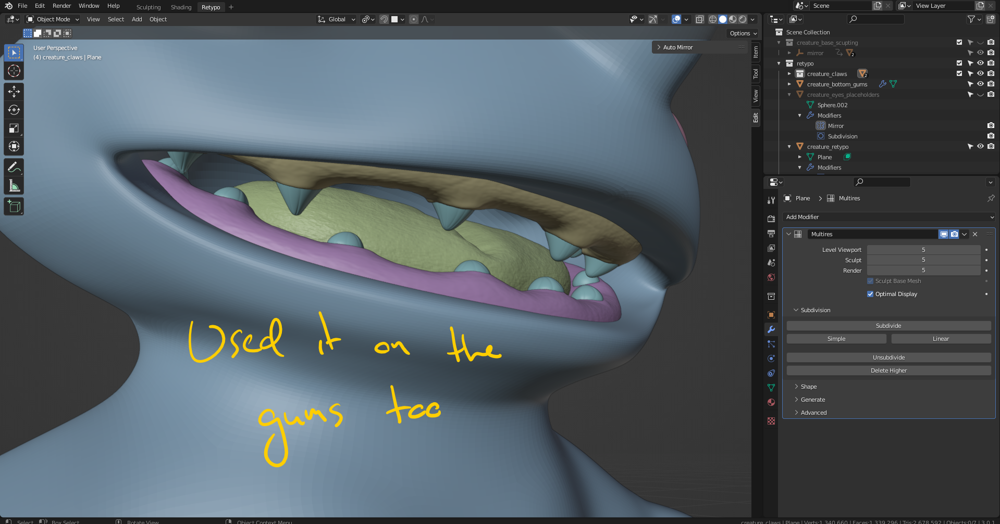
