# DEV-39, Horn Details
### Tags: [sculpting, AltB]
### Link: <https://academy.cgboost.com/courses/master-3d-sculpting-in-blender/lectures/32812082>

## Detailing the horns

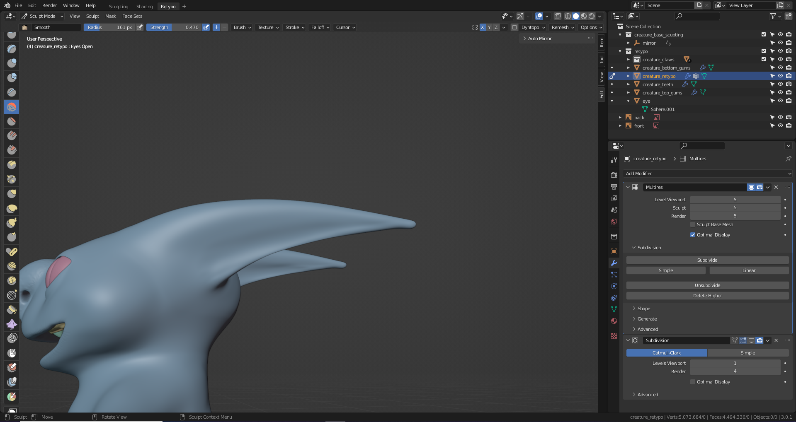

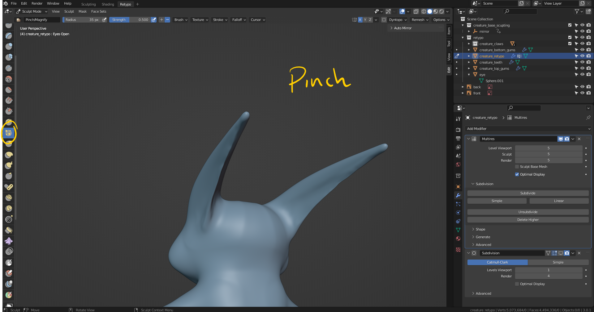

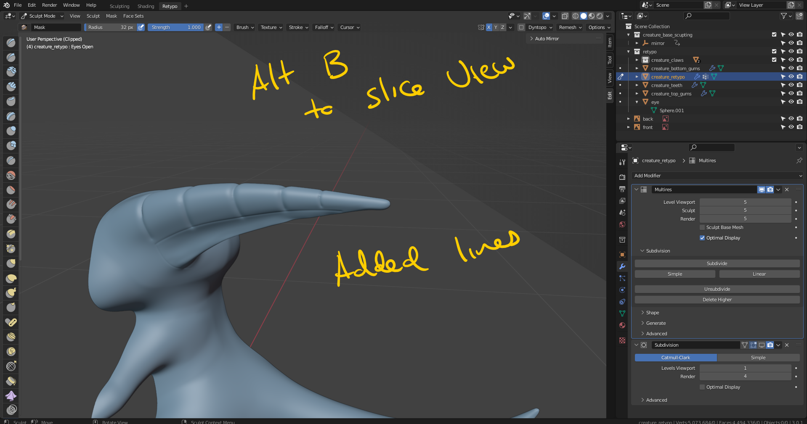

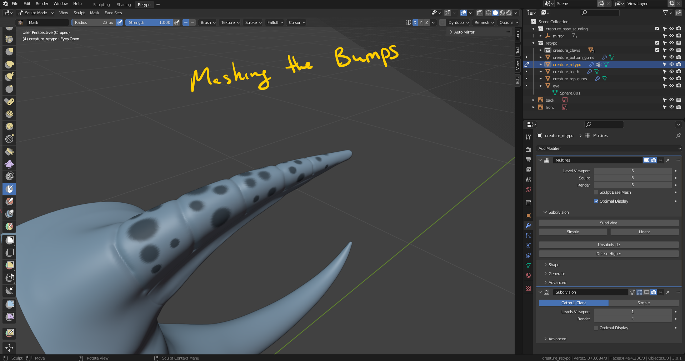

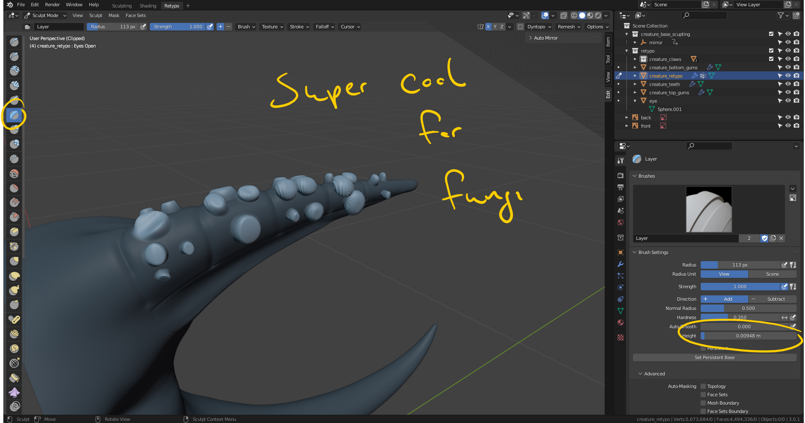

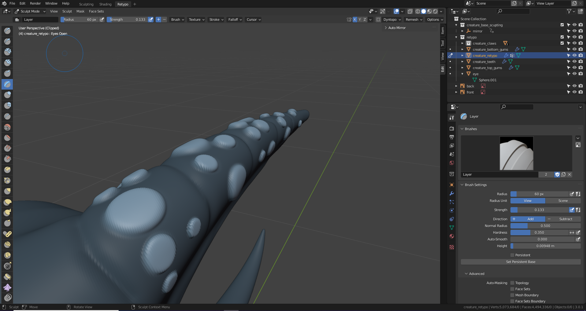

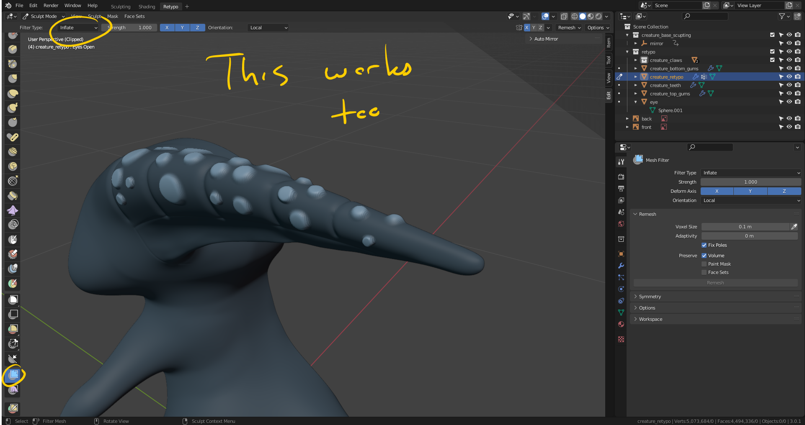

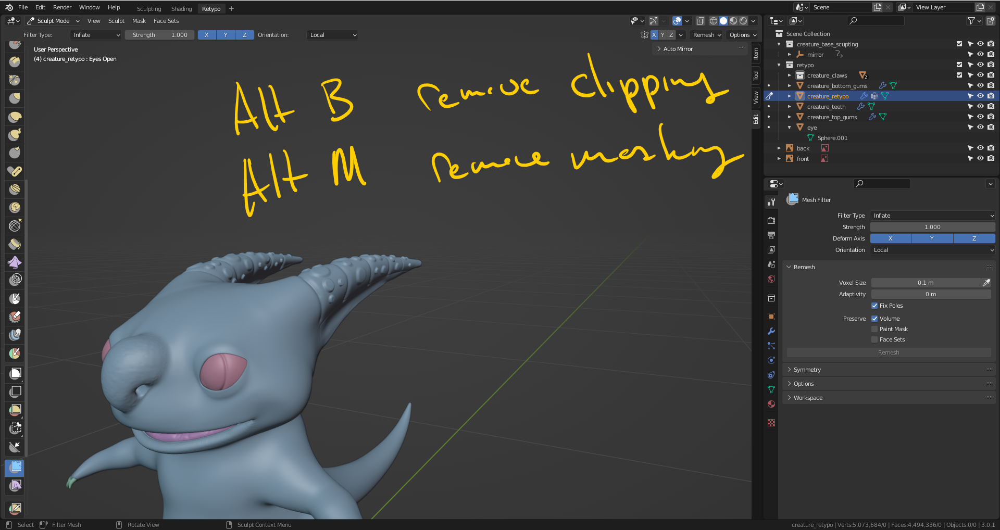

## Adding smaller jitter bumps

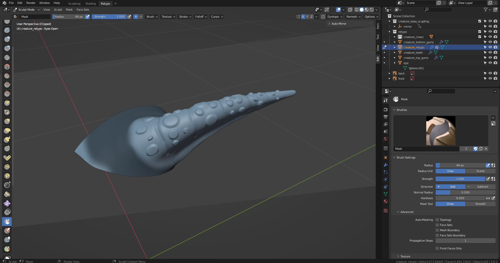

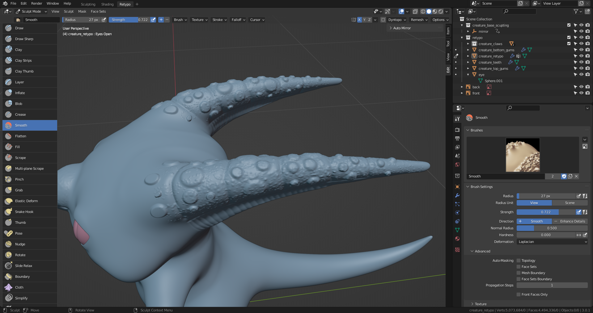

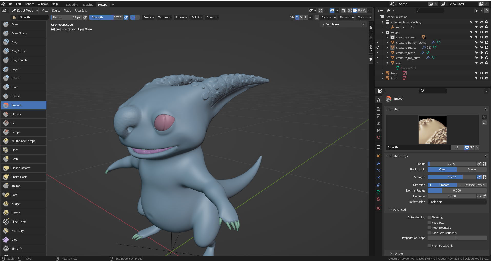