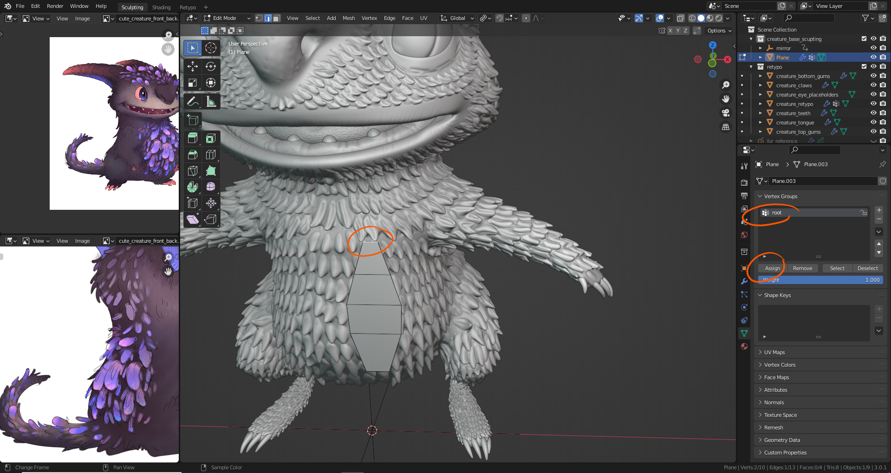

# DEV-42, Fur Elments
### Tags: [vertex groups]
### Link: <https://academy.cgboost.com/courses/master-3d-sculpting-in-blender/lectures/33179280>

## Create a single glow fur

## Add Vertex groups so that duplicates will have them too

## Turn on magnetic settings

## Keep Original somewhere

## Apply the fur and use the vertex groups with Alt S to make adjustments

