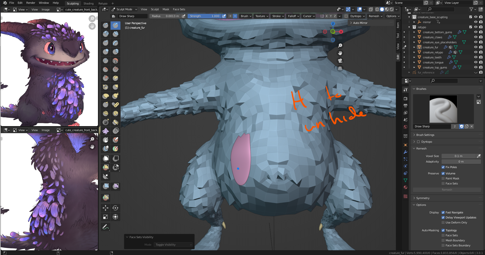

# DEV-43, Increase details to the glow fur
### Tags: [sculpting, solidfy]
### Link: <https://academy.cgboost.com/courses/master-3d-sculpting-in-blender/lectures/33180567>

## Manage thickness of fur

## add details to fur

