# DEV-44, Back Pack Part 1
### Tags: [spacing, zoom, flattening facesets]
### Link: <https://academy.cgboost.com/courses/master-3d-sculpting-in-blender/lectures/33242265>

## Troubleshooting: Spacing/Hardness

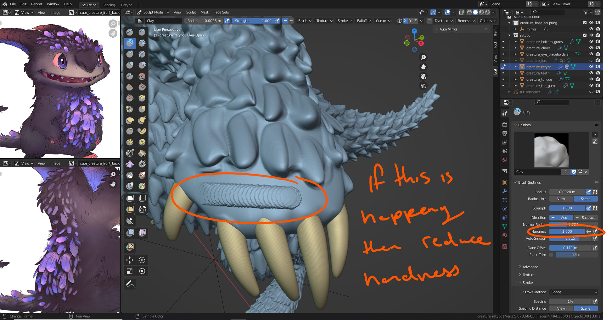

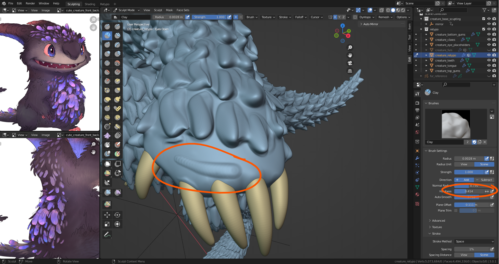

## Troubleshooting: Zoom

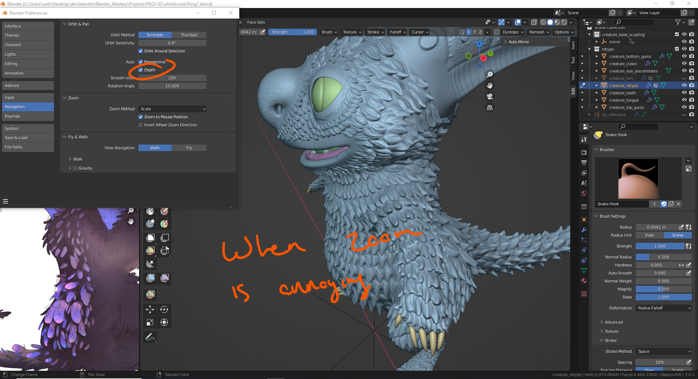

## Creating the Backpack

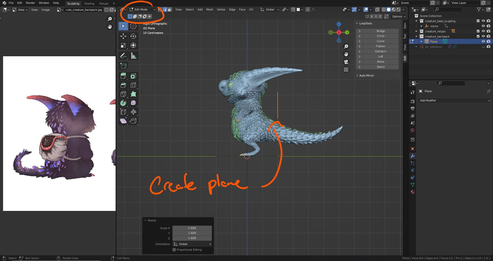

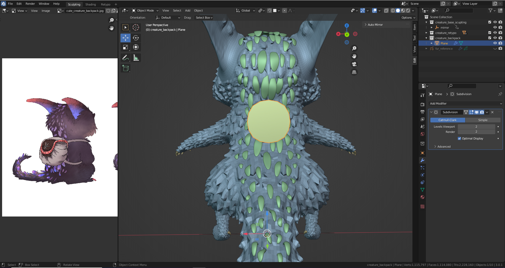

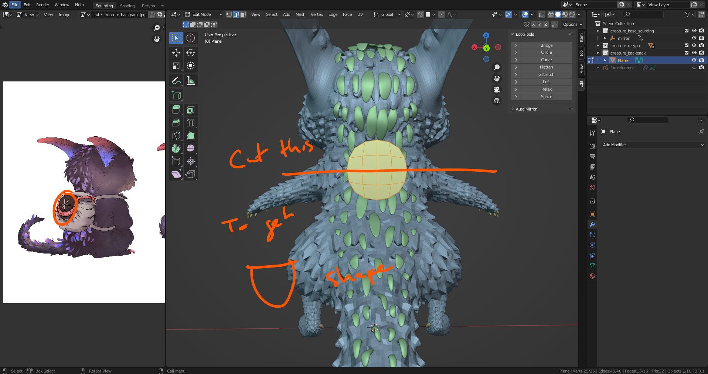

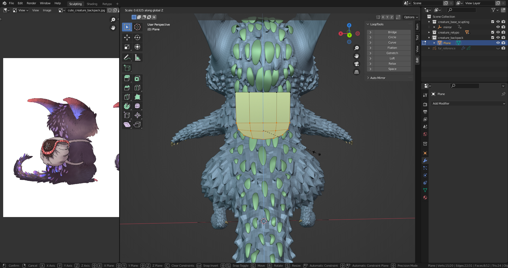

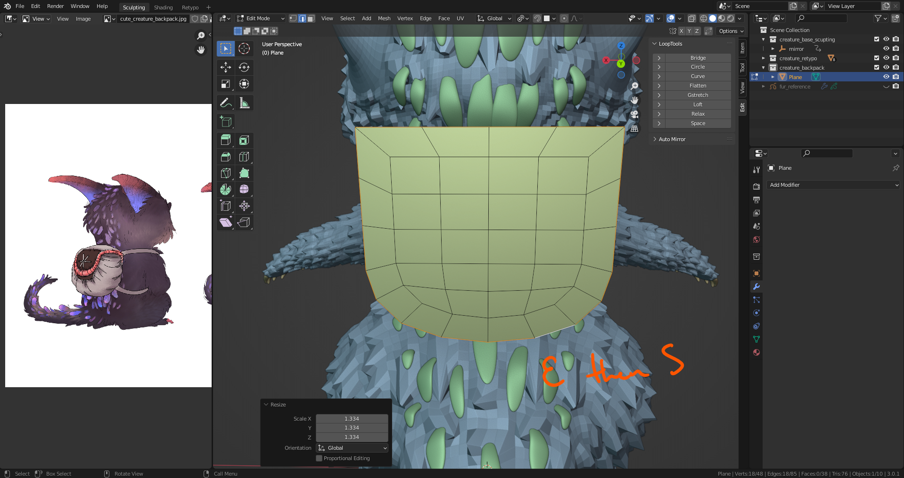

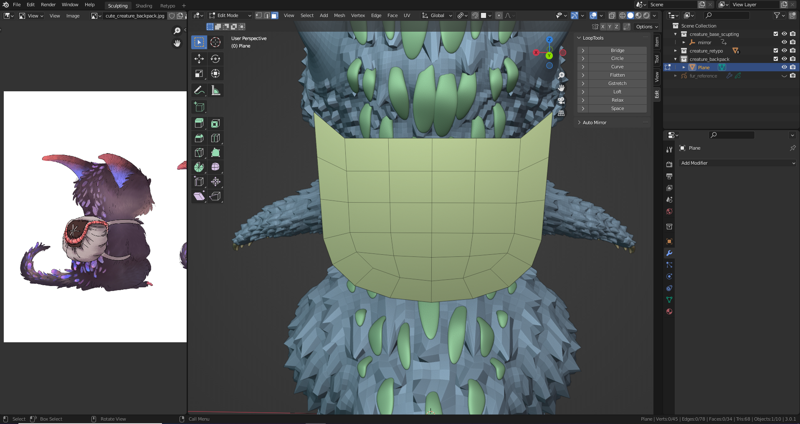

### Flattening a line
    S,Z then 0

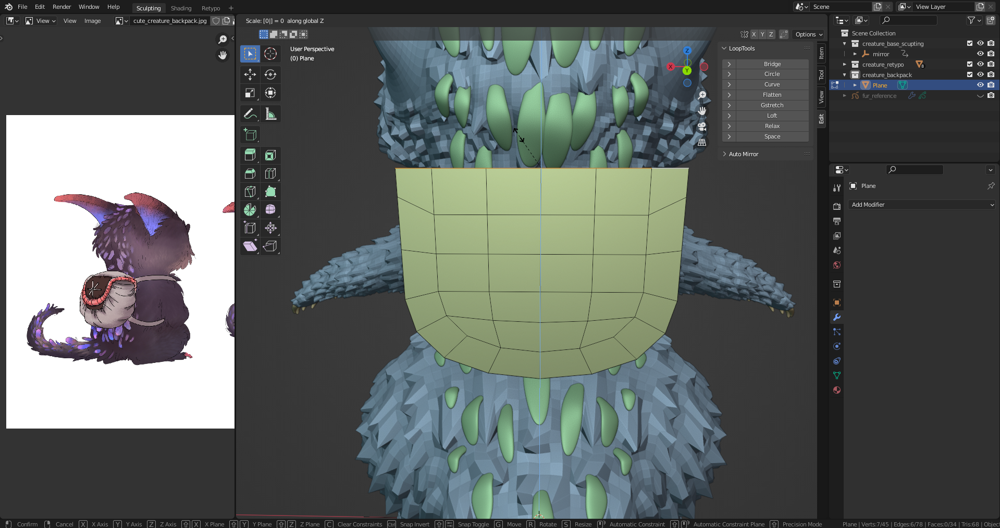

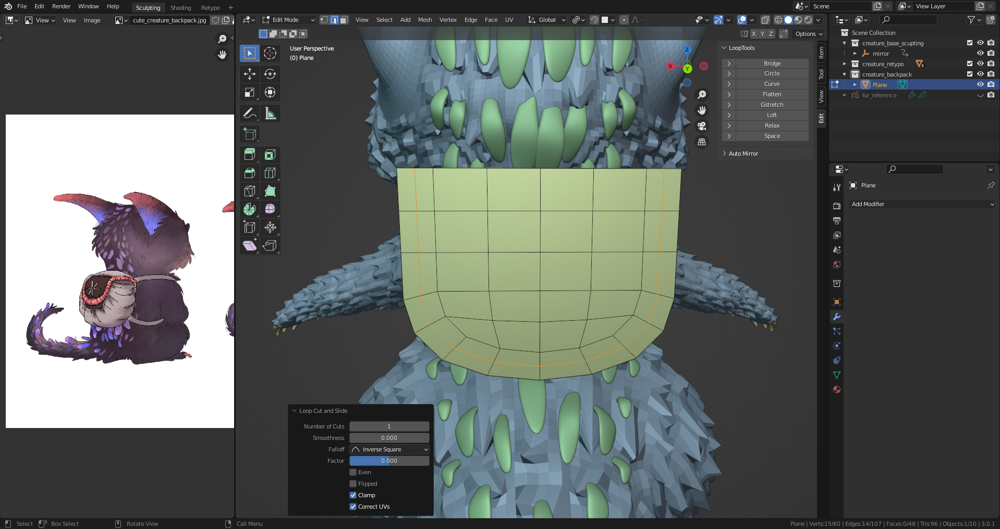

    At some point make a duplicate of this face

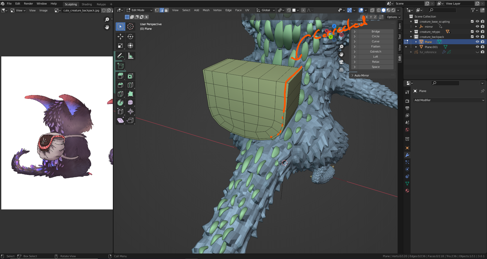

## Facesets

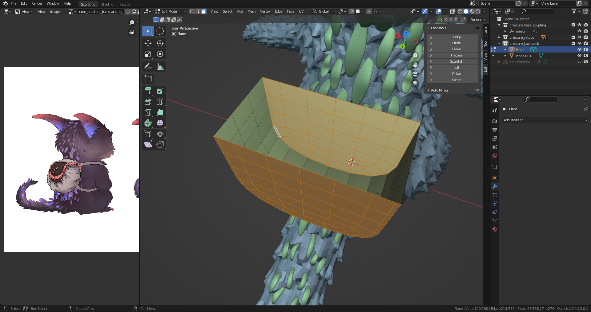

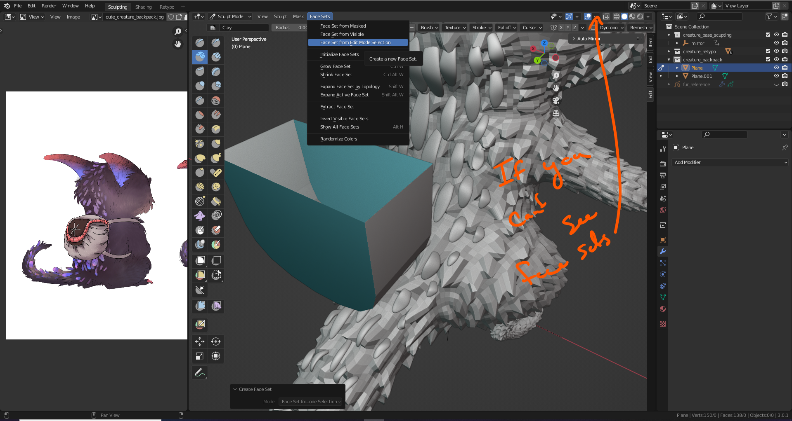

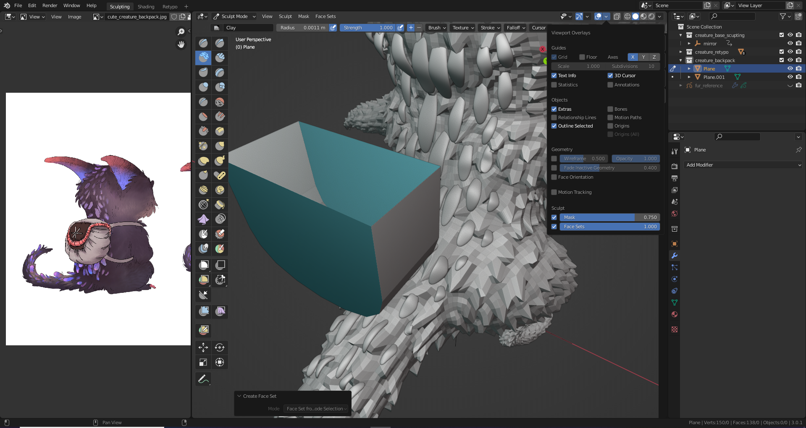

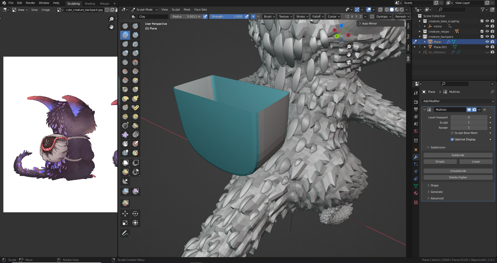