# DEV-48, Back Pack Lid Part 1
### Tags: [sharp, cloth filter]
### Link: https://academy.cgboost.com/courses/master-3d-sculpting-in-blender/lectures/33244759

## Creating the Lid 

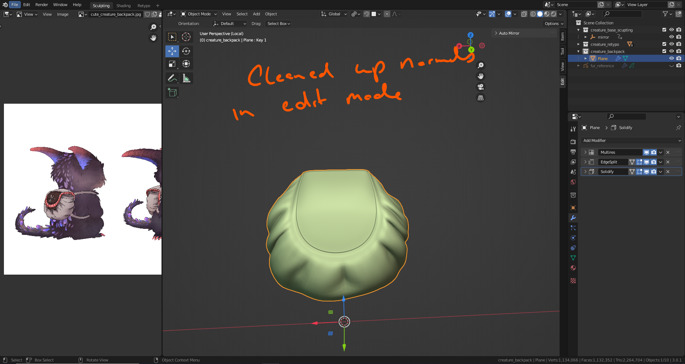

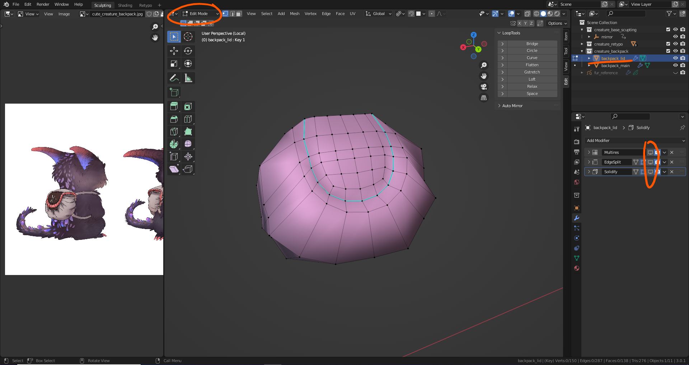

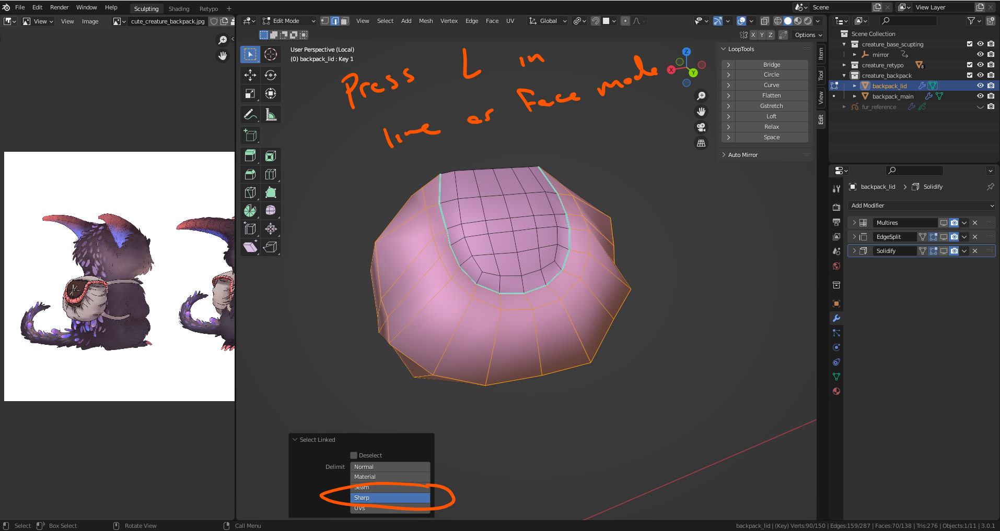

## Resizing lid with ALT-S and more

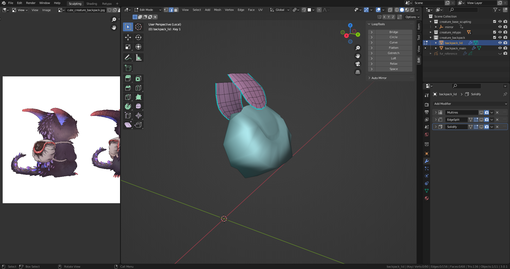

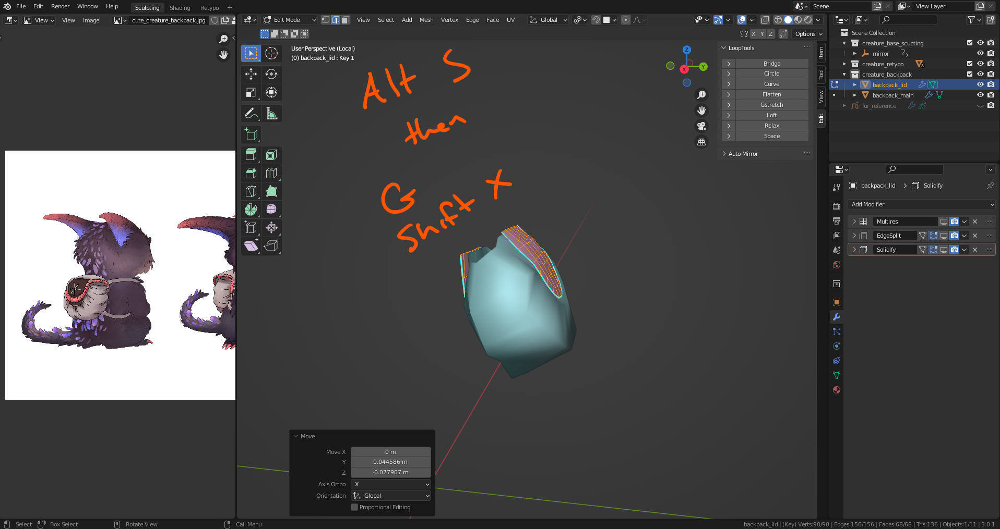

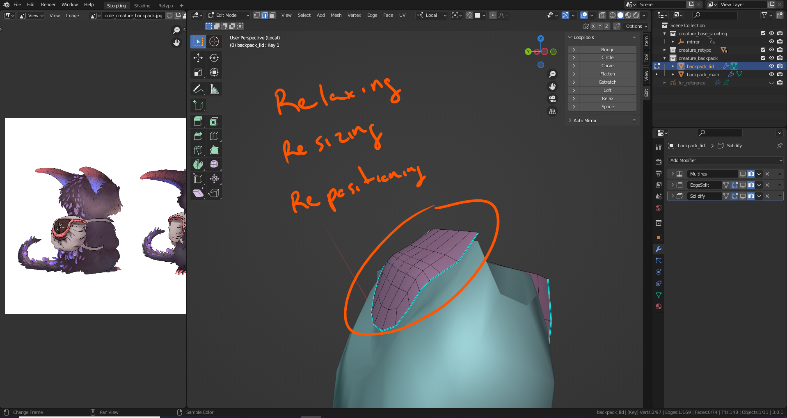

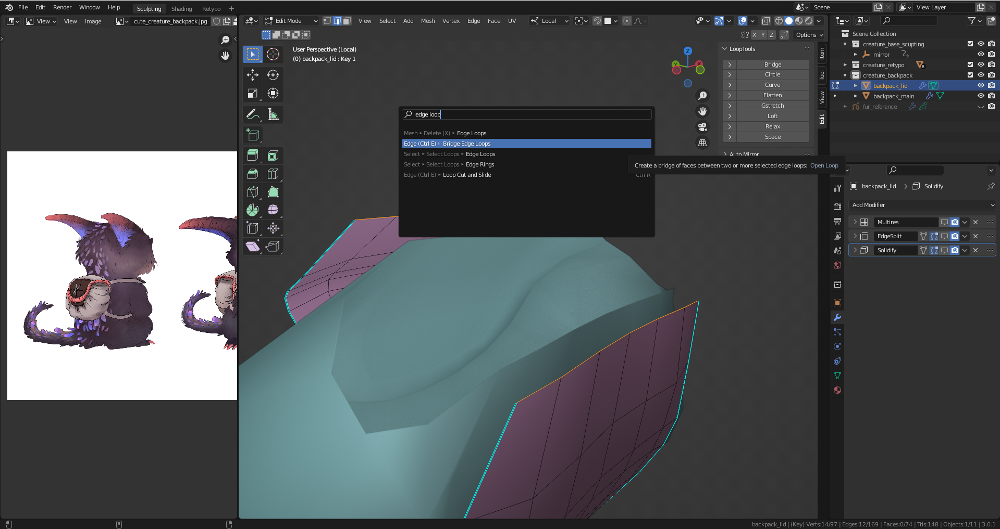

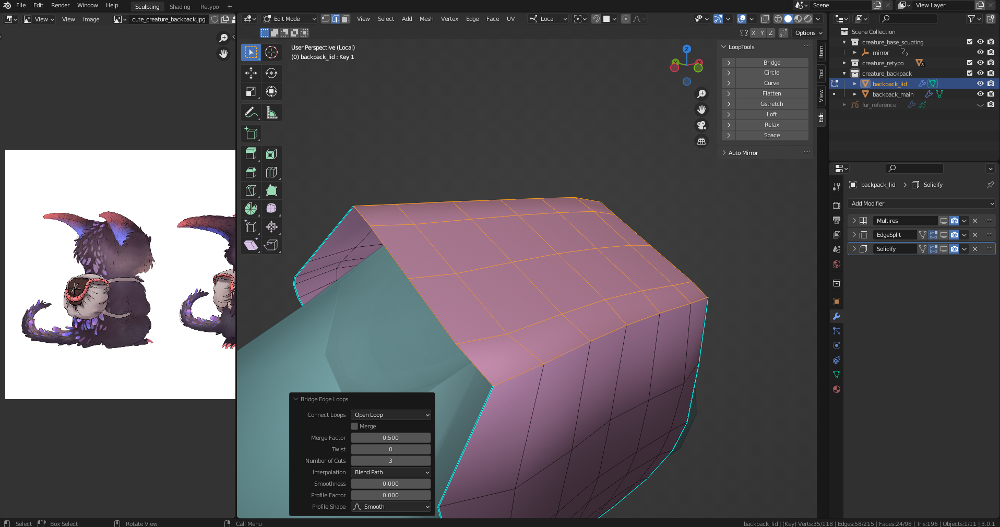

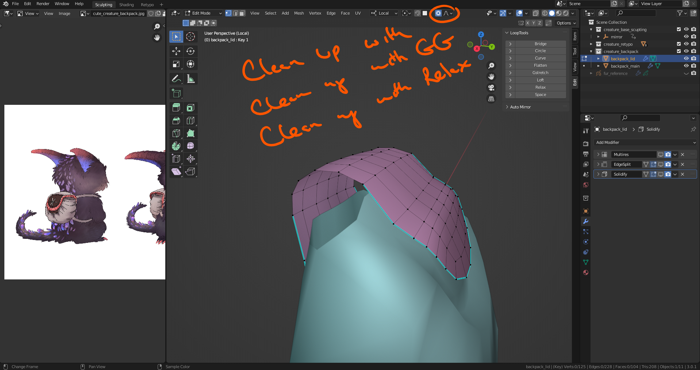

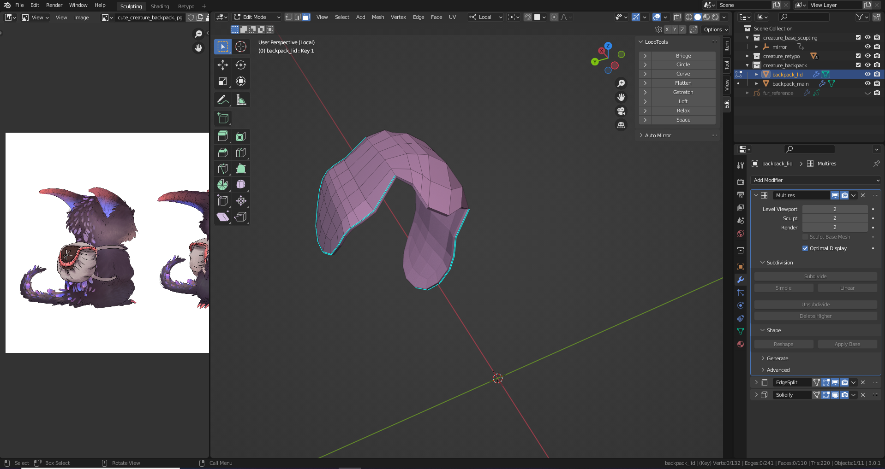

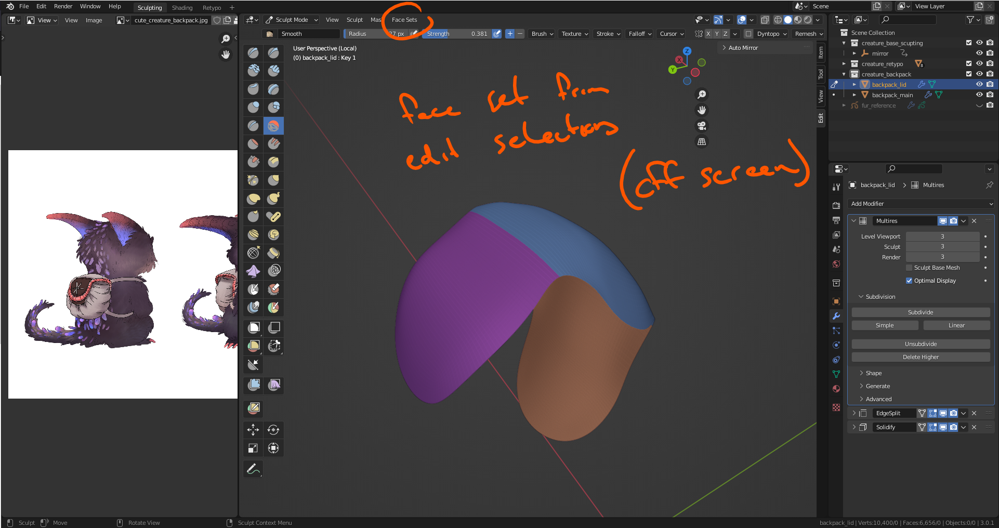

## Inflating the lid with clothfilter

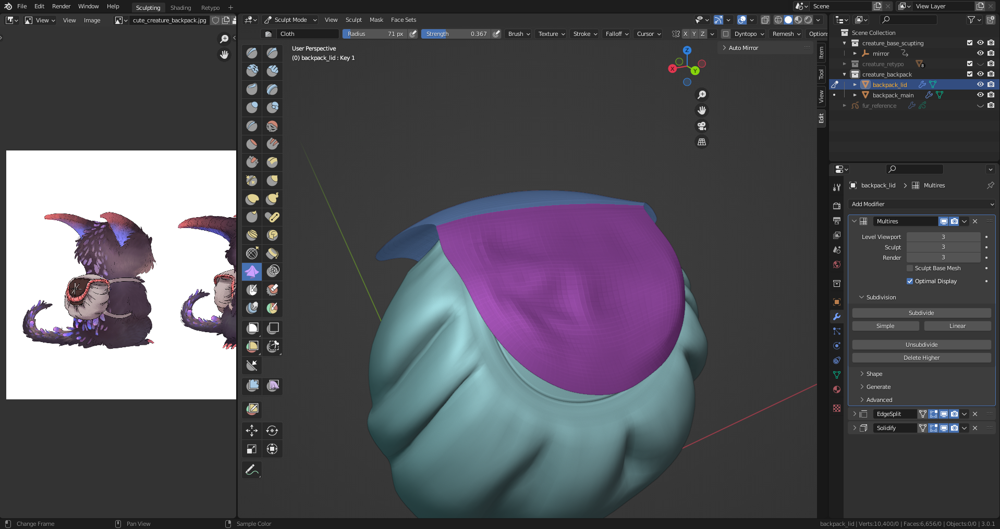

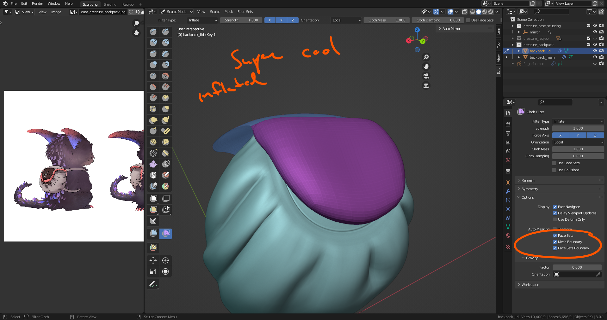

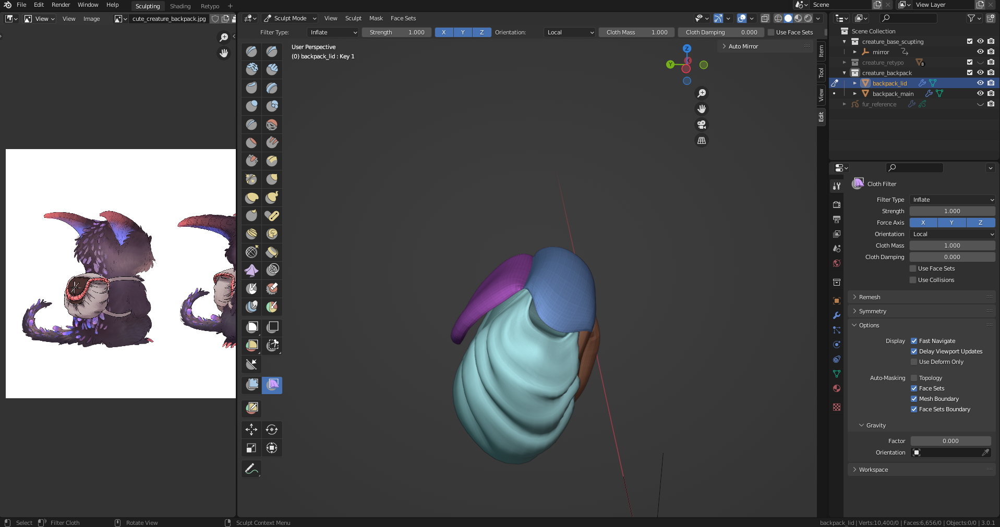

## Adding new sharpes and cleaing old ones

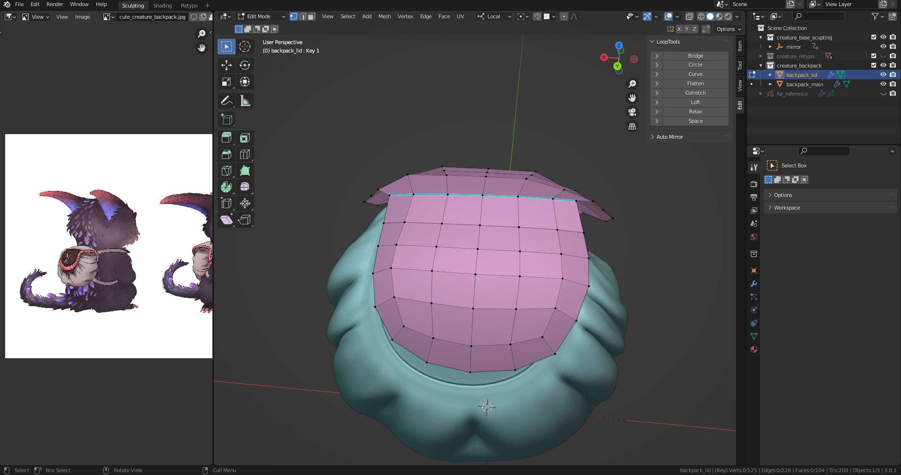

