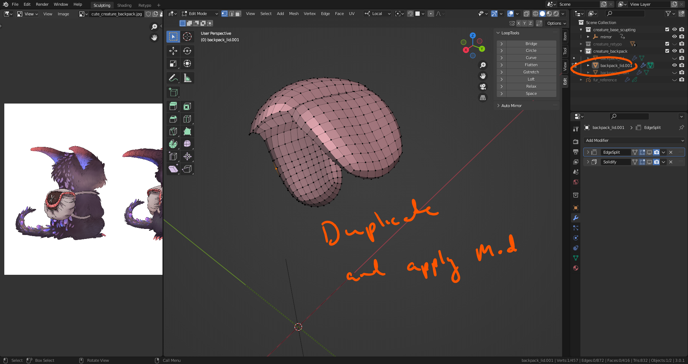
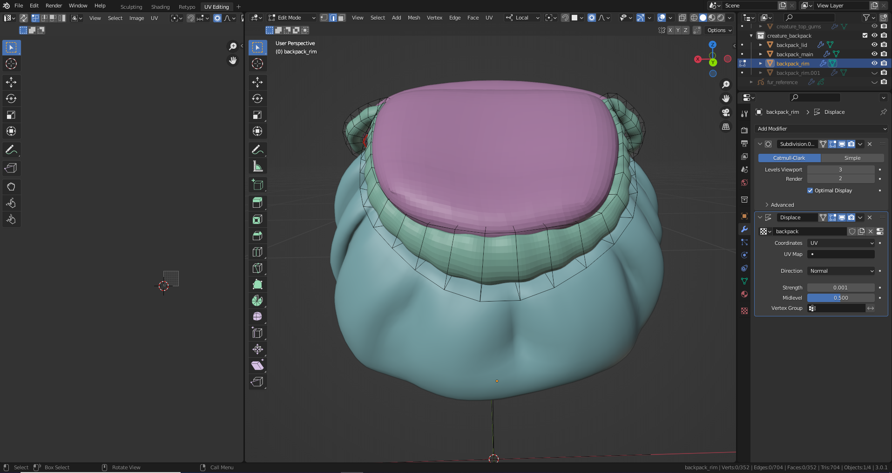
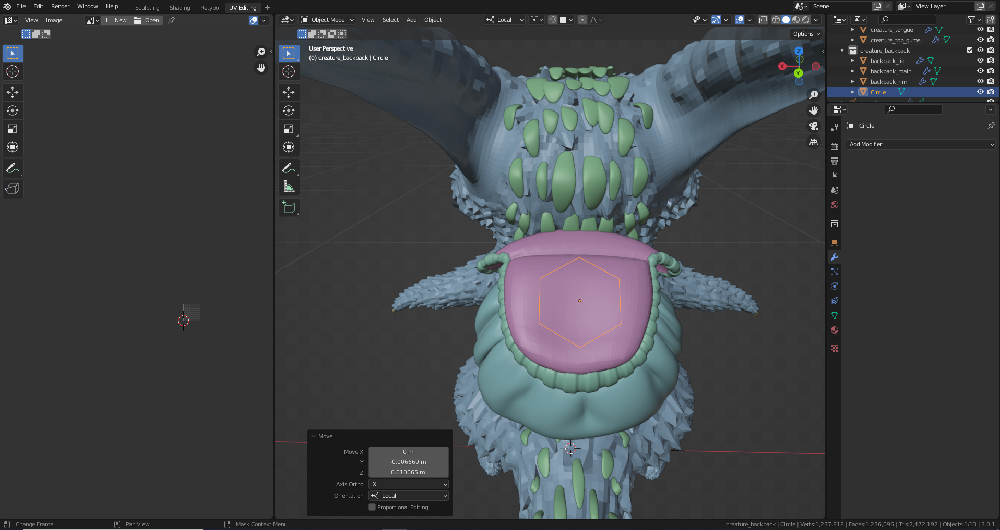
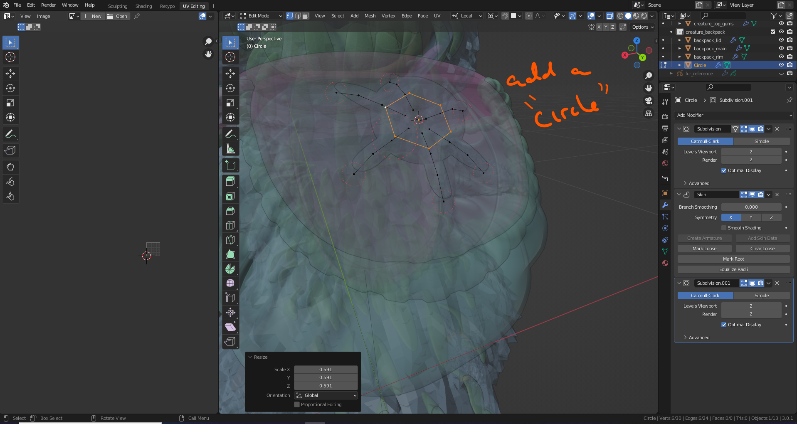

# DEV-47, Back Pack Lid Part 2
### Tags: [skin modifer, UV Map, mark seam, displacement modifier, skin modifier]
### Link: <https://academy.cgboost.com/courses/master-3d-sculpting-in-blender/lectures/33245807>

## Creating the Lid Rim

## Manipulating with skin modifier

## Marking Seams

    What is a UV seam?
    A UV mesh is made of UVs similar to how a polygon mesh is made of vertices. Unfolding a UV mesh refers to the process of cutting a seam in the UV mesh and then unfolding along that seam. The process is similar to cutting a seam along a shirt and laying it flat on a table.

## Creating and applying a UV Map

## Creating the knot

## Creating the knot with skin modifier

## Adding details to the lid with knot

