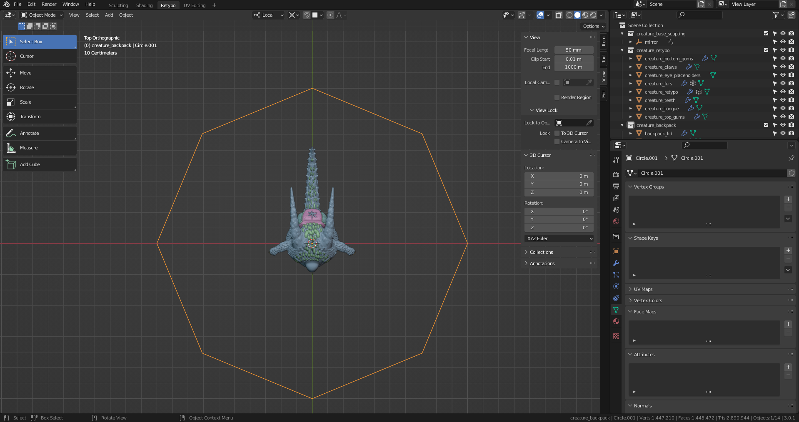
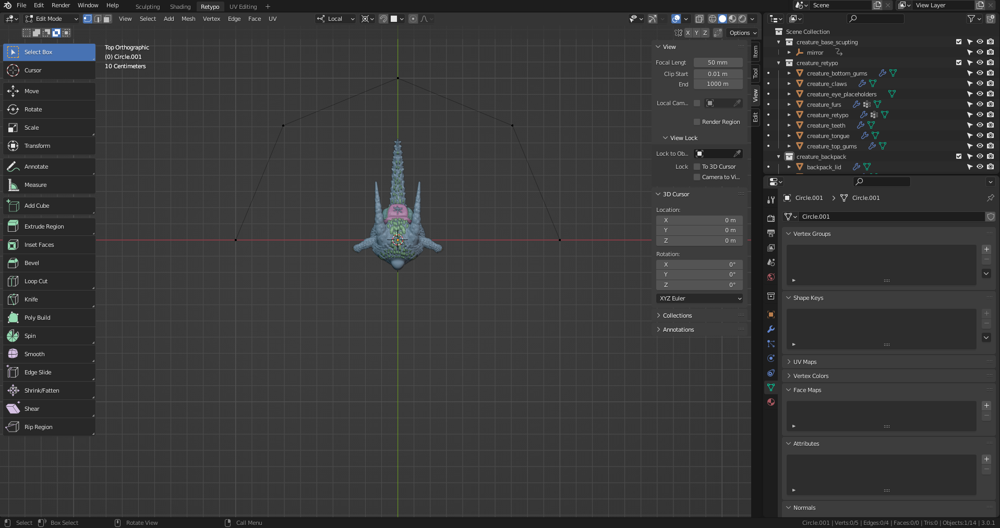
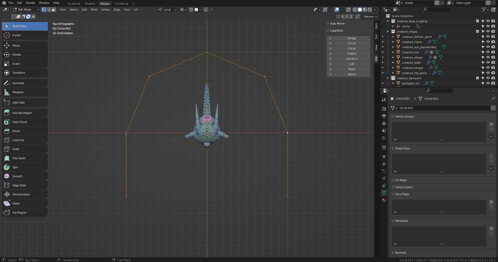
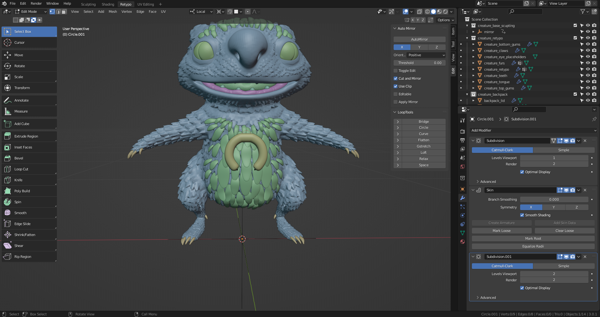
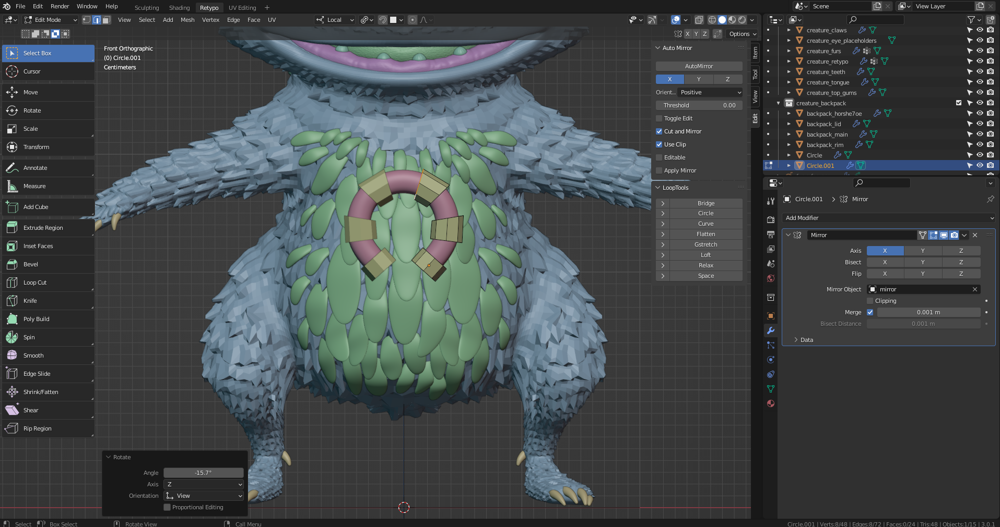
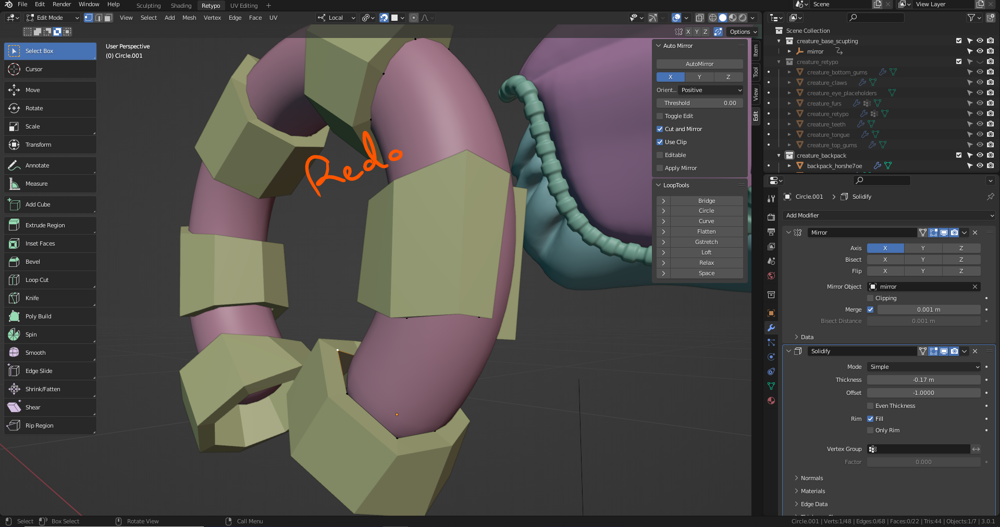
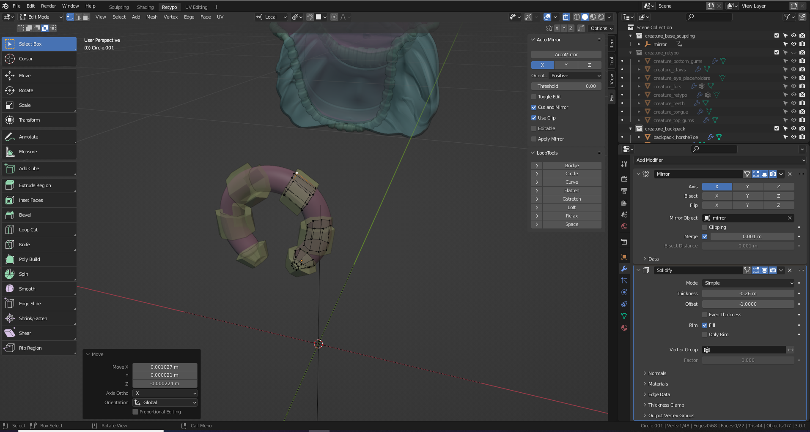
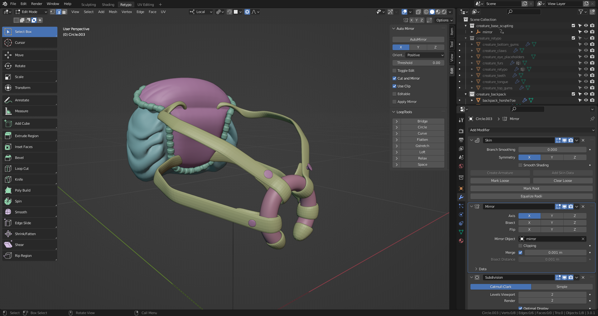
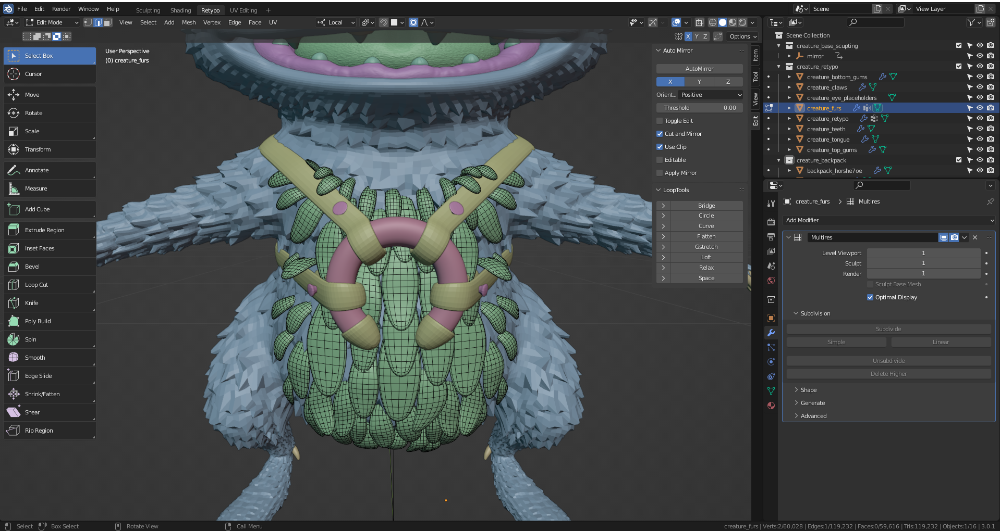
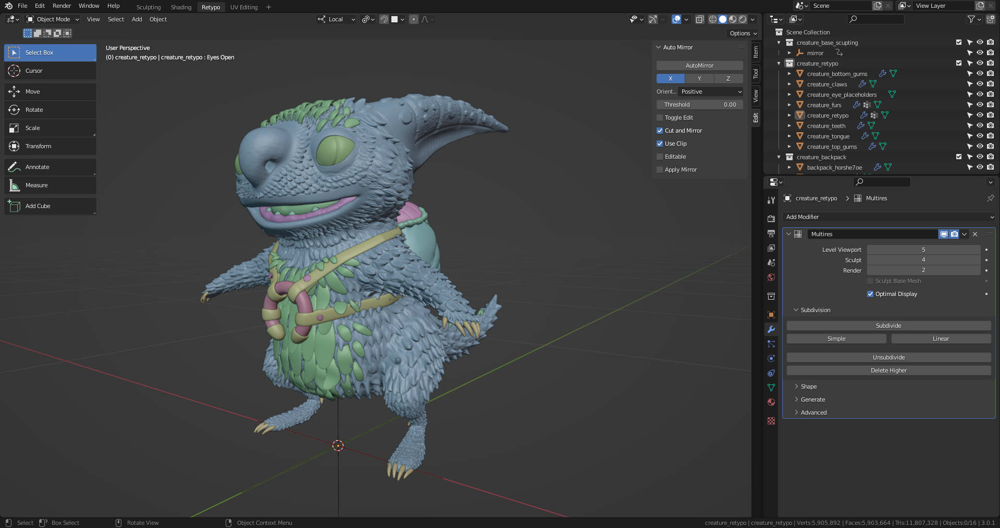

# DEV-48, Back Pack Straps
### Tags: [skin, soldify]
### Link: <https://academy.cgboost.com/courses/master-3d-sculpting-in-blender/lectures/33285859>

## Creating the horseshoe thing

    I did this one way, but im gonna re translate the points so that they stick directly to the mesh. Then I can solidify them as they say on.

