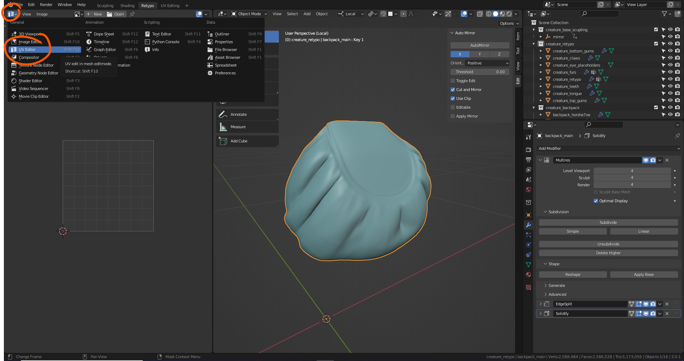

# DEV-49, Adding Details without sculpting
### Tags: [uv editing, displace mod, vertex groups]
### Link: https://academy.cgboost.com/courses/master-3d-sculpting-in-blender/lectures/33287079

## Applying UV Map

## Reapplying UV Map and adding vertex Maps

## Lid UV Mampping

