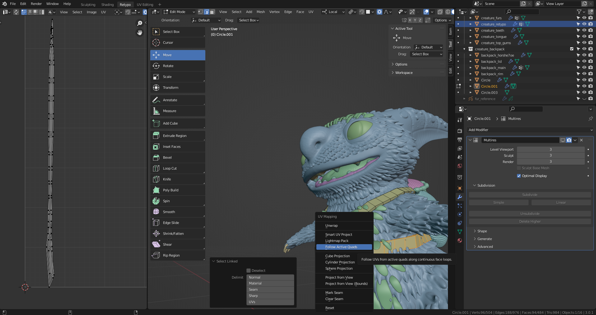
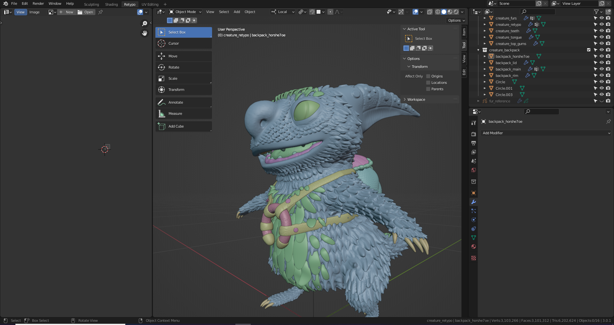
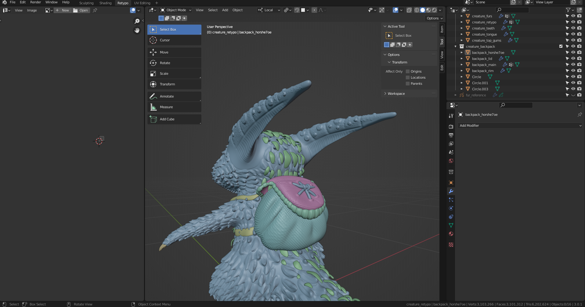
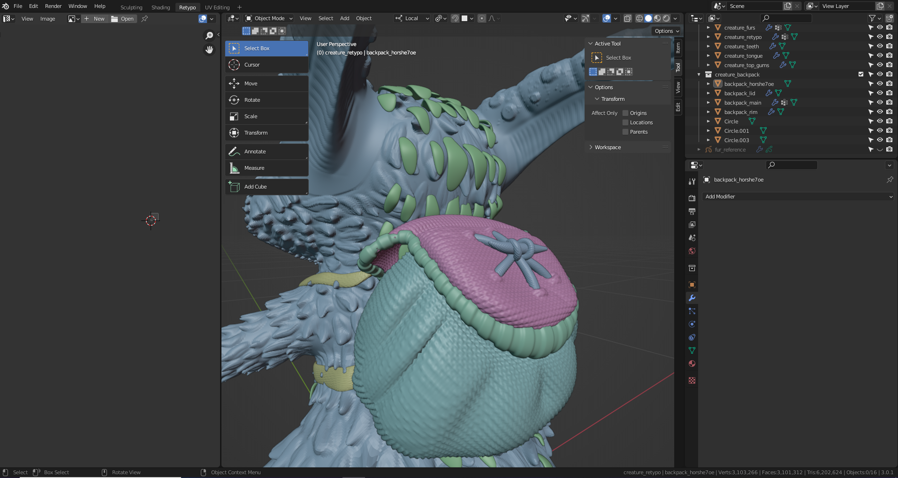

# DEV-50, Adding textures to the cords and horseshoe
### Tags: [uv wrapping, displace mod]
### Link: <https://academy.cgboost.com/courses/master-3d-sculpting-in-blender/lectures/33287188>

## Cord textures

