# DEV-52, Clay Shader - Bump Map
### Tags: [bump maps, nodes, website]
### Link: https://academy.cgboost.com/courses/master-3d-sculpting-in-blender/lectures/33782398

## Adding in our Voronoi texture

    Shift A > Textures > Voronoi

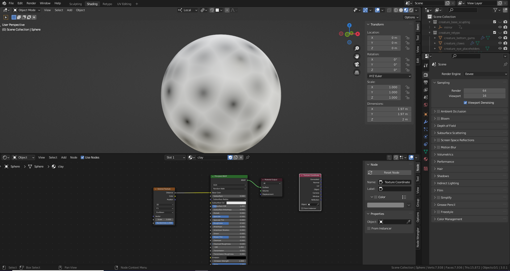

    Shift A > Input > Texture Coordinate

    By having our own texture coordinate instead of the built in one,
    we are able to be independence of scaling of the model for our voronoi texture after applying our changes.

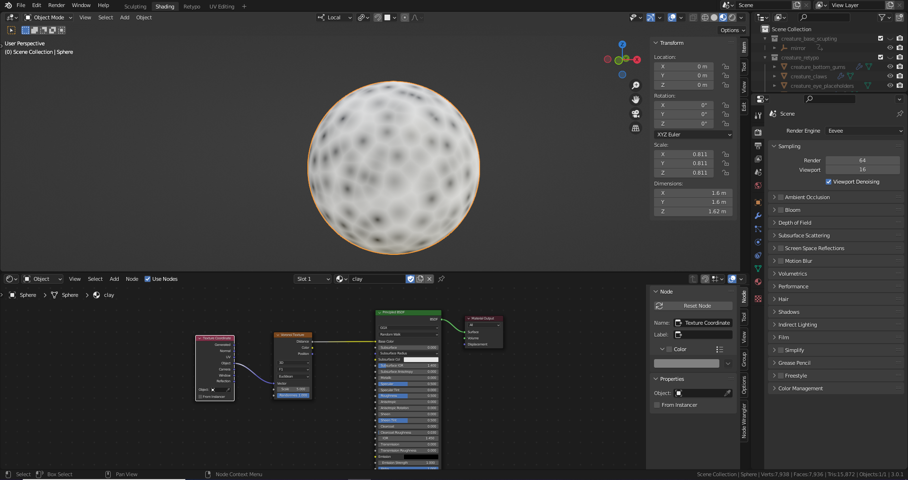

## Adding in our Bump node

    Shift A > Vector > Bump

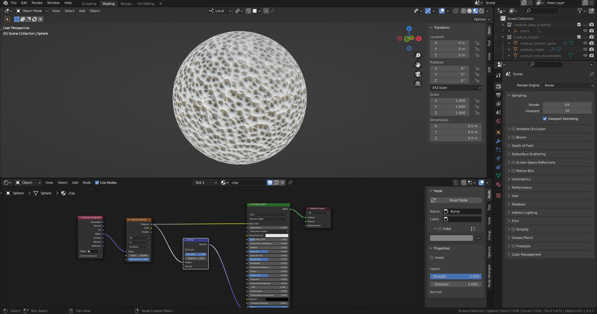

## Adding in our Multiply Node to have more control over the strength

    Shift A > Converter > Math
    Add > Multiply
    To manage the strength

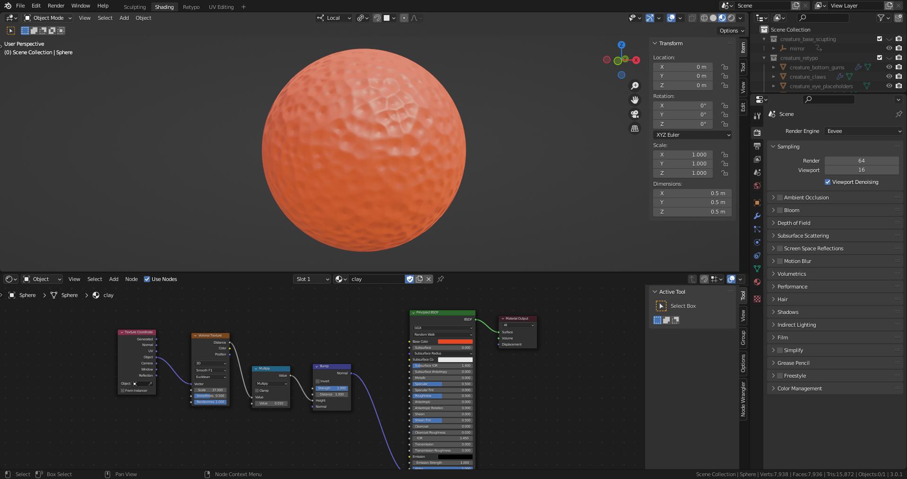

## Handy controls

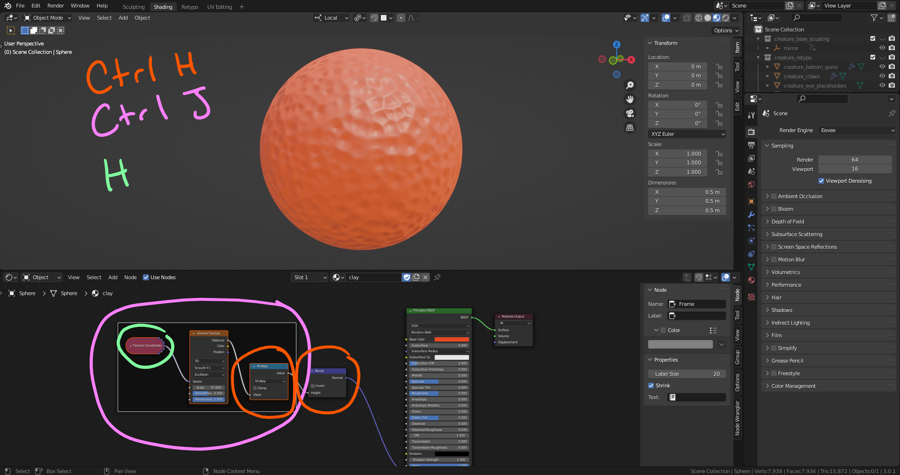

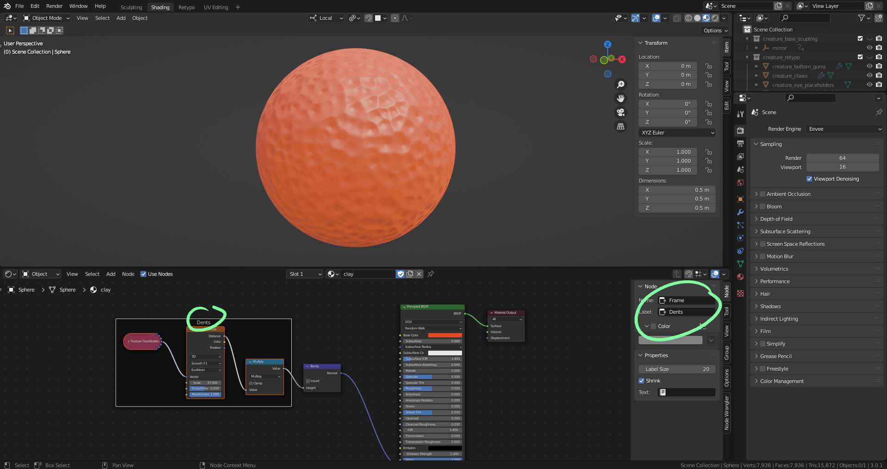

## Website for textures

<https://www.cgbookcase.com/>

    Shift A > Texture > Image Texture

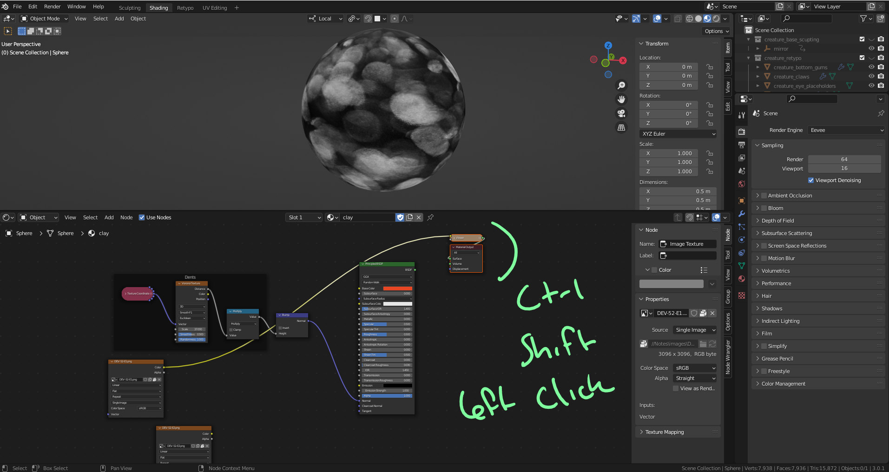

  CTRL + SHIFT + LEFT CLICK

  This is one of the features of the addon, to see a preview immediately of the thing you are working on

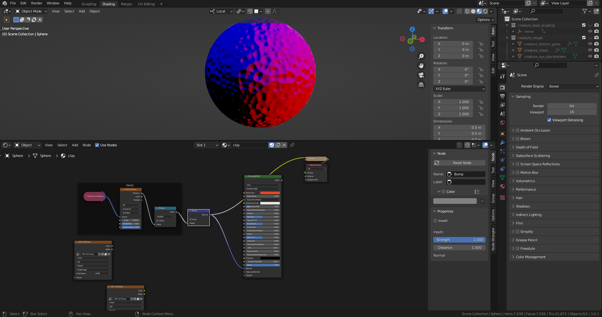

  Whenever you have a texture where the color is to be disregarded, use non-color

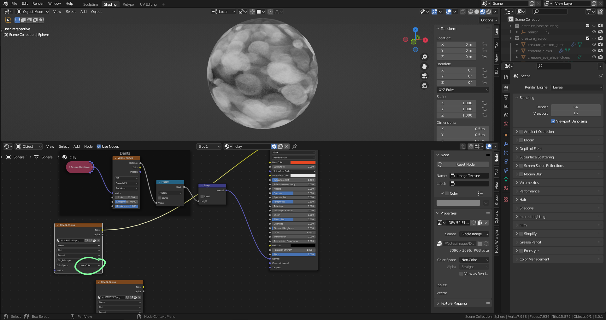

  CTRL + T

  The Mapping node you can change the position, rotation and the scale of the texture

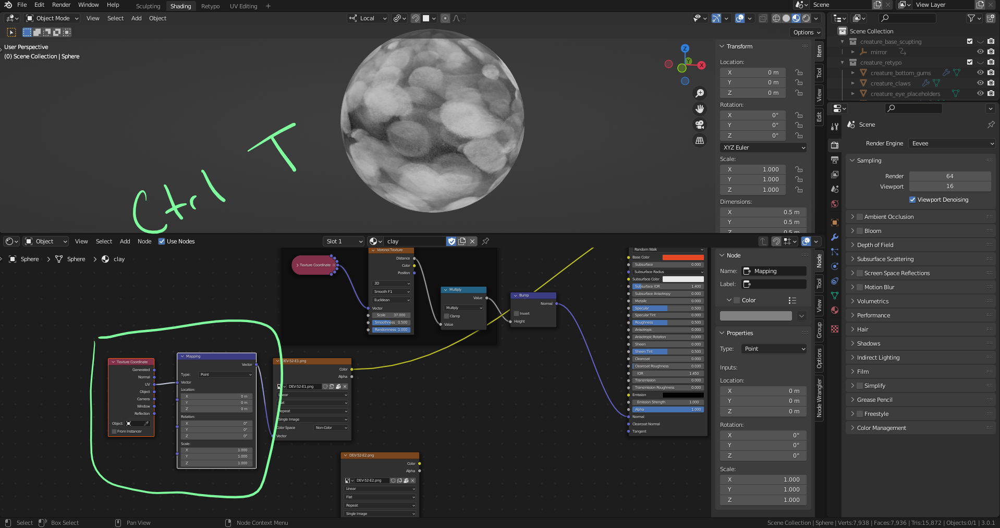

  Wiring up our new nodes

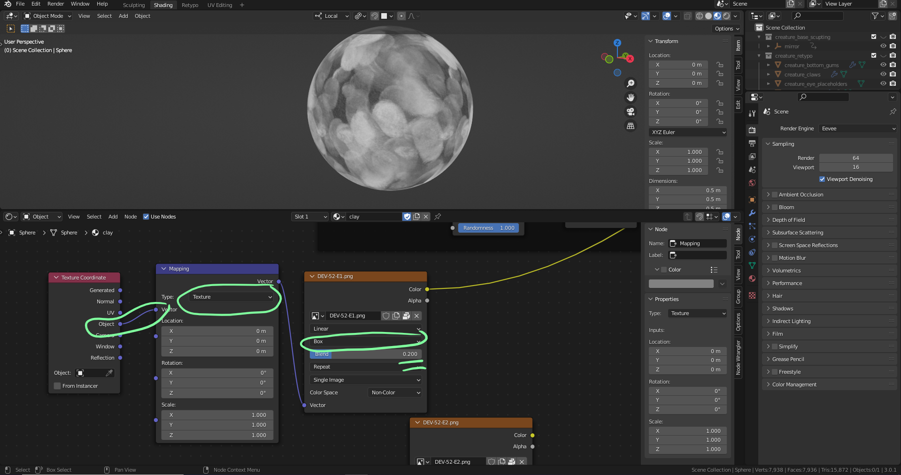

  Change the scaling to .15

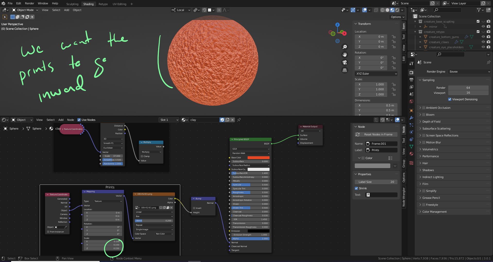

  Shift A > Color > Invert
  Invert the finger prints

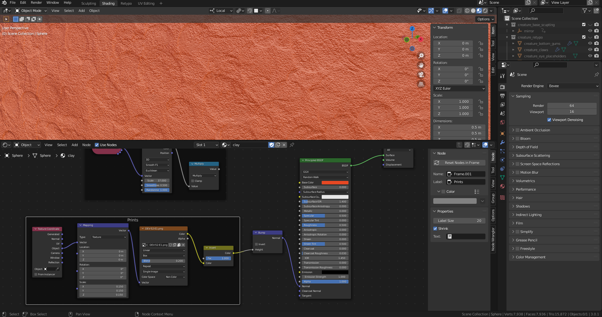

  Shift A > Converter > Math
  Add > Multiply
  To manage the strength

  If you a duplicating something inside a nod box label thing, press Ctrl P

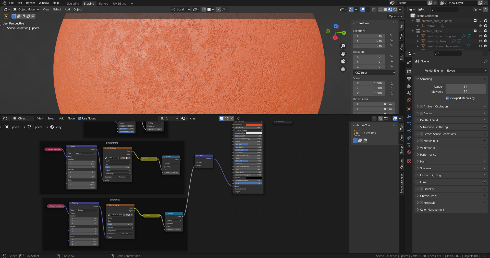

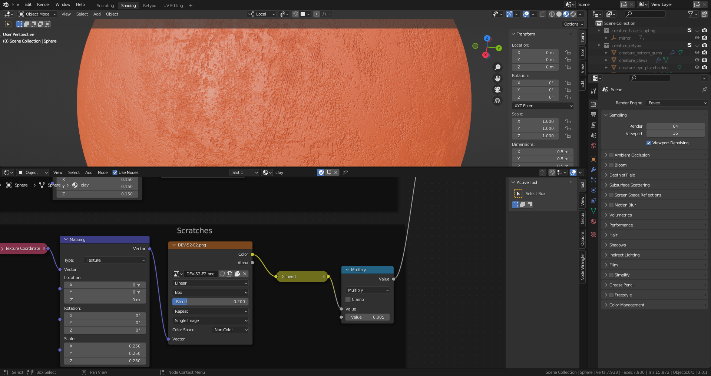S

## Adding all of them together

  Shift A > Color > MixRgb
  MixRgb > Screen

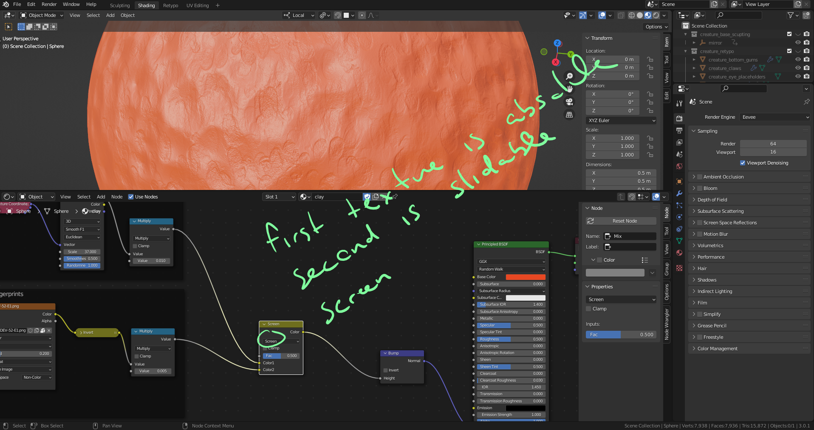
