# DEV-53, Applying the clay shader
### Tags: [nodes, cycles]
### Link: https://academy.cgboost.com/courses/master-3d-sculpting-in-blender/lectures/33783267

## Testing Roughness

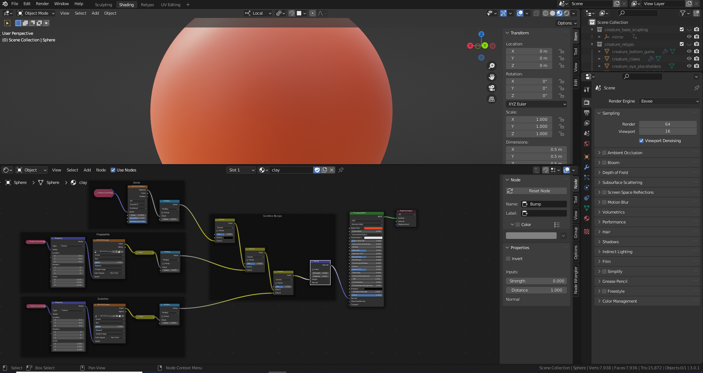

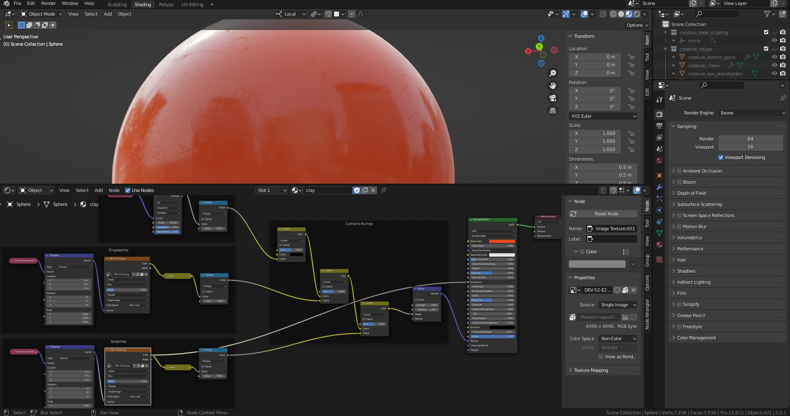

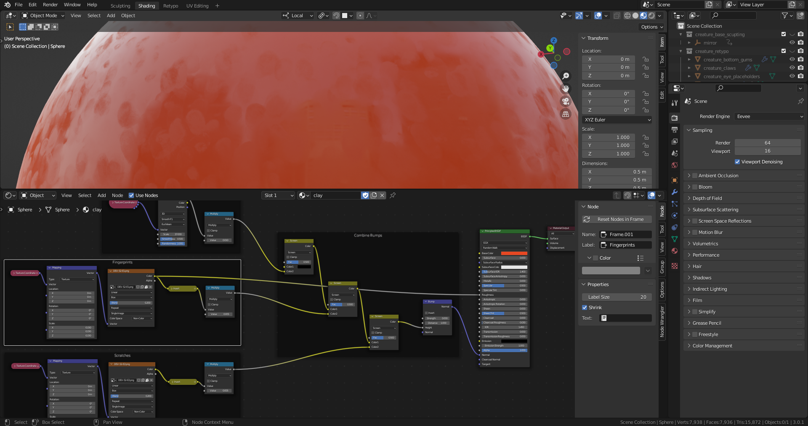

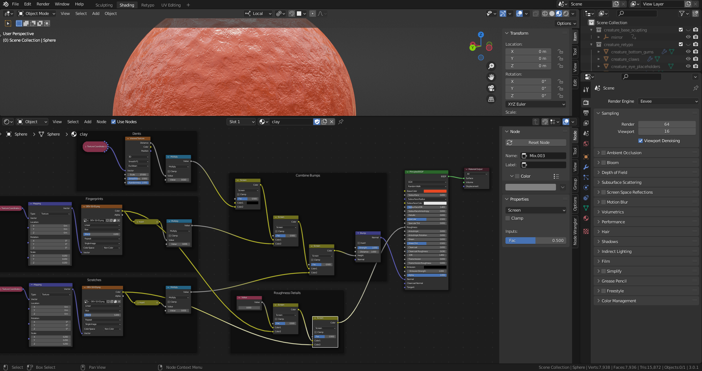

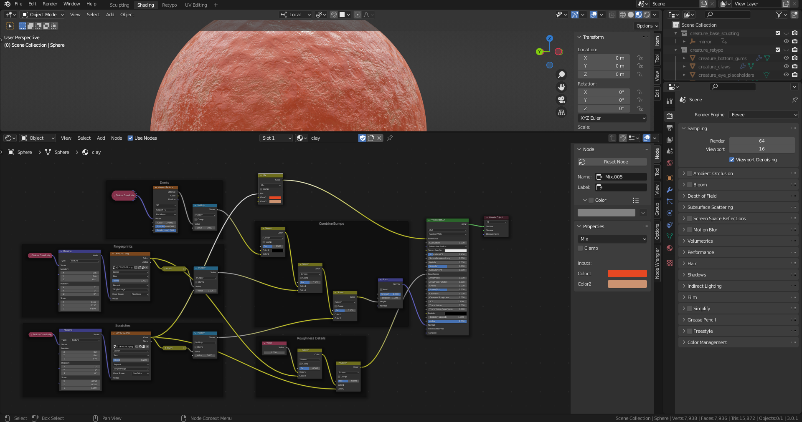

## Applying to the creature

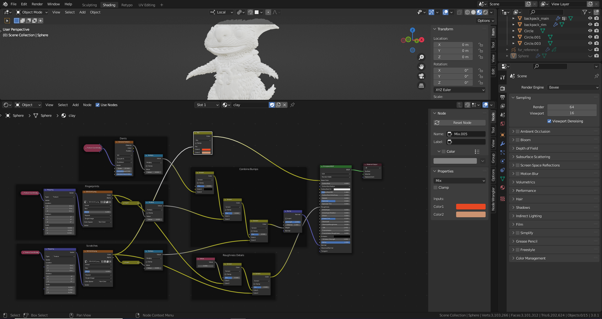

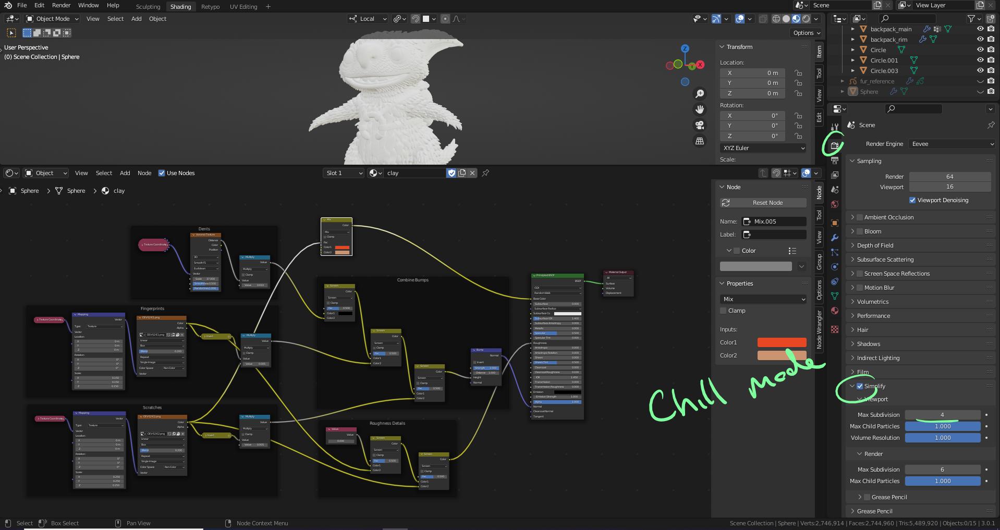

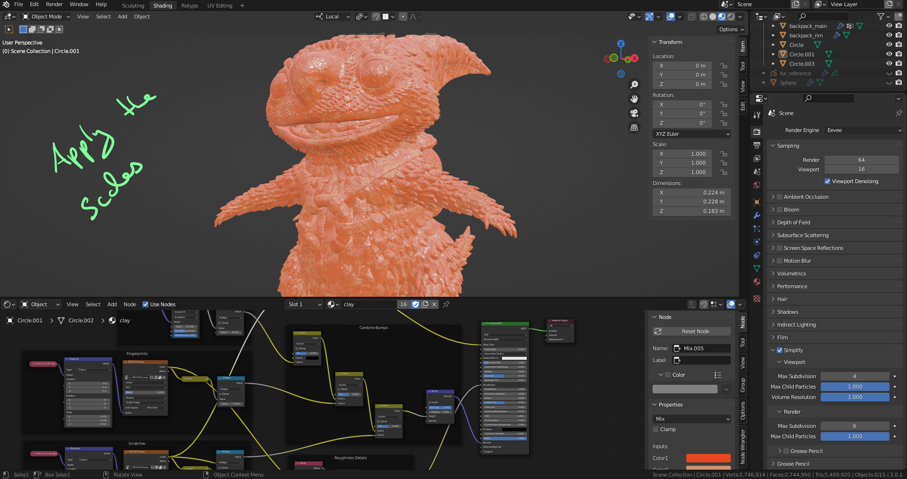

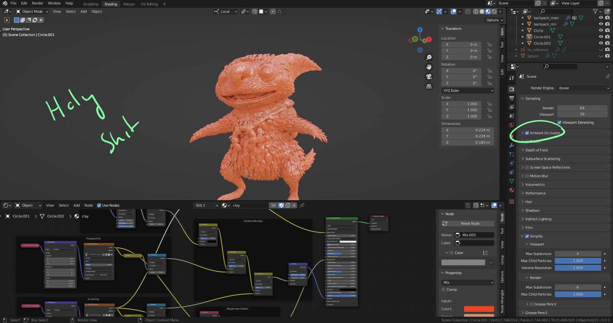

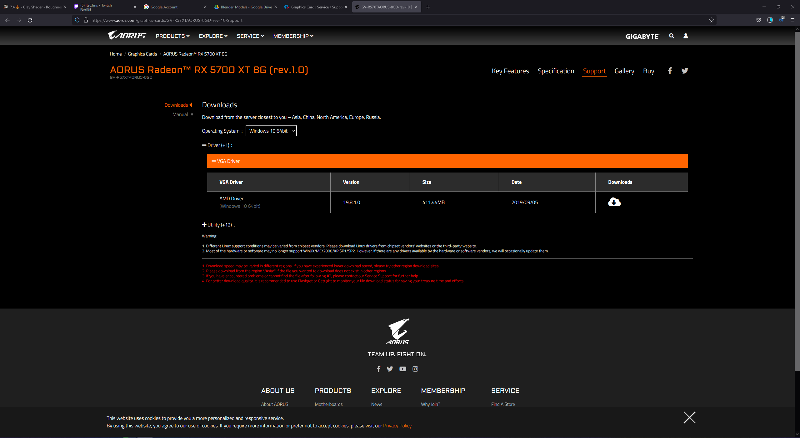

## Install Driver

https://www.aorus.com/graphics-cards/GV-R57XTAORUS-8GDS-rev-10/Support

## Last touches

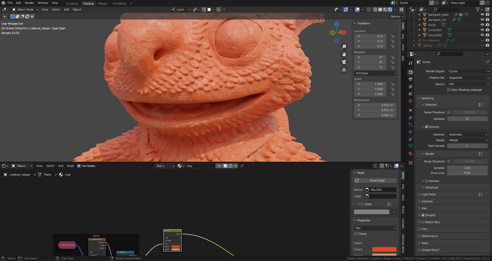

  Shift A > Input > Geometry

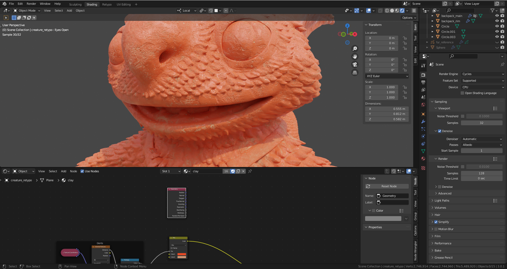

  Shift A > Converter > Color Ramp

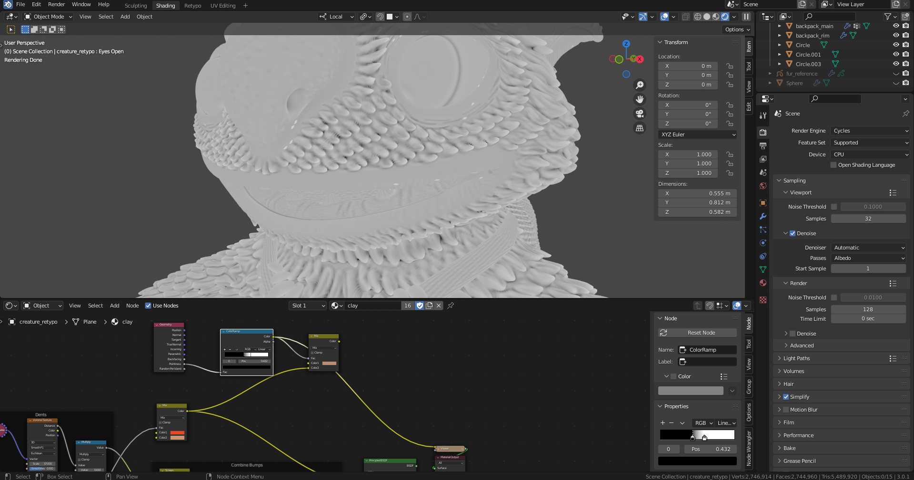

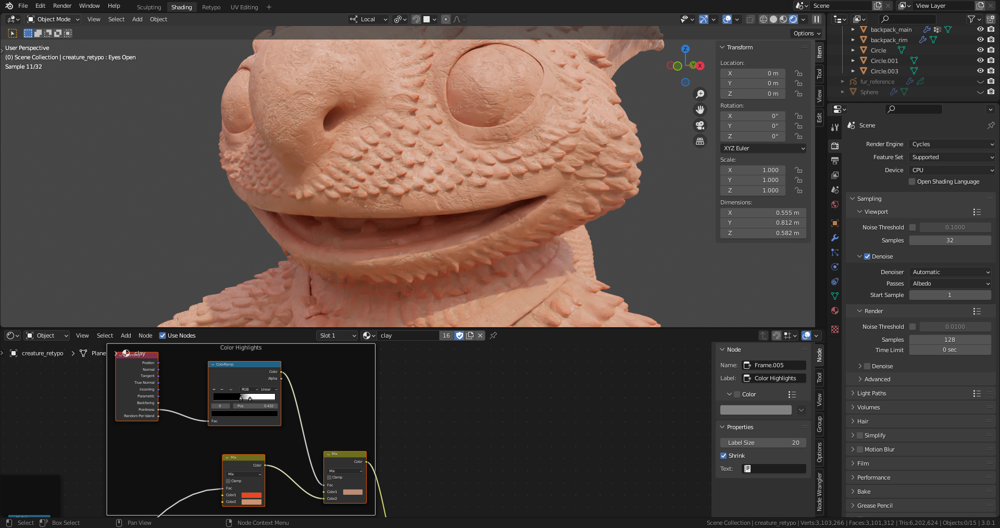

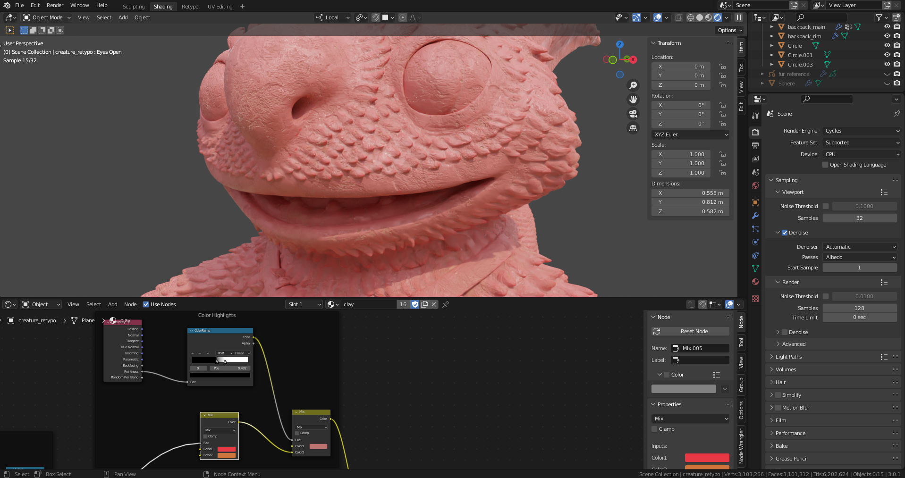
