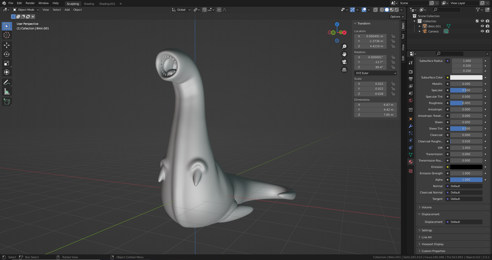

# DEV-54, Sculpt Vertex Colors basics
### Tags: [vertex paint]
### Link: https://academy.cgboost.com/courses/master-3d-sculpting-in-blender/lectures/33798040

## Blender installs
<https://builder.blender.org/download/daily/archive/>

## Vertex painting

  The idea behind vertex painting is that we are actually
  painting on the vertices instead of painting on the pixels of a
  texture
