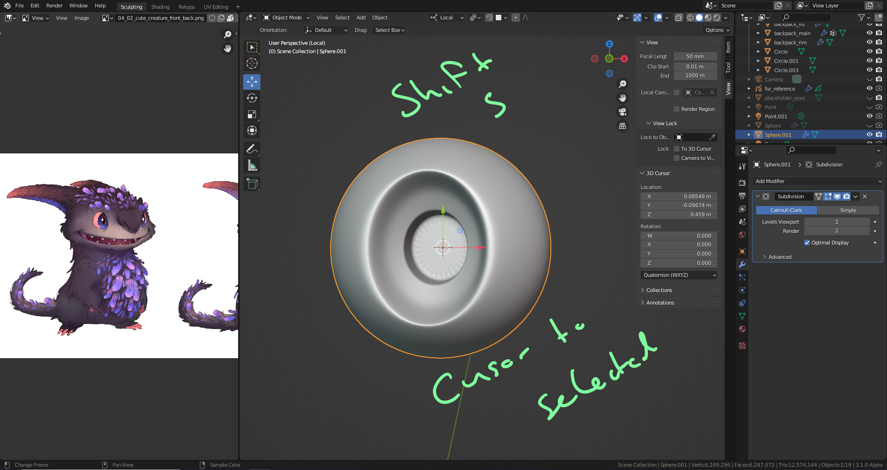
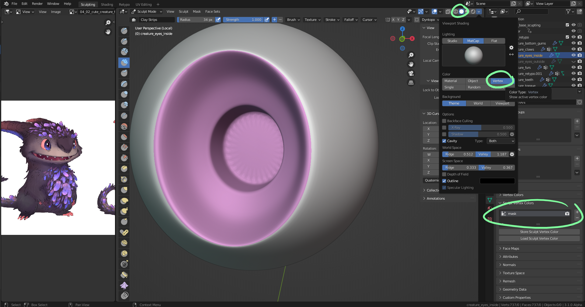

# DEV-59, Coloring - The Eyes
### Tags: []
### Link:<https://academy.cgboost.com/courses/master-3d-sculpting-in-blender/lectures/33898298>

## Prepare inner eye

## Prepare outer eye

## Add masks

## Add nodes and eye ring

## Add Fresnel texture

## Add outer eye

